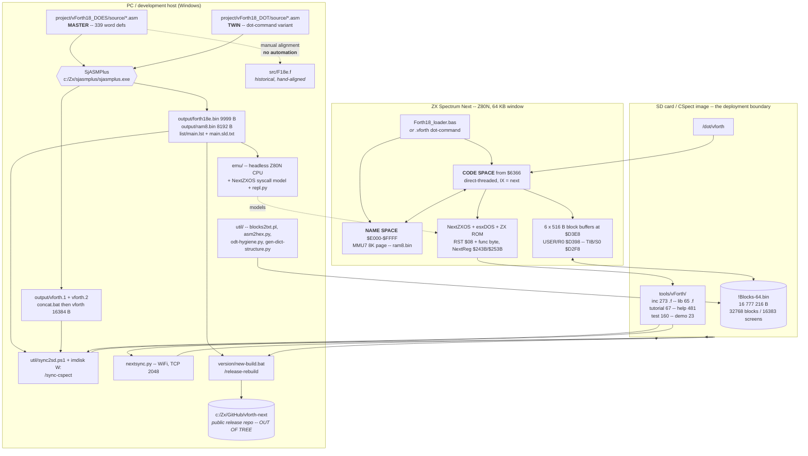
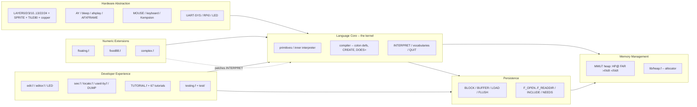

# vForth Next -- REVERSE ENGINEERING REPORT

**Repository:** `dev-F18` (`https://github.com/mattsteeldue/dev-F18`)
**Analysed at:** branch `main`, commit `7ef2c90` ("Add Kempston joystick tutorial;
fix ONBOARDING.md staleness"), working tree carrying 40 untracked paths.
**Date of analysis:** 2026-09-11.
**Language note:** this document is in English because the repository's own
convention (`tools/vForth/tutorial/CLAUDE.md` section 1) mandates *"All source
code, comments, and documentation: English only"*, while author interaction
happens in Italian.

---

## How to read this document

Every non-trivial claim carries a **confidence level** and the **file(s) it was
inferred from**. Where code and prose documentation disagree, the code wins and
the disagreement is called out explicitly:

> **DOC/CODE MISMATCH** -- what the document says vs. what the code does.

### Confidence legend

| Level | Meaning |
|---|---|
| **High** | Read directly from source, binaries, or a mechanical count I ran in this session. |
| **Medium** | Inferred from consistent but indirect evidence (naming, structure, several corroborating files). |
| **Low** | Plausible reading with material gaps; stated as such, never asserted. |
| **Not determinable** | Explicitly declared unknown. No guess offered. |

### What was actually executed during this analysis

Read-only inspection only. No build, no emulator run, no sync, no write to the
project tree outside `docs/REVERSE.md`. Concretely: filesystem enumeration,
`git ls-files` / `git log` / `git status`, `grep` / `diff` / `cmp` over the
assembler and Forth sources, `md5sum` over the produced binaries, and byte dumps
of `!Blocks-64.bin` and the two DOT binaries. The build was **not** reproduced
(SjASMPlus lives outside the repo at `c:/Zx/sjasmplus/sjasmplus.exe` per
`.claude/commands/build.md`), so every statement about build *output* derives
from the committed artifacts and the assembler listing, not from a fresh run.

### Relationship to `tools/vForth/doc/ONBOARDING.md`

A prior reverse-engineering pass already exists in the repository:
`tools/vForth/doc/ONBOARDING.md` (1764 lines), generated at commit `af403da` on
2026-09-04. **This document is an independent re-derivation, not a copy.** The
two agree on all structural conclusions; they differ on three counts and on the
staleness of the boot-chain addresses. Divergences are itemised in section 13.4.

---

# 1. Executive Summary

## 1.1 Purpose of the software

**vForth Next** is a complete, self-contained **Forth implementation -- compiler,
interpreter, editor, block filesystem and hardware library -- for the Sinclair ZX
Spectrum Next**, an FPGA re-implementation of the 1982 ZX Spectrum with a Z80N
CPU, 2 MB RAM, hardware sprites, multiple display layers and an SD-card OS
(NextZXOS / esxDOS).

It is not an application that happens to be written in Forth. It **is** the
language environment: the deliverable is a ~10 KB machine-code kernel plus a
16 MB block file which together turn the machine into a Forth workstation.

- Evidence: `project/vForth18_DOES/source/main.asm:44` -- *"This is the complete
  compiler for v.Forth for SINCLAIR ZX Spectrum Next"*; `tools/vForth/CLAUDE.md:18-20`.
- Licence **MIT**, Copyright (c) **1990-2026 Matteo Vitturi**
  (`tools/vForth/LICENSE.md`, `main.asm:18-37`). The 1990 start date, plus the
  `src/F15*.f` sources and the `project/vForth16_MDR_MGT/` tree, evidence a
  **36-year lineage** ported forward from ZX Microdrive and MGT DISCiPLE hardware.
- **Confidence: High.**

## 1.2 Problems it solves

| Problem | How vForth solves it | Evidence |
|---|---|---|
| The Next offers no resident high-level language but NextBASIC, which is slow and cannot address memory at 8K-page granularity | A direct-threaded Forth whose primitives *are* Z80N machine code, with `CODE` words and an on-machine `ASSEMBLER` vocabulary | `CLAUDE.md` "Compilation Model"; `lib/assembler.f`; `src/Z80N-Assembler-Dictionary.txt` |
| 64 KB Z80 address space vs. 2 MB of RAM | The dictionary is **split across two address spaces**: code at `$6366+` in the fixed window, names in an 8K MMU7-paged heap at `$E000-$FFFF` | `system.asm` `New_Def` macro; `CLAUDE.md` "Memory Layout" |
| No editor and no source storage on a machine without a hosted development OS | A 16 MB **block file** (`!Blocks-64.bin`) holding 16383 1 KB Screens, edited in place by `EDIT`, interpreted by `LOAD` | `L3.asm` `BLOCK`/`LOAD`; `util/blocks2txt.pl`; `home/vForth20/README.md` |
| A 10 KB kernel cannot contain everything | **`NEEDS`** -- a demand loader pulling `inc/<word>.f` or `lib/<module>.f` from the SD card only if the word is absent from the dictionary | `L3.asm:426` `Colon_Def NEEDS`; `inc/CLAUDE.md` |
| Next hardware (sprites, Layer 2/3, AY, DMA, UART, mouse, copper) is undocumented from Forth | 65 `lib/` modules, 67 numbered tutorials, 481 per-word `HELP` files, all shipped on the SD card | `lib/`, `tutorial/`, `help/` |
| Self-hosted compilation on real hardware is too slow for daily work | The core was **re-expressed in SjASMPlus Z80N assembly**; the original self-compiling Forth source (`src/F18e.f`) is kept as a readable reference | `project/CLAUDE.md` "Primary Development Workflow" |

**Confidence: High** for every row -- each traces to a named file.

## 1.3 Principal users

Inferred from artifacts; never declared anywhere in the repository.

1. **The author** -- effectively a single maintainer (`git log`: 188 commits,
   `mvitturi` dominant). He alone runs the release pipeline, which hardcodes
   `C:\Zx\...` paths on his own machine.
2. **ZX Spectrum Next hobbyists** who download the published ZIP
   (`vForth_18_NextZXOS_<build>.zip`, produced by `version/new-build.bat`) and
   unpack it onto an SD card. They consume `tutorial/`, `help/`, `demo/` and the
   PDF manual.
3. **Forth implementers / retro-computing students** reading `src/F18e.f` to study
   a complete Forth kernel expressed in idiomatic Forth (`CLAUDE.md`: *"Its primary
   value is readability"*).
4. **LLM coding assistants** -- unusual but real here: two `.claude/` trees provide
   10 slash commands, 5 skills and a review agent, and six `CLAUDE.md` files
   totalling ~65 KB act as the operating manual. The release pipeline is
   *implemented* as a skill (`/release-rebuild`), not as a script.

**Confidence: Medium-High.** (1) and (2) are strongly supported by the release
scripts and the public-repo references; (3) and (4) are inferred from file purpose.

## 1.4 Principal functional flows

**A. Develop the core (PC side).**
Edit `project/vForth18_DOES/source/*.asm` -> `/build DOES` runs SjASMPlus ->
`output/forth18e.bin` (9999 B) + `output/ram8.bin` (8192 B) -> smoke-test in the
headless emulator -> copy both to `tools/vForth/` -> mirror the change into
`project/vForth18_DOT/` -> `/build DOT` -> concatenate `vforth.1` + `vforth.2`
-> `dot/vforth` (16384 B).
*Source: `.claude/commands/build.md`, `main.asm:173-174`, `project/vForth18_DOT/concat.bat`.*

**B. Develop a library word (SD side).**
Write `inc/<word>.f` or `lib/<MODULE>.f` -> write `help/<word>.txt` -> write
`test/<word>.f` and register it in `test/CORE-TESTS.f` -> sync to the CSpect SD
image (`/sync-cspect`) or to real hardware over WiFi (`nextsync.py`) -> load with
`NEEDS <WORD>` at the `ok` prompt.
*Source: `inc/CLAUDE.md`, `help/CLAUDE.md`, `test/CLAUDE.md`, `.claude/skills/sync-cspect/`.*

**C. Boot on the machine.**
`Forth18_loader.bas` does `LOAD "ram8.bin" BANK 16`, then `LOAD "forth18e.bin"
CODE 25446`, then `RANDOMIZE USR 25446` -> `ColdRoutine` -> `COLD` -> `WARM` ->
`BLK-INIT` (opens `!Blocks-64.bin`) -> `ABORT` -> `AUTOEXEC` (`11 LOAD`) ->
`INCLUDE lib/autoexec.f` -> `SPLASH` -> `ok` prompt.
*Source: `Forth18_loader.bas` (tokenised +3DOS BASIC; strings readable),
`L0.asm:8-13`, `L2.asm`, `lib/AUTOEXEC.f`.*

**D. Release.**
`/release-rebuild YYYYMMDD` -> gate on the hand-prepared `.odt`/`.pdf` manual ->
`/bump-build` (stamp the date in five canonical places, rebuild both variants) ->
`perl util/blocks2txt.pl` -> `/sync-cspect` -> `version/new-build.bat` copies into
the **public** repository `c:\Zx\GitHub\vforth-next` and produces the download ZIP.
*Source: `.claude/skills/release-rebuild/SKILL.md`, `version/new-build.bat`.*

---

# 2. System Overview

## 2.1 High-level architecture

The system is a **cross-development pipeline plus a self-hosted runtime**, with
the SD-card filesystem as the boundary. Three properties are unusual enough that
you should internalise them before reading any code:

1. **The dictionary lives in two disjoint address spaces.** A word's *name* (name
   field, link, xt pointer) is written into an 8K page mapped at `$E000-$FFFF`
   through MMU7; the word's *code* is written at `HERE` in the fixed `$6366+`
   window. The `New_Def` macro in `system.asm` performs both writes by flipping
   the assembler's `org` back and forth at assembly time -- so the dictionary link
   chain is literally a side effect of `include` order in `main.asm`.
   **Confidence: High** (`system.asm:123-170`).
2. **There is no build system.** No Makefile, no CMake, no npm/pip manifest, no
   CI. The build is one SjASMPlus invocation documented in a Markdown slash
   command; the release is a `.bat` file plus a skill. **Confidence: High**
   (verified by searching for `.github`, `Makefile`, `*.yml`, `*.yaml`,
   `package.json`, `pyproject.toml`, `requirements.txt`, `Dockerfile`,
   `Jenkinsfile`, `.gitlab-ci.yml` -- **all absent**).
3. **The block file is simultaneously the source repository, the error-message
   table and the boot script.** `!Blocks-64.bin` is 16 MB of 512-byte blocks;
   Screens 2-9 are reserved for the system, Screen 11 is the autoexec hook, and
   Screen 12 upwards is user source. **Confidence: High** (`CLAUDE.md`
   reserved-screens table; my byte dump of block 1 confirms the header).

## 2.2 Principal components

| Component | Location | Size / count | Role |
|---|---|---|---|
| `system.asm` | `project/*/source/` | 245 lines | Z80 register contract, dictionary-entry macros (`New_Def`, `Colon_Def`, `Constant_Def`, `Variable_Def`, `User_Def`), memory-layout equates. **This file is the dictionary compiler.** |
| `L0.asm` | same | 2180 lines, **83 defs** | Origin block, inner interpreter (`Next_Ptr`), stack / arithmetic / memory primitives, `(FIND)`, `ENCLOSE`, `CMOVE`, `(EMITC)`, `(CLS)`, `KEY`, `SELECT`. Includes `next-opt0.asm` at line 1169. |
| `next-opt0.asm` | same | 252 lines, **9 defs** | esxDOS / NextZXOS file syscalls: `F_OPEN` `F_CLOSE` `F_READ` `F_WRITE` `F_SEEK` `F_FGETPOS` `F_SYNC` `F_OPENDIR` `F_READDIR`. |
| `L1.asm` | same | 1711 lines, **146 defs** | The compiler proper: `:` `;` `CONSTANT` `VARIABLE` `USER` `<BUILDS`/`DOES>` `CREATE` `LITERAL` `WORD` `NUMBER` `ERROR`, plus MMU7 heap words `MMU7@` `MMU7!` `>FAR` `<FAR` `FAR` `HP@` `SKIP-HP-PAGE`. |
| `L2.asm` | same | 550 lines, **29 defs** | `INTERPRET`, `VOCABULARY`, `FORTH`, `DEFINITIONS`, `QUIT`, `ABORT`, `WARM`, `COLD`, `BASIC`, mixed-precision math (`M*` `SM/REM` `FM/MOD` `*/`), `MESSAGE`. |
| `next-opt1.asm` | same | 187 lines, **10 defs** | `REG@` / `REG!` (NextReg via ports `$243B`/`$253B`), `M_P3DOS`, `BLK-FH`, `BLK-FNAME`, `BLK-SEEK/READ/WRITE`, `BLK-INIT`. |
| `L3.asm` | same | 1021 lines, **62 defs** | Block I/O (`R/W` `+BUF` `UPDATE` `BUFFER` `BLOCK` `FLUSH` `LOAD` `-->`), file inclusion (`F_GETLINE` `F_INCLUDE` `OPEN<` `INCLUDE`), `NEEDS` + the FAT filename mapper `MAP-FN`, pictured output (`<#` `#` `#S` `#>`), `WORDS` `LIST` `INDEX`, control structures (`IF` `BEGIN` `DO` `LOOP`), `SPLASH`, `AUTOEXEC`, `MARKER`, `FORGET`. |
| `src/F18e.f` | `tools/vForth/src/` | 162 805 B | The same kernel in **self-compiling Forth**. Historical readable reference, hand-maintained, not generated. |
| `inc/` | repo | **273 tracked** `.f` (+19 in `inc/doc/`) | One Forth word per file, demand-loaded by `NEEDS`. |
| `lib/` | repo | **65** modules (+`lib/doc/`) | Multi-word feature modules: graphics layers, AY sound, mouse, floating point, fixed point, locals, editor, decompiler, persistence, UART/RPi0, sprites, tilemap. |
| `help/` | repo | **481** `.txt` | One short help page per word, displayed by `HELP`. |
| `test/` | repo | **160** `.f`, 9 suites, **1158** `T{` assertions | ANS-Forth conformance and regression tests -- run **on the target**, not on the PC. |
| `tutorial/` | repo | **67** numbered `.f` | Progressive guided tutorials, dispatched by `lib/TUTORIAL.f`. |
| `emu/` | repo | ~13 Python files, ~105 KB | Headless Z80N CPU + NextZXOS syscall model + REPL. The only PC-side test harness. |
| `util/` | repo | Perl / Python / PowerShell | Block dump (`blocks2txt.pl`), ODT hygiene, SD sync, asm-to-hex conversion, maze generator, dictionary-structure generator. |
| `.claude/` | repo (two trees) | 10 commands, 5 skills, 1 agent | **The process automation.** This is where the CI/CD equivalent actually lives. |

> **Word-count method.** I counted uncommented `New_Def | Colon_Def |
> Constant_Def | Variable_Def | User_Def` macro invocations across the six
> assembled files: **339 total** (83 + 9 + 146 + 29 + 10 + 62), yielding 339
> distinct name strings. A handful create data buffers rather than callable words
> (`NEEDS-W`, `NEEDS-FN`, `NEEDS-INC`, `NEEDS-LIB` at `L3.asm:330-340`), so treat
> **339 as an upper bound** on user-visible core words. **Confidence: High.**

## 2.3 Architecture diagram



## 2.4 Dependencies between components

**Build-time (breaking these breaks the assembly):**

- `main.asm` -> `system.asm` -> `L0.asm` (-> `next-opt0.asm`) -> `L1.asm` ->
  `L2.asm` -> `next-opt1.asm` -> `L3.asm`. **Include order is semantically
  significant**, not conventional: `system.asm`'s macros thread the `Heap_Ptr` /
  `Prev_Ptr` / `Dict_Ptr` / `Latest_Definition` assembler symbols through every
  subsequent definition, so the dictionary link chain and the heap watermark are
  assembly-time state. Reordering two includes silently produces a different --
  and wrong -- dictionary. **Confidence: High** (`main.asm:140-145`,
  `system.asm:123-170`).
- `emu/repl.py` -> `emu/emulator.py` -> `emu/z80_instructions.py`.
  `emu/repl.py:28-29` **hardcodes** `project/vForth18_DOES/output/forth18e.bin`
  and `ram8.bin`. **There is therefore no emulator harness for the DOT variant.**
  **Confidence: High.**

**Runtime (resolved on the machine, at load time):**

- `NEEDS X` -> try `inc/X.f`, then `lib/X.f`, else print the name and message 43
  ("File not found"). Path constants are literal counted strings
  `NEEDS-INC = "inc/"` and `NEEDS-LIB = "lib/"` at `L3.asm:337-340`; the search
  logic is the threaded code at `L3.asm:426-441`. **Confidence: High**
  (read the `dw` thread directly, not the prose).
- `INCLUDE` / `NEEDS` -> `F_INCLUDE` -> **BLOCK 1 used as the line buffer** ->
  the shared 6-buffer pool. This couples file inclusion to block I/O and produces
  one of the system's nastiest bugs (section 13.3). **Confidence: High.**
- `lib/*` -> `inc/*` via `NEEDS` headers. Most-depended-upon targets, by
  mechanical count over `inc/*.f lib/*.f`: `GRAPHICS-COMMON` (20 referrers),
  `SPLIT` and `FLIP` (9 each), `[']`, `IDE_MODE!`, `FAR`, `.BORDER` (8 each),
  `CASE` (7). Heaviest consumers: `lib/GRAPHICS.f` (15 `NEEDS`),
  `lib/GRAPHICS-COMMON.f` and `lib/AUTOEXEC.f` (11 each). **Confidence: High.**
- **Two libraries patch the core at load time** -- `lib/floating.f` rewrites the
  `NUMBER` call inside `INTERPRET` to `FNUMBER`; `lib/assembler.f` replaces the
  `NOOP` placeholder inside `;CODE` with the ASSEMBLER vocabulary. This is the
  most invasive coupling in the system and the reason `MARKER` cannot unload
  them. **Confidence: High** (`lib/CLAUDE.md` "Patch-requiring libraries";
  corroborated by the open `TODO.md` entry on the missing `NO-ASSEMBLER`).

---

# 3. Repository Map

The git root (`D:\Zx\Forth\F18` on this host) is **not a normal source root**: it
is a **mirror of the ZX Spectrum Next SD-card filesystem**. The nextsync WiFi
utility copies it verbatim to the machine, which is why the root holds
`nextsync.py`, `syncpoint.dat` and `syncignore.txt` alongside the project.
`.gitignore` excludes `dot/`, `home/`, `nextzxos/` and `tools/vForth/version/`,
so several directories present on disk are deliberately untracked.
**Confidence: High** (`CLAUDE.md` "General development principle"; `.gitignore`;
`syncignore.txt`).

## 3.1 Git-root level

| Path | Contents | Why it exists | Importance |
|---|---|---|---|
| `tools/vForth/` | **The entire project.** | Its SD-card path is `C:/tools/vForth` on the Next; the loader does `.CD "C:/tools/vForth"`. | **Critical** |
| `dot/` *(untracked)* | `vforth` (16 KB dot-command), `term0` | NextZXOS dot-commands live in `/dot` at the SD root, not under `tools/`. Deploy target of `/build DOT`. | High |
| `nextsync.py`, `sync*`, `syncignore.txt`, `syncpoint.dat` | Jari Komppa's NextSync v4 server (2020), third-party | Pushes the tree to real hardware over WiFi (TCP 2048). | Medium |
| `home/` *(untracked)* | `vForth20/` (public README/INSTALL), `exer/`, `tutorial/`, `Mouse/`, `RaspPI0/` | End-user SD content and the public-facing README. | Low for development |
| `nextzxos/` *(untracked)* | `browser.cfg`, `*.sys`, menus | NextZXOS configuration shipped on the card. | Low |
| `tools/xxx_vForth/` *(gitignored)* | An older working copy | Historical. Ignore. | None |

## 3.2 `tools/vForth/` level

| Path | Contents | Why it exists | Importance |
|---|---|---|---|
| `project/` | `vForth18_DOES/` (master), `vForth18_DOT/` (twin), `vForth16_MDR_MGT/` (historical). Each has `source/`, `output/`, `list/`. | **The authoritative core source.** All core changes originate in `vForth18_DOES/source/`. | **Critical** |
| `src/` | `F18e.f` (current) plus `F15a/F15b/F15m/F16c/F16m/F17d/F17e`, `Z80N-asm.f`, `Z80N-Assembler-Dictionary.txt` | Self-compiling Forth form of the kernel; readable reference and historical archive. | High (reference) |
| `inc/` | **273 tracked** single-word `.f` files + `inc/doc/` (19 read-only copies of core words) | On-demand word loading; keeps the resident dictionary small. | **Critical** |
| `lib/` | **65** multi-word modules + `lib/doc/` | Feature and hardware subsystems. | **Critical** |
| `help/` | **481** `.txt`, one per word, max 21 lines each | Backs the on-machine `HELP` command. | High |
| `test/` | **160** `.f`; 9 suites; 1158 `T{` assertions | ANS conformance + regression, executed on the target. | High |
| `tutorial/` | **67** `NNN-slug.f` + `afx/`, `bmp/` assets | Progressive learning path; dispatched by `lib/TUTORIAL.f`. | High |
| `emu/` | Python headless Z80N emulator, REPL, ~10 `test_*.py` | The **only** automated PC-side verification. | **Critical for dev loop** |
| `util/` | `blocks2txt.pl`, `putscr.pl`, `asm2hex.py`, `odt-hygiene.py`, `gen-dict-structure.py`, `chomp-maze.py`, `sync2sd.ps1`, `verify2sd.ps1`, `mountw.ps1`, `sd-sync.config.ps1`, `blank-blocks.ps1` | Build-adjacent tooling. `sd-sync.config.ps1` is the single source of truth for sync paths and guards. | High |
| `demo/` | 23 `.f` + `chomp-chomp/`, `chomp-chomp-next/`, BMP assets | Example programs and games; also the proving ground for new libraries. | Medium |
| `doc/` | 5 `.md` reference conversions, the `.odt`/`.pdf` manuals (five builds), `ONBOARDING.md`, `previous/`, `txt/` | The manual is **hand-maintained and must never be edited automatically**. | High |
| `prompts/` | 30 plans/analyses (`LOCALS-PLAN.md`, `LAYER24-PLAN.md`, `CHOMP-*`, ...) | Repository convention: *"Plans go in `prompts/`, never the project root."* | Medium (design rationale) |
| `version/` *(gitignored)* | Dated build snapshots + `new-build.bat`, `new-version.bat` | Historical releases; **never modify**. Holds the release pipeline scripts. | Medium |
| `forum/` | ~36 community-contributed `.f` | Third-party/contributed samples. | Low |
| `.claude/` | 10 commands, 5 skills, 1 agent, `settings.json` | Executable process documentation. | High |
| `!Blocks-64.bin` | 16 777 216 B | The block/Screen store -- see section 6. | **Critical** |
| `forth18e.bin`, `ram8.bin` | 9999 B / 8192 B | **Deployed** core binaries; must match `project/vForth18_DOES/output/`. Verified identical by MD5 at this commit. | **Critical** |

> **Naming trap.** The repository convention calls the documentation directory
> `doc/` (under `tools/vForth/`). This report was requested at `docs/REVERSE.md`,
> i.e. a **new top-level `docs/` directory at the git root**, which is where you
> are reading it. That is deliberate per the request but is *not* the project's
> own convention; `tools/vForth/CLAUDE.md` additionally states that analysis
> documents belong in `prompts/`. Flagging it so nobody mistakes `docs/` for an
> established location. **Confidence: High.**

---

# 4. Runtime Architecture

## 4.1 Entry points

| Entry | Address / trigger | Variant | Source |
|---|---|---|---|
| `Cold_origin` | `$6366` -- `and a` (clears carry = cold) then `jp ColdRoutine` | DOES | `L0.asm:8-10` |
| `Warm_origin` | `$636A` -- `scf` (sets carry = warm) then `jp WarmRoutine` | DOES | `L0.asm:11-13` |
| Dot-command | `.vforth` at `ORIGIN $2000`, parameters parsed from BASIC's HL | DOT | `project/vForth18_DOT/source/main.asm:106`, `L2.asm` DOT-only prologue |
| DeZog debug | `ORIGIN $8080` when `DEBUGGING equ 1` | DOES | `main.asm:116` |
| Headless emulator | `VForthEmulator.initialize_cold_start()` sets `PC=$6366`, `SP=$D2F8`, `IY=$5C3A`, carry clear | PC | `emu/emulator.py:209-229` |

The carry flag **is** the cold/warm selector -- `and a` versus `scf` before the
jump. **Confidence: High** (read directly).

## 4.2 Startup sequence (classic / DOES variant)

Addresses below are **measured from this build's artifacts**
(`project/vForth18_DOES/list/main.sld.txt` and `list/main.lst`), not copied from
prose:

```
Forth18_loader.bas
  .CD "C:/tools/vForth"
  LOAD "ram8.bin" BANK 16        <- the name space / heap page
  LOAD "forth18e.bin" CODE 25446 <- $6366, the code space
  RANDOMIZE USR 25446
        |
        v
$6366  Cold_origin : and a ; jp ColdRoutine
        |   ColdRoutine self-initialises SP/DE/BC/IX from
        |   S0_origin/R0_origin/Cold_Start/Next_Ptr in the origin block
        v
$7622  COLD    -- EMPTY-BUFFERS, NMODE, FIRST/PREV/USE, then falls into WARM
        v
$7619  WARM    -- calls BLK-INIT, then ABORT
        v
$78DE  BLK-INIT -- close any open BLK-FH, then F_OPEN "!Blocks-64.bin"
        v
$75F6  ABORT   -- S0 SP! , R0 RP! , then AUTOEXEC (first time only)
        v
$800F  AUTOEXEC -- 11 LOAD   (Screen 11, user-configurable)
        |             -> INCLUDE lib/autoexec.f
        v
$7FEB  SPLASH  -- banner: version, core version, NextZXOS version,
                  CPU speed, dictionary free, heap free, free disk space
        v
$75BA  QUIT    -- QUERY / ACCEPT loop -> the interactive `ok` prompt
```

Three behaviours here are load-bearing and non-obvious:

1. **`BLK-INIT` failure is non-fatal but leaves the system inconsistent.** If
   `F_OPEN` on the block file fails, boot still proceeds to `ABORT` and reaches
   the `Ok` prompt -- with no working `BLOCK`/`LOAD`/`EDIT`. **Confidence: High**
   (`CLAUDE.md` Boot Sequence, consistent with `next-opt1.asm` `BLK_INIT`).
2. **`AUTOEXEC` self-disables by rewriting its own call site.** On first execution
   it patches the `dw AUTOEXEC` slot inside `ABORT` to a `NOOP`, so every
   subsequent `COLD`/`WARM`/`ABORT` skips it. This is why a second `COLD` does not
   re-print the banner. **Confidence: High** (`CLAUDE.md`, corroborated by the
   listing comment `dw AUTOEXEC // autoexec, patched to noop`).
3. **`ERROR` ends in `QUIT`, not `ABORT`.** `QUIT` resets `STATE` and the return
   stack but **not** `CONTEXT`/`CURRENT`. Code that temporarily switches vocabulary
   must restore it itself. **Confidence: High** (`CLAUDE.md` error-reporting
   section; `L2.asm` `QUIT`/`ABORT`).

> **DOC/CODE MISMATCH (verified, minor but real).**
> `tools/vForth/CLAUDE.md` "Boot Sequence" lists `COLD $7616`, `WARM $760D`,
> `BLK-INIT $78D2`, `ABORT $75EA`, `AUTOEXEC $8003`, `SPLASH $7FDF`.
> The current build's listing gives `COLD $7622`, `WARM $7619`, `BLK-INIT $78DE`,
> `ABORT $75F6`, `AUTOEXEC $800F`, `SPLASH $7FEB` -- **every address is exactly
> 12 ($0C) bytes higher**, i.e. the core grew 12 bytes ahead of `ABORT` since the
> documentation was written. Sources: `project/vForth18_DOES/list/main.sld.txt`
> (`|F|COLD` = decimal 30242 = `$7622`) and `list/main.lst:17066` (`>COLD:` at
> `7622`). **Confidence: High** -- two independent artifacts agree.
> *Impact:* anyone setting a breakpoint from the `CLAUDE.md` table lands 12 bytes
> early, inside the preceding word. Treat the listing as the only address source.

## 4.3 The inner interpreter and the two address spaces

vForth is **direct-threaded** (claimed +25% over indirect threading,
`CLAUDE.md`). The consequences are visible in three places:

- **`next` is `jp (ix)`**, and `IX` permanently holds `Next_Ptr`. The macro is
  two bytes and 2 T-states faster than `jp <addr>` (`system.asm:60-63`).
- **`Next_Ptr` itself** is `ld a,(bc) / inc bc / ld l,a / ld a,(bc) / inc bc /
  ld h,a / jp (hl)` -- fetch the next xt into HL from the IP, then jump straight
  into it (`L0.asm:88-105`). For a `CODE` word, HL points at real Z80 machine
  code. For a colon definition, it points at a 3-byte `call Enter_Ptr`.
- **Every dictionary entry is split.** `New_Def` writes the name-field part at
  `(Heap_Ptr & $1FFF) + $E000` and the code part at `Dict_Ptr`, linking them with
  a `mirror_Ptr` cell in each direction (`system.asm:123-170`):

```
NAME SPACE ($E000-$FFFF, MMU7 8K page)     CODE SPACE (from $6366)
  [len | END_BIT | flags]                    [ mirror_Ptr - $E000 ]   <- back-pointer
  [name bytes, last byte | END_BIT]          [ call Enter_Ptr ]       <- if colon def
  [ link -> previous NFA ]                   [ actual Z80 code / dw thread ]
  [ xt -> Dict_Ptr + 2 ]  --------------->
```

Flag bits live in the length byte: `SMUDGE_BIT $20`, `IMMEDIATE_BIT $40`,
`END_BIT $80` (`system.asm:78-81`). **Confidence: High.**

## 4.4 Z80 register contract

This is the single most important thing to learn before touching a `CODE` word.
Violating it corrupts the interpreter in ways that surface far from the cause.

| Register | Role | Rule |
|---|---|---|
| `BC` | **Instruction Pointer** (Forth IP) | Must be preserved across ROM/OS calls |
| `DE` | **Return Stack Pointer** | Must be preserved across ROM/OS calls |
| `HL` | W -- working register | Free |
| `SP` | **Data (calculation) stack pointer** | The Z80 hardware stack *is* the Forth data stack |
| `IX` | Inner-interpreter `next` address | Must always hold `Next_Ptr` |
| `IY` | ZX system variables base (`$5C3A`) | Reserved by the ROM's 50 Hz interrupt |
| `BC' DE' HL'` | Extra W registers | Customary to `EXX` into "machine-code scope" |

Source: `main.asm:52-67`, `system.asm:7-12`, `CLAUDE.md`. **Confidence: High.**

## 4.5 Memory layout -- computed, not hardcoded

`system.asm:222-229` derives the whole low-memory map from one constant:

```
LIMIT_system  = $E000                          ; first byte past the last buffer
BUFFERS       = 6
FIRST_system  = LIMIT_system - 516*6  = $D3E8  ; first block buffer
USER_system   = FIRST_system - 80     = $D398  ; user-variable area
R0_system     = USER_system           = $D398  ; return stack top (grows down)
TIB_system    = R0_system - 160       = $D2F8  ; terminal input buffer (grows up)
S0_system     = TIB_system            = $D2F8  ; data stack top
```

`516 = 512 data + 4 bytes` of per-buffer bookkeeping (block number + flags).
**The `$D2F8` figure is independently confirmed** by `emu/repl.py` /
`emu/emulator.py:220`, which seeds `SP = 0xD2F8`. Below that: BASIC RAMTOP `$61FF`,
IM-2 vector table at `$6200`, core origin `$6366`. **Confidence: High.**

**Banks versus pages -- the most common newcomer error.** NextBASIC and NextZXOS
allocate in **16K banks**; the MMU maps **8K pages**. One 16K bank = two 8K pages.
`MMU7!`/`MMU7@` take an **8K page** number; NextReg `$12` (Layer 2 RAM bank) takes
a **16K bank** number. The loader's `LOAD "ram8.bin" BANK 16` is a 16K-bank
operation; the heap it feeds is addressed as 8K pages. Never write "16K bank via
MMU7". **Confidence: High** (`CLAUDE.md` "Banks (16K) vs Pages (8K)";
`Forth18_loader.bas`).

## 4.6 Inter-module communication

There is no message bus, no RPC, no IPC. Communication happens by four mechanisms
only:

1. **The data stack.** Every word's contract is its stack effect comment
   `( before -- after )`. This is the entire API surface.
2. **The dictionary.** `NEEDS` resolves a name; late binding via `DEFER`/`IS`
   (`inc/defer.f`, `inc/is.f`) where indirection is wanted.
3. **Direct thread patching.** `lib/floating.f` and `lib/assembler.f` overwrite
   cells inside already-compiled core definitions. `lib/TUTORIAL.f` uses the
   gentler "stub + patch" variant (`' LOAD-TUTORIAL  ' TUTORIAL >BODY !`).
4. **NextZXOS syscalls** -- `rst $08` followed by a function byte
   (`$94` = M_P3DOS/terminal, `$9A`-`$A4` = file API). See section 7.

**Confidence: High** for all four (read in `L0.asm`, `next-opt0.asm`,
`next-opt1.asm`, `lib/CLAUDE.md`).

---

# 5. Business Domains

No bounded context is declared anywhere in the repository -- there is no DDD
vocabulary, no module manifest, no package system. The contexts below are
**inferred** from directory structure, `NEEDS` dependency clusters, and the
distinct data each group owns. **Confidence: Medium** for the partitioning;
**High** for the membership of each file.

## 5.1 Bounded contexts



| Context | Owns | Key files | Stability |
|---|---|---|---|
| **Language Core** | The dictionary, the stacks, the text interpreter | `L0-L2.asm`, `system.asm` | Very stable -- changes here force a build-number bump and full re-release |
| **Persistence** | `!Blocks-64.bin`, file handles, the include mechanism | `L3.asm`, `next-opt0.asm`, `next-opt1.asm` | Stable, but the highest-risk area (see 13.3) |
| **Memory Management** | The MMU7 8K-page window and the name-space watermark | `L1.asm` (`MMU7!` `FAR` `HP@` `PAGE-WATERMARK`), `lib/heap.f` | Stable |
| **Hardware Abstraction** | NextReg state, display layers, sound chips, ports | `lib/LAYER*.f`, `lib/AY.f`, `lib/SPRITE.f`, `lib/MOUSE.f`, `lib/UART-SYS.f` | **Volatile** -- where most new work lands |
| **Numeric Extensions** | Alternate number representations | `lib/floating.f`, `lib/fixed88.f`, `lib/complex.f` | Stable but invasive (`floating` patches the core) |
| **Developer Experience** | Editor, decompiler, tutorials, tests | `lib/edit.f`, `lib/see.f`, `lib/TUTORIAL.f`, `lib/testing.f` | Actively growing |

## 5.2 Principal aggregates

| Aggregate | Root | Invariants it must preserve |
|---|---|---|
| **Dictionary entry** | NFA in the heap page | Length byte carries `END_BIT`+flags; last name byte has `END_BIT`; link points to the previous NFA; xt points to `Dict_Ptr+2`; the code side holds the mirror back-pointer |
| **Vocabulary** | `FORTH`, `ASSEMBLER`, `EDITOR`, ... | `CONTEXT` (search) and `CURRENT` (definition) are separate; `:` resets `CONTEXT` from `CURRENT` |
| **Screen** | Screen number N | = BLOCK `2N` + BLOCK `2N+1`; 16 lines x 64 bytes per block; padded with `BLANK`, never NUL |
| **Block buffer** | One of six 516-byte slots | Round-robin via `FIRST`/`PREV`/`USE`; `UPDATE` marks dirty; `FLUSH`/`EMPTY-BUFFERS` reconcile with disk |
| **Heap string** | `ha` (heap address) | Produced by `H"`, lives in MMU7 name space, shares the scarce page with the name space |
| **Module** | `MARKER NO-<NAME>` or a stub word | Executing the marker must remove the module *and* undo any core patch it applied |

**Confidence: High** for dictionary entry, Screen and block buffer (read from
`system.asm`, `L3.asm`, `CLAUDE.md` offsets table); **Medium** for module.

## 5.3 Core business concepts a newcomer must learn

1. **Word** -- the unit of everything. A name, a stack effect, a body.
2. **xt (execution token)** -- since v1.2, `'` and `-FIND` return the **CFA**, not
   the PFA (`CLAUDE.md` "Breaking Changes Since v1.2"). Old Forth literature will
   mislead you here.
3. **PFA and `DOES>`** -- at runtime the `DOES>` body receives the PFA as TOS;
   caller arguments sit *beneath* it (`CLAUDE.md`; canonical example
   `inc/2constant.f`).
4. **`CHAR` vs `[CHAR]`, `'` vs `[']`** -- interpret-state vs compile-only
   immediate. Using `[CHAR]` at the top level is a real bug even when it appears
   to work (documented regression in `lib/DIR.f`).
5. **Screen vs Block** -- a Screen is what you `LOAD`; a Block is the 512-byte
   allocation unit. Two Blocks per Screen.
6. **`NEEDS` vs `INCLUDE`** -- `NEEDS` is idempotent and interpreter-only;
   `INCLUDE` always loads.
7. **The heap (MMU7 name space) is the scarce resource**, not the code space.
   Every name, every `H"` string and every `ABORT"` message competes for the same
   8K page -- the one currently mapped at `$E000-$FFFF`. **The heap address
   space, however, extends over 8 theoretical pages**: a heap-pointer `ha` is a
   single 16-bit cell whose top 3 bits are a page number relative to the base
   heap page (`$20-$27`, i.e. 32-39) and whose low 13 bits are the byte offset
   from `$E000` within it -- so 8 x 8K = 64K is the structural ceiling of the
   heap, fixed by the `ha` format rather than by the MMU. Only one of those
   pages is visible at a time, which is why `FAR ( ha -- a )` must re-map before
   every access, and why widening the page count would break `ha` everywhere
   (`FAR`, `>FAR`, `HP@`, `SKIP-HP-PAGE`, ...). Scarcity is therefore per-page
   pressure inside a bounded 64K space, which is exactly why the library
   convention is `?ERROR` with a numbered message rather than `ABORT"`
   (`CLAUDE.md` "Error reporting"; `lib/CLAUDE.md` "Heap-pointer format";
   `prompts/HEAP-PAGE-PARAM-PLAN.md` "Vincolo strutturale").

---

# 6. Data Layer

**There is no database, no ORM, and no migration framework.** Every conventional
data-layer question maps onto something else here; the mapping is given below.
**Confidence: High** (verified by absence: no SQL, no schema file, no driver, no
connection string anywhere in the tree).

## 6.1 Stores

| Store | Medium | Size | Accessed by |
|---|---|---|---|
| **Block file** `!Blocks-64.bin` | Single flat file on the SD card | **16 777 216 B** (verified) = 32768 blocks = 16383 Screens | `BLOCK`, `BUFFER`, `UPDATE`, `FLUSH`, `LOAD`, `EDIT` via `BLK-SEEK`/`BLK-READ`/`BLK-WRITE` (`next-opt1.asm`) |
| **Source files** | FAT filesystem on the SD card | ~1000 `.f`/`.txt` files | `F_OPEN`/`F_READ` via `INCLUDE`/`NEEDS` |
| **The dictionary** | RAM, at runtime | code space from `$6366`; name space one 8K MMU7 page | `CREATE`, `,`, `ALLOT`, `FORGET`, `MARKER` |
| **Session snapshot** | Optional file | -- | `lib/PERSISTENCE.f` (`RESTORE-SYSTEM`, disabled by default in `lib/AUTOEXEC.f`) |

## 6.2 Deducible schema of `!Blocks-64.bin`

This is the closest thing to a schema in the system, and getting it wrong is the
documented way to lose a day.

**Block 0 is not stored. The file begins with BLOCK 1.** Therefore:

| Target | File offset |
|---|---|
| BLOCK `b` | `(b - 1) * 512` |
| Screen `S` (= blocks `2S`, `2S+1`) | `(2S - 1) * 512` |
| Screen `S`, line `L` (0-15, 64 bytes each) | `(2S - 1) * 512 + L * 64` |
| Error message `#n` | `(n + 32) * 64 + 3 * 512` |

**Verified independently in this session:** a dump of the first 512 bytes of
`!Blocks-64.bin` yields the metadata header

```
\ v-Forth 1.8 - NextZXOS versione - build 2026-08-20
\ MIT License (c) 1990-2026 Matteo Vitturi
...
\ This file provides persistency for BLOCK/Screen facility
\ The first 512 bytes of this file aren't used by BLOCK.
```

-- i.e. BLOCK 1 sits at offset 0, confirming the `(b-1)*512` rule. It is
corroborated by `util/blocks2txt.pl`, which does `seek B, 512, 0` before counting
Screens from 1. **Confidence: High.**

**Reserved Screens (from `CLAUDE.md`, structurally consistent with the dump):**

| Screen | Blocks | Contents |
|---|---|---|
| 0 | 0 | Not stored |
| 0.5 | 1 | System metadata + copyright; **doubles as the `F_INCLUDE` line buffer** |
| 2-3 | 4-7 | Error messages `#-32`..`#-1` (negative/THROW-aligned area) |
| 4-8 | 8-17 | Standard error messages `#0`..`#79`, read by `?ERROR` -> `ERROR` -> `MESSAGE` |
| 9 | 18-19 | `9 LOAD` prints the whole message table, then `FORGET`s itself |
| 10 | 20-21 | Formerly `include src/f18e.f`; now free |
| 11 | 22-23 | **Autoexec hook** -- `AUTOEXEC` does `11 LOAD` |
| 12+ | 24+ | User source |

Lines are space-padded (`BLANK`) to 64 bytes. **The file size must never change.**
A NUL byte inside a Screen silently aborts interpretation mid-`LOAD` with no error.

## 6.3 "Entities"

| Conventional concept | Here |
|---|---|
| Table | Screen |
| Row | A 64-byte line |
| Primary key | Screen number (the `n` in `n LOAD`) |
| Index | First line of each Screen -- `blocks2txt.pl` builds the index from it |
| Foreign key | `-->` (continue to the next Screen), `NEEDS`/`INCLUDE` (cross-file) |
| Constraint | 64 bytes/line, 16 lines/block, ASCII, no NUL, no TAB |

## 6.4 ORM and migration strategy

- **ORM:** none. The mapping is arithmetic (`(b-1)*512`) implemented once in
  `next-opt1.asm` (`BLK-SEEK`) and duplicated in `util/blocks2txt.pl`,
  `util/patch0block.py`, `util/blank-blocks.ps1` and `util/chomp-maze.py`.
  **This duplication is real technical debt** -- see 13.5.
- **Migration:** the file layout has never changed within v1.8. Content changes
  are made by editing Screens on the machine (`EDIT`) or via the `util/` scripts
  on the PC. There is **no schema-version field** and **no migration tool**.
- **"Backup":** `util/blocks2txt.pl` dumps the whole file to a dated text snapshot
  (`util/!Blocks-64.bin_YYYYMMDD.txt`, `doc/txt/`). That is the only versioned
  record of block contents -- the binary itself is excluded from nextsync
  (`syncignore.txt`) and copied only with an explicit `-WithBlocks` switch.
  **Confidence: High.**

## 6.5 The data-layer trap that will cost you a day

**The off-by-one is silent.** Using `block * 512` instead of `(block-1) * 512`
shifts everything by one block -- eight lines within a Screen -- and the wrong
text reads as perfectly plausible (a *different* error message rather than
garbage). When touching the binary: verify by reading back through the real
`BLOCK` mechanism in the headless emulator, diff against a copy to confirm only
the intended byte ranges changed, and never let the file size change.
**Confidence: High** (`CLAUDE.md`, stated as hard-won experience).

---

# 7. External Dependencies

## 7.1 Runtime dependencies (on the target machine)

| Dependency | Interface | Used for | Evidence |
|---|---|---|---|
| **NextZXOS / esxDOS file API** | `rst $08` + function byte | `F_OPEN $9A`, `F_CLOSE $9B`, `F_SYNC $9C`, `F_READ $9D`, `F_WRITE $9E`, `F_SEEK $9F`, `F_FGETPOS $A0`, `F_OPENDIR $A3`, `F_READDIR $A4` | `next-opt0.asm` (9 defs); function codes confirmed by the emulator's dispatcher `emu/emulator.py:257-300` |
| **NextZXOS `M_P3DOS`** | `rst $08 / db $94` with `ld c,7` and interrupts disabled | Generic +3DOS gateway used by `M_P3DOS` | `next-opt1.asm` `M_P3DOS` |
| **NextZXOS terminal channel** | `rst $08 / db $94`, dispatch on `C` (1=KEY, 2=EMIT, 7=CLS) | Console I/O | `emu/emulator.py:262-275` mirrors the core |
| **ZX Spectrum ROM** | `rst $10` (print), `call $1601` (CHAN-OPEN, via `SELECT`), `call $0DAF` (CL-ALL) | Character output and screen clear | `L0.asm:779`, `L0.asm:810`; stub list `emu/emulator.py` `ROM_STUBS` |
| **Next registers** | Ports `$243B` (select) / `$253B` (data) | `REG@` / `REG!` -- CPU speed, palette, Layer 2 config, core version | `next-opt1.asm` |
| **Hardware ports** | `$303B` (sprite slot), `$143B`/`$153B` (UART), `$FFFD`/`$BFFD` (AY) | Sprites, serial, sound | `CLAUDE.md` sprites section; `lib/UART-SYS.f`; `lib/AY.f` |
| **Raspberry Pi Zero** (optional) | UART at 115200 baud through the Next's accelerator header | `lib/RPi0.f` -- terminal to the Pi, `demo/term10.f` | `lib/RPi0.f:1-10` |

**The critical calling convention:** NextZXOS file syscalls return success/failure
**in the CARRY flag** (`Fc=0` ok, `Fc=1` error), not in `HL`. The Forth wrappers
extract it with `sbc hl,hl`. The headless emulator originally set only `HL` and
had to be corrected -- see `emu/emulator.py:295-302`. **Confidence: High.**

## 7.2 Build / tooling dependencies (development host)

| Tool | Where | Required for | Pinned? |
|---|---|---|---|
| **SjASMPlus** | `c:/Zx/sjasmplus/sjasmplus.exe` (outside the repo) | The only way to build the core | **Not pinned in-repo.** Version is not recorded anywhere I could verify. **Confidence: High** that it is unpinned. |
| **Python 3** | `C:\Users\<user>\anaconda3\python.exe` per `CLAUDE.md` | `emu/`, `util/*.py` | Not pinned; no `requirements.txt`. Uses **standard library only** (no third-party imports found). |
| **Perl** | System | `util/blocks2txt.pl`, `util/putscr.pl` | Not pinned |
| **PowerShell** | Windows | `util/sync2sd.ps1`, `verify2sd.ps1`, `mountw.ps1`, `blank-blocks.ps1` | Windows-only |
| **imdisk** | System | Mounts the CSpect SD image as `W:` | Not pinned |
| **CSpect** | `C:\Zx\CSpect\` | Emulated verification with real graphics/sound | v2.12.30 named in `main.asm:49`; image `cspect-next-2gb.img` |
| **MAME** (Next core) | System | Alternative emulator | Mentioned only as a **conflict** to guard against |
| **pdftotext** (poppler) | `util/poppler-26.02.0/...` (now vendored in-repo) | The release gate that checks the PDF manual's internal date | Path in `release-rebuild/SKILL.md` is now repo-relative (`$base\util\...`) |
| **pkzip25** | `util/pkzip25.exe` (now vendored in-repo; invoked via `%PKZIP%` = `%~dp0..\util\pkzip25.exe`) | Builds the download ZIP | `version/new-build.bat` |
| **NextSync** (Jari Komppa, 2020) | `nextsync.py` at the git root | WiFi deployment to real hardware, TCP 2048 | Vendored, third-party |
| **VS Code + DeZog** | -- | Source-level Z80 debugging (`DEBUGGING equ 1`, origin `$8080`) | `project/*/.vscode/` |

> **Risk.** Every host tool is referenced by **absolute path on one developer's
> machine** (`c:/Zx/sjasmplus/...`, `C:\Users\matteo\anaconda3\...`,
> `C:\Zx\GitHub\vforth-next`, `C:\Zx\CSpect\`). There is no environment
> abstraction. A second developer cannot build without editing the slash
> commands and skills. **Confidence: High.** See 13.1.

## 7.3 Queues, event buses, storage services, authentication

**None.** No message queue, no event bus, no object storage, no authentication or
authorisation of any kind, no network service other than the optional NextSync
TCP listener and the optional RPi0 serial link. There are **no secrets** anywhere
in the repository. **Confidence: High** (verified by search).

---

# 8. Configuration Guide

## 8.1 Configuration files

| File | Scope | What it controls |
|---|---|---|
| `project/*/source/main.asm` | Build | `DEBUGGING` (0 release / 1 DeZog / -1,-2 binary-compare), `ORIGIN`, `Heap_Ptr`, `Heap_offset`, and the `SAVEBIN`/`SAVENEX` output targets |
| `project/*/source/system.asm` | Build | `LIMIT_system`, `BUFFERS`, and the derived `FIRST`/`USER`/`R0`/`TIB`/`S0` map |
| `tools/vForth/util/sd-sync.config.ps1` | Deploy | `$SyncSource`, `$SyncDest`, `$SyncImage`, exclusion lists, the CSpect/MAME process guard, the 1980-timestamp guard, the HDFMonkey 2-hour skew tolerance. **Single source of truth for sync -- never duplicate it into a skill.** |
| `syncignore.txt` (git root) | Deploy | What NextSync must not push to real hardware |
| `.gitignore` (git root) | VCS | Excludes `dot/`, `home/`, `nextzxos/`, `tools/vForth/version/`, `*.lnk`, sync state |
| `.gitattributes` | VCS | `* -text` -- **all files are treated as binary**; git performs no line-ending conversion. Essential: the block file and the `.f` sources are byte-sensitive. |
| `.claude/settings.json` (x2) | Tooling | Pre-approved PowerShell commands and additional accessible directories |
| **Screen 11** in `!Blocks-64.bin` | Runtime | The autoexec hook -- what runs at first `COLD` |
| `lib/AUTOEXEC.f` / `lib/AUTOEXEC-DOT.f` | Runtime | Banner, palette, which utilities to offer, whether `PERSISTENCE` restores a session |

## 8.2 Environment variables

**None used by the project.** No `.env`, no `os.environ` read in `emu/` or
`util/*.py`, no `$env:` read in the PowerShell scripts other than `$env:TEMP` for
scratch space in the release gate. Configuration is by **file editing and absolute
paths**. **Confidence: High** (verified by search).

## 8.3 Secrets

**None.** No credentials, tokens, keys or connection strings exist in the tree.
The only network endpoints are the NextSync listener (LAN, unauthenticated, from
the vendored 2020 third-party script) and an optional UART link to a directly
attached Raspberry Pi Zero. **Confidence: High.**

## 8.4 Configuration precedence, and where docs disagree with reality

Effective precedence, most specific first:

1. `main.asm` `DEBUGGING` -- overrides `ORIGIN`, `Heap_Ptr`, `Heap_offset` and
   selects the output artifacts. Nothing overrides it.
2. `system.asm` equates -- derive the runtime memory map at assembly time.
3. `sd-sync.config.ps1` -- overrides any path mentioned in a skill's prose.
4. Screen 11 -> `lib/AUTOEXEC.f` -- runtime behaviour at first cold start.
5. `CLAUDE.md` prose -- **lowest authority**; verified stale in at least two places.

> **DOC/CODE MISMATCH #1 -- repository root path.**
> `tools/vForth/CLAUDE.md` states the nextsync root is `C:\Zx\Forth\F18`, and
> every `util/*.ps1`, `.bat` and skill hardcodes `C:\zx\forth\F18\...`.
> On this host the repository is at **`D:\Zx\Forth\F18`**. The build, sync and
> release tooling therefore **cannot run unmodified here**. Nothing in the code
> derives the root dynamically. **Confidence: High** (observed working directory
> vs. `sd-sync.config.ps1:6`, `version/new-build.bat`, `.claude/settings.json`).

> **DOC/CODE MISMATCH #2 -- boot-chain addresses.** See section 4.2: every
> address in the `CLAUDE.md` boot table is 12 bytes lower than the current build.
> **Confidence: High.**

> **DOC/CODE MISMATCH #3 -- the DOT variant's deployed binary is stale.**
> `project/vForth18_DOT/output/vforth` carries the SPLASH string
> `build 2026-08-20`; the deployed `dot/vforth` at the git root carries
> `build 2026-01-01`, and their MD5s differ
> (`02f2ff41...` vs `9599aa8c...`). Step 7 of `.claude/commands/build.md`
> ("copy `project/vForth18_DOT/output/vforth` to `./dot/vforth`") has not been
> performed for this build. Because `dot/` is `.gitignore`d, **no version-control
> mechanism can catch this**. **Confidence: High** -- I extracted the banner
> strings from both binaries directly.
> *By contrast, the DOES pair is correctly deployed:* `forth18e.bin` and
> `ram8.bin` at `tools/vForth/` are **MD5-identical** to
> `project/vForth18_DOES/output/`.

---

# 9. Development Setup

## 9.1 Prerequisites

| Requirement | Notes |
|---|---|
| Windows | The sync, mount and release tooling is PowerShell/`.bat` only. The assembler build and the emulator are portable; **everything after the build is not.** |
| SjASMPlus | Expected at `c:/Zx/sjasmplus/sjasmplus.exe`. Version not pinned. |
| Python 3 | Standard library only. `CLAUDE.md` warns: if bare `python` resolves to the Windows Store stub, use the explicit interpreter path. |
| Perl | For `util/blocks2txt.pl`. |
| CSpect + a Next SD image | `C:\Zx\CSpect\cspect-next-2gb.img`. |
| imdisk | To mount that image as `W:`. |
| VS Code + DeZog | Optional, for source-level Z80 debugging. |
| A real ZX Spectrum Next | Optional, but the **only** way to validate several subsystems (DMA, some Layer 2 modes, real sprite timing). |

## 9.2 Installation

There is nothing to install. `git clone` and you have the tree. The dependency
that is *not* in the tree is the toolchain above.

**If your checkout is not at `C:\Zx\Forth\F18`** (as is the case on this host,
`D:\Zx\Forth\F18`), you must first reconcile the hardcoded paths in at least:
`util/sd-sync.config.ps1`, `util/mountw.ps1`, `util/sync2sd.ps1`,
`util/verify2sd.ps1`, `version/new-build.bat`, `.claude/settings.json`, and the
prose of `.claude/commands/build.md` and `.claude/skills/release-rebuild/SKILL.md`.

## 9.3 Build

Portable form (the slash command wraps exactly this):

```powershell
& "c:/Zx/sjasmplus/sjasmplus.exe" `
    "--sld=project/vForth18_DOES/list/main.sld.txt" `
    "--fullpath" `
    "--zxnext" `
    "--lst=project/vForth18_DOES/list/main.lst" `
    "project/vForth18_DOES/source/main.asm"
```

Outputs (from `main.asm:173-174`):
- `project/vForth18_DOES/output/forth18e.bin` -- `ORIGIN $6366`, **9999 bytes**
- `project/vForth18_DOES/output/ram8.bin` -- `$E000`, **8192 bytes**

For the DOT variant, substitute the folder, then concatenate:

```
cd project/vForth18_DOT/output
copy vforth.1 /b + vforth.2 /b vforth /b      # -> 16384 bytes
```

**Deploy after a verified build** (build.md steps 6-7):
- `project/vForth18_DOES/output/{forth18e.bin,ram8.bin}` -> `tools/vForth/`
- `project/vForth18_DOT/output/vforth` -> `dot/vforth`

Copy only if the MD5 differs. **If tests fail, do not deploy.**

## 9.4 Test

```bash
# 1. Headless smoke test -- must print the current build date in the banner
printf '.quit\n' | python emu/repl.py | grep build

# 2. Python regression scripts (emulator level)
python emu/test_emulator.py            # 1 000 instructions, boot sanity
python emu/test_extended.py            # 100 000 instructions, stress
python emu/test_include_phase.py       # INCLUDE path
python emu/test_interactive_phase.py   # keyboard/input queue
python emu/test_session_recording.py   # transcripts
python emu/test_benchmarking.py        # performance
python emu/test_words_stream.py        # the `13 SELECT WORDS` +3DOS-clobber case
python emu/test_tutorial_loading.py    # tutorial loadability
python emu/test_tutorial_suite.py

# 3. Forth conformance suite -- runs INSIDE vForth (emulator or CSpect), not on the PC
#    At the vForth `ok` prompt:
#      INCLUDE TEST/CORE-TESTS.f
#      INCLUDE TEST/MISSING-TESTS.f
#      INCLUDE TEST/FLOATING-TESTS.f
#      INCLUDE TEST/FIXED88-TESTS.f
#      INCLUDE TEST/LOCALS-TESTS.f
#    Then execute TESTING-DONE to unload the suite.
```

The smoke test can take several minutes -- the emulator is a pure-Python
instruction interpreter. **Confidence: High** for the commands (read from
`emu/README.md`, `emu/repl.py`, `test/CLAUDE.md`); **Not verified by execution**
in this session.

## 9.5 Local debugging

Four mechanisms, in increasing fidelity:

1. **`emu/repl.py`** -- type Forth at a `vforth>` prompt on the PC; `.quit` exits.
   `--load` answers `y` to the utility-loading question (slow).
2. **`emu/trace_words.py`** -- traces Forth word entry (gated on a chosen word,
   default `AUTOEXEC`) and spies on `KEY` (LASTK/FLAGS/queue).
3. **DeZog in VS Code** -- set `DEBUGGING equ 1` in `main.asm` (origin moves to
   `$8080`). `L0.asm` also contains a compiled-in `Next_Breakpoint_1` hook that
   fires when the IP matches a chosen value.
4. **CSpect** with the SD image -- the only way to see real graphics, sprites and
   sound.

On-machine introspection: `SEE` (decompiler, `lib/see.f`), `DUMP`, `.S`,
`WORDS`, `WHERE` (shows Screen/row/column of a compile error), `LOCATE`,
`USED-BY`. **Confidence: High.**

## 9.6 Starting the environment

```
/sync-cspect          # mounts W: via imdisk, robocopies, verifies, unmounts
                      # PREREQUISITE: CSpect AND MAME must both be closed
```
then launch CSpect against `cspect-next-2gb.img`, and inside it run the loader
(`Forth18_loader.bas`) or the dot-command (`.vforth`).

---

# 10. Deployment

## 10.1 There is no CI/CD

Verified by absence: no `.github/`, no `.gitlab-ci.yml`, no `Jenkinsfile`, no
`Dockerfile`, no `Makefile`, no `*.yml`/`*.yaml` anywhere in the tree.
**Confidence: High.**

What substitutes for CI is **`.claude/` -- a set of Markdown-described procedures
executed by an LLM agent**: 10 slash commands (`/build`, `/check-sync`,
`/sd-sync`, `/new-word`, `/new-code-word`, `/new-lib`, `/new-tutorial`,
`/review-word`, `/word-info`, `/fat-name`) and 5 skills (`/bump-build`,
`/release-rebuild`, `/sync-cspect`, `/regen-doc-dict-structure`,
`/blank-blocks`). This is an unusual but deliberate design: the procedures carry
gates and rationale that a shell script could not express, and the release skill
in particular is written as a **hard-stop gate machine**.

## 10.2 Environments

| Environment | What it is | How code arrives |
|---|---|---|
| **PC working tree** | `tools/vForth/` | Direct editing |
| **Headless emulator** | `emu/` in Python | Reads `project/vForth18_DOES/output/*.bin` directly |
| **CSpect SD image** | `cspect-next-2gb.img` mounted as `W:` | `/sync-cspect` -> `util/sync2sd.ps1` (robocopy) |
| **Real hardware** | ZX Spectrum Next + SD card | `nextsync.py` over WiFi (TCP 2048), filtered by `syncignore.txt` |
| **Public release** | `c:\Zx\GitHub\vforth-next` (**a separate repository, not in this tree**) + a download ZIP | `version/new-build.bat` |

## 10.3 Release process

`/release-rebuild YYYYMMDD` orchestrates, with a hard stop at step 1:

0. **Validate the argument** (`YYYYMMDD`); derive `YYYY-MM-DD`; detect the previous
   build date from `doc/vForth1.8-core-en-*.odt`.
1. **GATE (hard stop).** `doc/<PFX>YYYYMMDD.odt` and `.pdf` must already exist --
   the author prepares them by hand; the skill will never create or edit them.
   Existence is not enough: the content is checked (`.odt` via `content.xml`,
   `.pdf` via `pdftotext`) to contain the **new** date and **not** the old one,
   catching a rename without an internal edit.
1c. **ODT hygiene gate** -- `util/odt-hygiene.py` fails the release if the manual
   still carries the `_Toc*`/`_Hlk*` bookmark residue Word accumulates on every
   TOC update (18 617 of them, 30% of `content.xml`, were removed on 2026-08-18).
2. **`/bump-build`** -- stamp the new date in every canonical location and rebuild
   both variants. The canonical locations are: the SPLASH banner strings in
   `L0.asm` for **both** DOES and DOT, the `main.asm` header comments (`YYYYMMDD`
   form), `src/F18e.f`'s header, `CLAUDE.md`'s "Current version" line, and the
   first 512-byte block of `!Blocks-64.bin`. **All five were verified consistent
   at `2026-08-20` in this session.**
   Historical copies under `version/`, `project/*/source/version/`, `util/` and
   `doc/` **must never be touched**. Build dates inside `inc/`/`lib/` `.f` files
   are per-file last-edit dates, **not** the core build number -- never mass-update
   them.
3. **`perl util/blocks2txt.pl`** -- regenerate the block-file text dump.
4. **`/sync-cspect`** -- push to the SD image.
5. **`version/new-build.bat YYYYMMDD`** -- copy into the public repo (twice: an
   `SD/` subtree and the repo root), copy `dot/*`, prune `doc/previous/` and stale
   block dumps, recreate the ZIP from scratch (an incremental `-add` would leave
   stale entries), move older ZIPs to `download/older/`, and copy both projects'
   `source/`, `list/` and `output/`.
6. **Update `HISTORY.txt`** in the public repo, entries separated by two blank lines.

**Confidence: High** (read from the skill and the `.bat` verbatim).
**Confidence: Low** that this pipeline is runnable on this host, given the path
divergence in 8.4.

## 10.4 Rollback

There is no automated rollback. The available mechanisms are:

- **Stable binaries kept in-tree:** `project/vForth18_DOES/output/forth18e_stable.bin`,
  `ram8_stable.bin`, `output/stable/`, plus `forth18e___.bin`/`ram8___.bin`.
  Rollback = copy these back over the deployed pair.
- **`version/YYYYMMDD/`** snapshots of the whole source tree per build
  (gitignored, but present on disk).
- **`doc/previous/`** and `util/!Blocks-64.bin_YYYYMMDD.txt` for the manual and
  block-file contents.
- **`download/older/`** in the public repo retains superseded ZIPs.
- **Git** for everything tracked -- which excludes `dot/`, `home/`, `nextzxos/`
  and `version/`.

**Confidence: High.**

## 10.5 The CSpect-edited guard -- read this before your first sync

When you edit a Screen (or any file) **from inside CSpect**, the emulator writes
it back to the SD image but **zeroes the FAT timestamp to 1980-01-01**. A
destination file with that timestamp therefore holds the *newer* content and must
never be overwritten from the PC. This is implemented, not merely documented:
`Test-CSpectEdited` and `Get-CSpectProtectedSourcePaths` in `sd-sync.config.ps1`
are consumed by both `sync2sd.ps1` (skips the copy) and `verify2sd.ps1` (does not
count it as a difference); both print `PROTETTO: <file> (editato in CSpect, ts 1980)`.

Two related guards live in the same file:
- **Emulator lock guard** -- CSpect and MAME must never run together, and neither
  may run during a mount/sync/unmount. `Get-RunningBlockingEmulators` enforces it.
- **HDFMonkey skew** -- that tool shifts timestamps by exactly 2 hours; if the MD5
  matches and the delta is 2h within FAT's 2-second granularity, it is not a real
  difference (`Test-HdfMonkeyShift`).

Also: `!Blocks-64.bin` is **excluded from sync by default**. Overwriting it
destroys Screens edited inside the emulator. It ships only with an explicit
`-WithBlocks` / `blocks` switch, and even then the 1980 guard still applies.
**Confidence: High.**

---

# 11. Testing Strategy

## 11.1 Test types present

| Type | Where | Runs on | Automated? |
|---|---|---|---|
| **Forth conformance / unit** | `test/` -- 160 `.f`, 1158 `T{` assertions | Inside vForth (emulator or CSpect) | Manual invocation (`INCLUDE TEST/...`) |
| **Emulator regression** | `emu/test_*.py` -- 9 scripts | PC, Python | Manual invocation |
| **Boot smoke test** | `printf '.quit' \| python emu/repl.py` | PC | Manual; **the one gate `build.md` requires before deploying** |
| **Deployment verification** | `util/verify2sd.ps1` | PC vs. `W:` | Part of `/sync-cspect` |
| **Release content gates** | `/release-rebuild` steps 1, 1b, 1c | PC | Part of the skill |
| **Manual hardware checklist** | Prose checklists inside tutorial files (e.g. 054 DMA) | Real Next / CSpect | Human |

## 11.2 Test notation

```forth
T{  3 4 +        ->  7   }T
T{  -1 ABS       ->  1   }T
T{  : BITSSET? IF 0 0 ELSE 0 THEN ;  ->  }T
```

Provided by `lib/testing.f`, pulled in with `NEEDS TESTING`. **A passing test is
silent; only failures print.** Each suite opens with `MARKER TESTING-DONE` so the
whole suite can be removed from the dictionary afterwards. Test filenames use the
same FAT character mapping as `inc/` (`?DUP` -> `^dup.f`, `/MOD` -> `%mod.f`,
`>R` -> `}r.f`, `U<` -> `u{.f`, `S"` -> `s~.f`).

## 11.3 Observed coverage -- measured, not estimated

| Surface | Population | Covered | Notes |
|---|---|---|---|
| Core words (assembler) | **339** | -- | Exercised indirectly by `CORE-TESTS.f` |
| `test/` word files included by `CORE-TESTS.f` | -- | **119** | Mechanical count of `INCLUDE` lines |
| `test/` word files included by `CUSTOM-TESTS.f` | -- | **16** | |
| `inc/` single-word files | **273 tracked** | ~150 have a `test/` counterpart | Upper bound; matched by filename |
| `lib/` modules | **65** | **4** have a dedicated suite | `FLOATING`, `FIXED88`, `LOCALS`, plus the two `CHOMP-*` game suites |
| Total assertions | -- | **1158** `T{` occurrences | |

**Confidence: High** for every number (each is a count I ran).

## 11.4 Under-tested areas

1. **The DOT variant has zero automated coverage.** `emu/repl.py:28-29` hardcodes
   the DOES binaries. Nothing tests the dot-command's parameter parsing, its
   MMU/speed/layer save-restore, or its return path to BASIC -- which is precisely
   where the two variants differ. **Confidence: High.** The stale deployed
   `dot/vforth` (section 8.4) is the predictable consequence.
2. **61 of 65 `lib/` modules have no test suite.** Graphics layers, sprites,
   tilemap, AY, mouse, copper, UART, persistence, the editor and the decompiler
   are validated by eye on CSpect or hardware.
3. **Hardware the emulator does not model.** The zxnDMA controller is explicitly
   unmodelled (`TODO.md`, tutorial 054), so DMA can only be checked on real
   hardware/CSpect. Sprites, Layer 2/3 output and sound are likewise unverifiable
   headlessly.
4. **`LAYER24` is flagged experimental and unverified on real hardware** -- it
   works in the emulator but renders shifted 256 px right on CSpect
   (`CLAUDE.md` Known Bugs; `prompts/LAYER24-PLAN.md`).
5. **No test asserts the documented invariants of `!Blocks-64.bin`** -- not the
   16 777 216-byte size, not the `(b-1)*512` offset rule, not the absence of NUL
   inside Screens. Given that 6.5 calls the off-by-one "silent", this is the gap
   I would close first.
6. **No test enforces the ASCII/BOM/TAB encoding rule** or the "file must not end
   with space-then-newline" `INCLUDE` rule, both of which cause crashes.

---

# 12. Observability

Conventional observability does not exist and cannot: the target is a Z80 with no
logging subsystem, no filesystem journal and no network by default. Verified by
search -- no `logging`, `logger`, `syslog`, `telemetry`, `metrics`, `prometheus`
or `opentelemetry` usage anywhere except Python `print()` in `emu/`.
**Confidence: High.**

What exists instead:

## 12.1 "Logging"

| Mechanism | Where | What it gives you |
|---|---|---|
| The SPLASH banner | `L3.asm` `SPLASH`, `lib/AUTOEXEC.f` | Version, **build date**, core version, NextZXOS version, CPU speed, dictionary free, heap free, free disk space. This is the health check -- the build date in the banner is what `build.md` greps for. |
| `.( ... )` load banners | Every `inc/` and `lib/` file | Prints the word name as the file loads, so a failed load is visible at the point it happens |
| `ERROR` / `MESSAGE` | `L1.asm`, `L2.asm`, block Screens 2-8 | Prints the offending token, then the numbered message text from the block file |
| `WHERE` | `inc/where.f` | After a compile error with `BLK` non-zero, shows Screen number, row, and a caret under the column. This is why the library convention is `?ERROR` over `ABORT"` -- `ABORT"` loses the position. |
| Emulator stdout | `emu/emulator.py` | Unimplemented-syscall notices, file-handle events, loaded-binary confirmations |
| `nextsync.log` | Git root | NextSync transfer log (empty at this commit) |

## 12.2 "Monitoring" and "tracing"

| Tool | Purpose |
|---|---|
| `emu/emulator.py` `trace_enabled`, `pc_histogram`, `call_stack`, `loop_detector`, `print_trace_report()` | Instruction-level trace, hottest-PC histogram, CALL/RET depth |
| `emu/trace_words.py` | **Forth-level** tracing -- gates on entering a chosen word (default `AUTOEXEC`) and spies on `KEY` (LASTK / FLAGS / input queue) |
| `emu/test_benchmarking.py` + `start_benchmark`/`stop_benchmark` | Instructions/second and wall-clock measurement |
| `start_session_recording()` / `log_transcript()` | Records a full REPL session to a transcript file |
| On machine: `SEE`, `DUMP`, `.S`, `WORDS`, `LOCATE`, `USED-BY` | Live dictionary and stack introspection |
| `util/verify2sd.ps1` | Post-deploy differential audit of the SD image |

## 12.3 What is missing

- No structured logs, no log levels, no correlation IDs, no metric export.
- **No persistent record of a crash on real hardware.** When `EMITC` feeds the ROM
  a malformed control code the machine drops to **BASIC** with a ROM error letter
  and the *loader's* BASIC line number (e.g. `K Invalid colour, 150:1`) -- a
  number that has nothing to do with vForth. Nothing is captured; you reproduce it
  or you lose it.
- No health endpoint, no watchdog, no alerting. Not applicable to the platform.

**Confidence: High.**

---

# 13. Technical Debt

## 13.1 Architectural risks

| # | Risk | Evidence | Severity |
|---|---|---|---|
| R1 | **Single point of knowledge.** 188 commits, effectively one committer; the release pipeline hardcodes one machine's paths. | `git log`; `version/new-build.bat`; `sd-sync.config.ps1:6` | **High** |
| R2 | **The toolchain is unpinned and out of tree.** SjASMPlus, Python, Perl still live at absolute paths outside the repo, with no version recorded. A different SjASMPlus release could change output bytes with nothing to detect it. (Poppler and pkzip25 are now exceptions since this analysis: both were copied into `util/` -- `util/poppler-26.02.0/` and `util/pkzip25.exe` -- and `version/new-build.bat` now calls the latter by explicit path instead of relying on system PATH. Still unmanaged binaries, not manifest-tracked dependencies, and version/new-build.bat also carries an older, unused `version/pkzip25.exe` copy left over from before this fix.) | `.claude/commands/build.md`; absence of any manifest | **High** |
| R3 | **The repository cannot be built where it currently sits.** Every script assumes `C:\Zx\Forth\F18`; this checkout is at `D:\Zx\Forth\F18`. | Working directory vs. hardcoded paths | **High** (blocks a newcomer immediately) |
| R4 | **Triple maintenance of the same kernel.** `vForth18_DOES` (master), `vForth18_DOT` (twin, aligned "immediately") and `src/F18e.f` (aligned **by hand**, cadence "Maintained by hand!"). No diff tool, no test, no CI enforces any of it. | `CLAUDE.md` "The Three Codebases"; `project/CLAUDE.md` | **High** |
| R5 | **The DOT variant is untested and, right now, mis-deployed.** No emulator harness; deployed binary is 7 months behind its source. | `emu/repl.py:28-29`; MD5 + banner comparison | **Medium-High** |
| R6 | **Core patching by libraries.** `lib/floating.f` rewrites `INTERPRET`; `lib/assembler.f` rewrites `;CODE` and has **no** `NO-ASSEMBLER` to undo it. | `lib/CLAUDE.md`; `TODO.md` (open) | **Medium** |
| R7 | **A 16 MB binary blob is the source repository.** `!Blocks-64.bin` is tracked and edited from two directions (PC scripts and in-emulator `EDIT`), with conflict resolution by **FAT timestamp heuristic**. | `sd-sync.config.ps1` `Test-CSpectEdited` | **Medium** |
| R8 | **A global, shared error-message number space.** Modules reserve ranges by comment (`lib/locals.f` took #57-#60). A module shipped against an older block file prints the wrong text. | `CLAUDE.md` "Error reporting" | **Medium** |
| R9 | **`.gitignore` hides deployment outputs.** `dot/` and `version/` are untracked, so release artifacts and snapshots have no version-control safety net. | `.gitignore` | **Medium** |

## 13.2 Coupling hot-spots

- **`system.asm` -> everything.** Its macros are the dictionary compiler; the link
  chain is assembly-time state threaded by include order. Highest-blast-radius
  file in the repository.
- **`F_INCLUDE` -> BLOCK 1 -> the 6-buffer pool.** File inclusion and block I/O
  are not separable (see 13.3).
- **`lib/GRAPHICS-COMMON.f`** -- 20 dependents, the widest fan-in in the library.
- **`lib/floating.f` / `lib/assembler.f` -> the core thread.** Load order becomes
  semantically significant once either is loaded.
- **`util/sd-sync.config.ps1`** -- the only file three scripts and one skill all
  depend on. Correctly factored; keep it that way.

## 13.3 Known bugs still open (from `TODO.md` and `CLAUDE.md`, all verified present)

1. **`INCLUDE`/`NEEDS` crash on a trailing space before the final newline.** The
   file's last byte must be `0x0A` and the second-to-last must not be `0x20`.
   Only the final two bytes matter; interior trailing spaces are harmless.
2. **Block-buffer starvation -- the worst bug in the system.** `F_INCLUDE` holds
   the source line being interpreted in the **BLOCK 1 buffer**, inside the same
   round-robin pool of six buffers that user code draws from. An included file
   that reads six distinct blocks while interpreting recycles the buffer holding
   its own current line; `WORD` then re-reads BLOCK 1 from disk and the
   interpreter walks into the block file's metadata. **What you see is a random
   word reported "is undefined" -- a different word each run** -- and the file is
   usually blameless. Budget ~4-5 distinct blocks per included file; anything
   heavier belongs in a word *compiled* by the file and *executed from the `ok`
   prompt*. Found 2026-08-24 via `test/CHOMP-MAZE-TESTS.f`.
3. **`LOAD`: a definition cannot straddle the two Blocks of a Screen.**
4. **`LOAD`: a NUL byte silently stops interpretation** with no error.
5. **`OPEN<` works only in interpretation mode.**
6. **`?VOCAB` / `.VOCAB` are broken** on real hardware; removed from tutorial 018.
7. **`ASSEMBLER` cannot be unloaded** -- no `NO-ASSEMBLER`.
8. **Tutorial 054 (DMA) is unloadable** -- it does `NEEDS DMA`, but `dev/DMA.f` was
   never promoted to `lib/DMA.f`. The slot is registered in `lib/TUTORIAL.f`, so
   `54 TUTORIAL` resolves a file that then fails.
9. **`LAYER24` is experimental** -- unverified on real hardware.
10. **`LED` + `[BREAK]`** can lose data mid-I/O.
11. **The `:` / `\` FAT filename collision** -- both map to `_`. Latent today
    (neither word has an `inc/doc/` or `help/` file), documented with a resolution
    plan if it ever goes live.

## 13.4 Documentation debt and drift (my own findings)

| # | Finding | Evidence | Confidence |
|---|---|---|---|
| D1 | **Boot-chain addresses in `CLAUDE.md` are 12 bytes stale.** | `list/main.sld.txt` + `list/main.lst:17066` vs. `CLAUDE.md` | High |
| D2 | **`dot/vforth` deployed binary is build `2026-01-01` while its source is `2026-08-20`.** | Banner strings extracted from both binaries; MD5 mismatch | High |
| D3 | **`ONBOARDING.md` under-counts `inc/` as 252 files.** The true tracked count is **273**: 252 ordinary names plus **21 dot-prefixed** files (`.s.f`, `.border.f`, `.ink.f`, `.NOW.f`, ...) that a `*.f` glob silently skips. Same trap applies to `help/` (19 dot-prefixed entries). | `git ls-files` vs. `ls inc/*.f` | High |
| D4 | **`CLAUDE.md` says the DOES/DOT variants differ "only in startup/closedown routines and MMU7 8K page allocation".** Directionally true but the volume is understated: `L2.asm` grows from **550 to 861 lines** (+57%) in the DOT variant. I inspected the delta -- it is dot-command entry/exit scaffolding (BASIC parameter parsing, `Saved_Speed`/`Saved_MMU`/`Saved_Layer` save-restore, the `C:/dot/vforth.bin` path), so the *claim* holds; the word "only" oversells it. `L0.asm` differs by 133 lines, `L3.asm` by 40, `next-opt1.asm` by 33, `system.asm` by 16. | `diff` across all six pairs | High |
| D5 | **`doc/ONBOARDING.md` states the git root is `/home/matteo/project/dev-F18`.** On this host it is `D:\Zx\Forth\F18`. Both differ from `CLAUDE.md`'s `C:\Zx\Forth\F18`. Three documents, three roots. | Direct observation | High |
| D6 | **61 of 65 `lib/` modules have no module-level `help/` entry**, and 74 of the `inc/` word files have no same-named `help/*.txt`. `TODO.md` already acknowledges the `lib/` half of this. | Filename cross-match | High |

## 13.5 Dead and redundant code

- **`src/F15a.f`, `F15b.f`, `F15m.f`, `F16c.f`, `F16m.f`, `F17d.f`, `F17e.f`** --
  historical kernels, ~1 MB total, kept deliberately as archive.
- **`project/DIRECT/`, `DIRECT_RP/`, `INDIRECT/`** -- named in `CLAUDE.md`'s
  directory listing but **not present on disk**; only `vForth16_MDR_MGT`,
  `vForth18_DOES`, `vForth18_DOT` exist. Stale documentation.
- **`project/vForth18_DOES/output/`** carries five superseded binaries
  (`forth18e___.bin`, `forth18e_stable.bin`, `ram8___.bin`, `ram8_stable.bin`,
  `stable/`) alongside the current pair. Intentional rollback material, but
  unlabelled -- `_stable` vs `___` vs `stable/` is not documented anywhere.
- **`tools/xxx_vForth/`** -- an entire gitignored duplicate working copy.
- **The `(b-1)*512` block-offset arithmetic is reimplemented four times**
  (`next-opt1.asm` `BLK-SEEK`, `util/blocks2txt.pl`, `util/patch0block.py`,
  `util/chomp-maze.py`). Given 6.5's warning that the off-by-one is silent, this
  is the duplication most worth consolidating.
- **`lib/ZAP.f` / `ZAP~.f`, `lib/AFXFRAME{-asm,-code,-exx,-forth}.f`,
  `lib/afxplay.f` / `afxplay-ASM.f`, `lib/mouse-tester.f` / `mouse-ay-tester.f`**
  -- parallel implementations of the same feature (different optimisation
  strategies). Legitimate as comparative material; a maintenance multiplier.

**Working-tree hazard (not committed, but present right now):** 24 untracked files
sit in `inc/`, of which **17 are byte-identical copies of files in `inc/doc/`**
and 2 more (`2over.f`, `pick.f`) are *older* copies still containing the
`NEEDS CODE` line that `inc/CLAUDE.md` explicitly forbids ("Do not write
`NEEDS CODE`"). `inc/doc/` is documented as *"reference-only copies of core words
(never loaded by NEEDS)"*; these copies now sit **inside the `NEEDS` search path**.
The breakage is latent only because every one of them names a word that already
exists in the core, so `NEEDS` never loads them. They should be deleted, not
committed. **Confidence: High** (`cmp` against `inc/doc/`, `diff` on the two that
differ).

## 13.6 Circular dependencies

- **Build-time:** none. `main.asm`'s include chain is strictly linear.
- **Runtime:** `NEEDS` is idempotent by construction (it checks the dictionary
  first), so a mutual `NEEDS` between two files terminates rather than looping.
  I found no evidence of one, but did not exhaustively verify the 338-file graph.
  **Confidence: Medium.**
- **Conceptual cycle (real):** `INCLUDE` -> `F_INCLUDE` -> `BLOCK 1` -> the buffer
  pool -> `BLOCK` -> `R/W` -> file I/O -> `INCLUDE`. This is bug 13.3.2.
  **Confidence: High.**

---

# 14. Knowledge Transfer

## 14.1 The assembler core (`project/vForth18_DOES/source/`)

**What you must know.** `system.asm` is the dictionary compiler -- its macros
write a word's name into the MMU7 heap page and its code into the `$6366+` window
in a single expansion, threading assembler symbols (`Heap_Ptr`, `Prev_Ptr`,
`Dict_Ptr`) through every subsequent definition. Include order in `main.asm` is
therefore semantic. The register contract (BC=IP, DE=RSP, SP=data stack, IX=next,
IY=ROM) is absolute.

**Common mistakes.**
- Clobbering BC or DE across a ROM/OS call. The failure appears much later.
- Editing `L0.asm` and forgetting `L0.asm` exists **twice** -- DOES and DOT.
- Trusting the address table in `CLAUDE.md`. It is 12 bytes stale (D1). Use
  `list/main.lst` or `list/main.sld.txt`.
- Assuming `next-opt0.asm` is unused because `main.asm` does not include it --
  it is included from `L0.asm:1169`.
- Forgetting that changing the core means a **build-number bump in five places**
  plus a `src/F18e.f` update.

**Checklist for a core change.**
1. Edit `project/vForth18_DOES/source/`.
2. Mirror into `project/vForth18_DOT/source/`.
3. `/build DOES`; check exit code and output sizes (9999 / 8192).
4. Smoke test: `printf '.quit\n' | python emu/repl.py | grep build`.
5. Run the `emu/test_*.py` scripts.
6. `/build DOT`; concatenate; **verify the banner in the concatenated binary**.
7. Deploy both pairs only if the tests pass (MD5-compare first).
8. Update `src/F18e.f` by hand.
9. `/bump-build` if the deliverable changed.

## 14.2 Library and word authoring (`inc/`, `lib/`)

**What you must know.** One word per file in `inc/`; coherent modules in `lib/`.
The filename is the **FAT-mapped** word name (`: -> _`, `? -> ^`, `/ -> %`,
`* -> &`, `| -> $`, `\ -> _`, `< -> {`, `> -> }`, `" -> ~` -- nine entries,
source of truth `NDOM_PTR`/`NCDM_PTR` in `L3.asm:368-375`). Always write the
**real Forth name** in prose, help text and `NEEDS` lines.

**Common mistakes.**
- **Ending a file with a space before the final newline** -- crashes `INCLUDE`.
- **Using a TAB** -- forbidden; it breaks the tokeniser.
- **Non-ASCII or a BOM** -- forbidden. Only `0x20`-`0x7E`, LF, CR and `0x7F`
  (copyright) are allowed.
- **`ABORT"` in `inc/`/`lib/`** -- use `f n ?ERROR`. `ABORT"` costs ~12 bytes plus
  the string *permanently in the scarce MMU7 heap*, loses the error position that
  `WHERE` needs, and pulls in `S"` -> `H"` -> the heap. End-user application
  sources may use `ABORT"` freely.
- **`NEEDS` inside a colon definition** -- interpreter-only, always pointless.
- **`NEEDS CODE`** -- `CODE` is a core word; the guard is noise (and is exactly
  what the stray untracked `inc/` copies still contain).
- **`[CHAR]` at the top level** where `CHAR` belongs.
- **Writing an `inc/` file for a word that is already in the core** -- it will
  never load.

**Checklist for a new word.**
1. `inc/<fat-name>.f` with the `.( NAME )` banner, `NEEDS` deps, the definition.
2. File ends with a newline, second-to-last byte not a space, ASCII only, no TAB.
3. `help/<fat-name>.txt`, **max 21 lines** (`HELP` does not paginate; the screen
   is 24 rows).
4. `test/<fat-name>.f` with `T{ ... -> ... }T` assertions.
5. Register the test in `test/CORE-TESTS.f` (or the right suite).
6. For `CODE` words: develop with the ASSEMBLER vocabulary, then convert to
   release hex form with `python util/asm2hex.py in.f -o out.f` (`C;` becomes
   `SMUDGE`, `NEXT` becomes `$DD C, $E9 C,`).
7. Sync and load on the machine.

## 14.3 The block file

**What you must know.** `(block - 1) * 512`. Screen `S` = blocks `2S`, `2S+1`.
Lines are 64 bytes, space-padded. The file is exactly 16 777 216 bytes and that
must never change. Block 1 is metadata **and** the `F_INCLUDE` line buffer.
Screens 2-9 are the error-message table; Screen 11 is the autoexec hook.

**Common mistakes.**
- Using `block * 512` -- silently wrong, plausible-looking output.
- Writing a NUL into a Screen -- `LOAD` stops silently.
- Letting a definition straddle the two Blocks of one Screen.
- Syncing `!Blocks-64.bin` over a copy edited inside CSpect -- the 1980-timestamp
  guard exists precisely because this destroys work.
- Adding an error message without recording the number in the module header --
  the number space is global.

**Checklist for touching the binary.**
1. Copy the file first.
2. Apply the change.
3. Read it back **through the real `BLOCK` mechanism** in the headless emulator --
   not through your own arithmetic.
4. Binary-diff against the copy; confirm only the intended ranges moved.
5. Confirm the size is unchanged.
6. `perl util/blocks2txt.pl !Blocks-64.bin 16383` to refresh the text dump.

## 14.4 Emulator and testing

**What you must know.** `emu/` is a pure-Python Z80N interpreter plus a model of
the NextZXOS syscalls it needs. It is slow but it is the only automated gate. It
boots the full chain and prints the complete banner. Four non-obvious fixes were
required and you should know them, because the same classes of bug recur:
(1) file syscalls must return status in **carry**, not just `HL`; (2) `(CLS)`
queries the layer via `rst $08/$94` and must be told it is not layer 0; (3) real
ZX ROM entry points are stubbed with `RET`; (4) **keys are delivered on `HALT`**,
not on a fixed instruction interval, because the key-wait loops `ei halt` each
frame. A fifth made MMU7 paging real (`Z80CPU.mmu7_page` swaps the `$E000`
window; NextReg read-back ports `$243B`/`$253B` are modelled).

**Common mistakes.**
- Expecting a graphics/sound/DMA test to mean anything headlessly.
- Testing the DOT variant with `emu/repl.py` -- it loads DOES binaries only.
- Forgetting `TESTING-DONE` after a suite, then puzzling over a polluted dictionary.
- Running `python` when it resolves to the Windows Store stub.

## 14.5 Release

**What you must know.** The `.odt`/`.pdf` manual is prepared **by hand** and the
skill will refuse to start without it. `util/odt-hygiene.py` is the one sanctioned
automatic edit of the manual, and only in `content.xml`, only on request. The
build number goes in exactly five canonical places; historical copies are
untouchable. The public repository is a **separate tree** at
`c:\Zx\GitHub\vforth-next`.

**Checklist.** Follow `/release-rebuild YYYYMMDD` and do not skip the gates --
they exist because renaming a manual without editing its internal date is a
mistake that has actually been made.

---

# 15. First Week Survival Guide

## Day 1 -- Get it running and read the boot path

**Morning.**
1. Resolve the path problem first (R3). Either move the checkout to
   `C:\Zx\Forth\F18` or reconcile `util/sd-sync.config.ps1`,
   `util/mountw.ps1`, `version/new-build.bat` and `.claude/settings.json`.
   Nothing else works until this is done.
2. Read, in this order: `tools/vForth/CLAUDE.md` (all of it -- it is the single
   densest document in the repository), then `inc/CLAUDE.md`, `lib/CLAUDE.md`,
   `test/CLAUDE.md`, `help/CLAUDE.md`, `project/CLAUDE.md`.
3. Install SjASMPlus, Python 3, Perl. Build: `/build DOES`. Confirm
   `forth18e.bin` is 9999 bytes and `ram8.bin` is 8192.

**Afternoon.**
4. `printf '.quit\n' | python emu/repl.py` -- wait for it, then confirm the banner
   shows `build 2026-08-20`.
5. `python emu/repl.py` and type: `1 2 + .` then `WORDS` then `.quit`.
6. Open `system.asm` and read `New_Def` line by line until you can explain, out
   loud, why a dictionary entry exists in two places at once. **This is the
   single highest-leverage 30 minutes in the whole codebase.**

**Day 1 done when:** you have built the core, seen the banner, and can explain
the split dictionary.

## Day 2 -- Understand the runtime

1. Trace the boot chain in `list/main.lst`: find `COLD` (`$7622`), `WARM`,
   `BLK-INIT`, `ABORT`, `AUTOEXEC`, `SPLASH`. **Note that these do not match the
   table in `CLAUDE.md`** -- confirming D1 yourself is the fastest way to learn
   that the listing is the only address authority.
2. Read `lib/AUTOEXEC.f` end to end. It is the best worked example of idiomatic
   vForth: `MARKER` task scoping, `REG@`/`REG!`, pictured numeric output,
   `NEEDS`, and the `ASK-Y/N` pattern.
3. Read the `NEEDS` implementation in `L3.asm:330-441` as threaded code. Once you
   can read `dw` threads, you can read the whole kernel.
4. Compute the memory map yourself from `system.asm:222-229` and check that you
   get `$D3E8 / $D398 / $D2F8`. Cross-check `$D2F8` against
   `emu/emulator.py:220`.
5. Run `python emu/trace_words.py` and watch a real word execute.

## Day 3 -- Write something

1. Pick a trivial word. Follow the 14.2 checklist end to end: `inc/`, `help/`,
   `test/`, register in `CORE-TESTS.f`.
2. Verify the byte-exact rules on your file: last byte `0x0A`, second-to-last not
   `0x20`, ASCII only, no TAB, help file <= 21 lines.
3. Load it in the emulator with `NEEDS <YOURWORD>` and run its tests.
4. Deliberately break it: put a trailing space before the final newline and watch
   `INCLUDE` crash. Knowing that failure shape by sight will save you hours.
5. Read `test/CORE-TESTS.f` and run the suite. Note what silence means.

## Week 1 -- Depth

- **Day 4 -- the block file.** Dump it (`perl util/blocks2txt.pl`). Find the error
  messages in Screens 4-8 and verify message `#0` lands at offset `0xE00`. Read
  `util/blocks2txt.pl` and `next-opt1.asm` `BLK-SEEK` side by side and see the
  same arithmetic written twice.
- **Day 5 -- a library module.** Read `lib/LOCALS.f` with
  `prompts/LOCALS-PLAN.md` open. It is the most sophisticated thing in the
  library (it splices dictionary structure into a still-open colon definition and
  jumps over it with a `BRANCH`), and the plan document explains both the design
  and the rejected alternative.
- **Day 6 -- the two variants.** `diff` all six `.asm` pairs. Understand exactly
  what the DOT prologue does (BASIC parameter parsing, MMU/speed/layer
  save-restore) and why there is no emulator harness for it.
- **Day 7 -- close a real gap.** Two good starters from `TODO.md`, in order of
  value:
  1. **Promote `dev/DMA.f` to `lib/DMA.f`** so tutorial 054 becomes loadable.
     Self-contained, fixes a user-visible break, has a written CSpect
     verification checklist already in the tutorial file.
  2. **Re-deploy `dot/vforth`** (D2) -- one `copy` plus a banner check, and it
     removes a live inconsistency between the shipped dot-command and its source.

**Do not, in week 1:** touch `system.asm`'s macros; edit the `.odt`/`.pdf` manual;
run `/release-rebuild`; sync with `-WithBlocks`; or commit the 24 stray untracked
files in `inc/`.

---

# 16. FAQ

**1. Where do I start reading?**
`tools/vForth/CLAUDE.md`, then `system.asm`'s `New_Def` macro. Those two explain
80% of the architecture. `src/F18e.f` is the readable form of the same kernel if
assembler is not your first language.

**2. What is the difference between the DOES and DOT variants?**
Same kernel, two delivery mechanisms. DOES loads from BASIC (`Forth18_loader.bas`
+ `forth18e.bin` + `ram8.bin`, origin `$6366`); DOT is a NextZXOS dot-command
(`.vforth`, origin `$2000`, `DEBUGGING equ 1`, `Heap_Ptr $1F80`,
`Heap_offset $2000`). Divergence is confined to startup/closedown and MMU7 page
allocation -- concretely `L2.asm` grows 550 -> 861 lines with BASIC parameter
parsing and `Saved_Speed`/`Saved_MMU`/`Saved_Layer` save-restore.

**3. Why are there three codebases for the same kernel?**
`vForth18_DOES` is the master; `vForth18_DOT` is the twin (aligned immediately on
every core change); `src/F18e.f` is the historical self-compiling Forth form kept
for readability and aligned **by hand**. Only DOES is bootstrap-verifiable.

**4. Do I need real hardware?**
For core and language work, no -- the headless emulator suffices. For graphics,
sprites, sound, DMA, UART and anything timing-sensitive, yes (or CSpect).

**5. How do I run the tests?**
Two separate worlds. PC side: `python emu/test_*.py`. Target side: boot vForth and
`INCLUDE TEST/CORE-TESTS.f`. The Forth suite does **not** run on the PC directly.

**6. A test passed but printed nothing. Is that right?**
Yes. `T{ ... }T` is silent on success and prints only on failure.

**7. My file loads and then the machine shows a vertical grid / crashes. Why?**
Almost certainly a space immediately before the file's final newline. The last
byte must be `0x0A` and the second-to-last must not be `0x20`.

**8. A random word is reported "undefined", and it is a different word each run.**
Block-buffer starvation (13.3.2). Your included file reads too many distinct
blocks while interpreting and recycled the buffer holding its own source line.
Budget 4-5 distinct blocks per included file; move heavy work into a word that is
compiled by the file and executed from the `ok` prompt.

**9. Why is the word's file called `^dup.f` and not `?dup.f`?**
FAT filenames cannot hold Forth's punctuation. Nine characters are mapped:
`: -> _`, `? -> ^`, `/ -> %`, `* -> &`, `| -> $`, `\ -> _`, `< -> {`, `> -> }`,
`" -> ~`. Source of truth: `NDOM_PTR`/`NCDM_PTR` in `L3.asm:368-375`. Always use
the **real** word name in prose and in `NEEDS` lines.

**10. `NEEDS FOO` prints the name and an error. What happened?**
Neither `inc/FOO.f` nor `lib/FOO.f` exists, or the file exists but does not define
`FOO`. Message 43 is "File not found". Check the FAT mapping of the filename.

**11. What is the difference between `NEEDS` and `INCLUDE`?**
`NEEDS` is idempotent -- it checks the dictionary first and skips the load if the
word is present. `INCLUDE` always loads. `NEEDS` is interpreter-only.

**12. Why should I use `?ERROR` instead of `ABORT"` in a library?**
`ERROR` prints the offending token and leaves `>IN BLK` on the stack, which
`WHERE` turns into Screen/row/column with a caret. `?ERROR` is a core word
(no `NEEDS`) and costs ~5 bytes; `ABORT"` costs ~12 bytes **plus the string,
permanently, in the scarce MMU7 heap**. Application code may use `ABORT"` freely.

**13. Is it a 16K bank or an 8K page?**
Both units name the same RAM at different granularities. NextBASIC and the
NextZXOS allocator work in **16K banks** (and NextReg `$12` is a bank number);
the MMU maps **8K pages**, and `MMU7!`/`MMU7@` take a page number. One bank = two
pages. Never write "16K bank via MMU7".

**14. Where does the compiled code go, and where do the names go?**
Code at `HERE` in the fixed window from `$6366`. Names in an 8K page mapped at
`$E000-$FFFF` through MMU7. The heap (name space) is the scarce resource, not the
code space.

**15. Screen or Block?**
A **Screen** is what `n LOAD` takes (1 KB, 16 lines x 64 bytes... twice). A
**Block** is the 512-byte allocation unit. Screen `N` = Block `2N` + Block `2N+1`.
File offset of Block `b` is `(b-1)*512` -- **not** `b*512`.

**16. Can I edit `!Blocks-64.bin` with a hex editor?**
Yes, carefully. Copy first, keep the size exactly 16 777 216 bytes, then verify by
reading back through the real `BLOCK` mechanism in the emulator and binary-diffing
against your copy. The off-by-one is silent and produces plausible wrong text.

**17. Is there CI?**
No. No `.github/`, no pipeline file of any kind. The equivalent is `.claude/` --
10 slash commands and 5 skills executed by an LLM agent, with the release skill
written as a hard-stop gate machine.

**18. How do I cut a release?**
`/release-rebuild YYYYMMDD`. Prepare `doc/vForth1.8-core-en-YYYYMMDD.odt` and
`.pdf` **by hand first** (with the internal date actually edited, not just the
filename), or the skill stops at its first gate.

**19. Where does the build number live?**
Five canonical places: the SPLASH strings in `L0.asm` for **both** variants, the
`main.asm` header comments (`YYYYMMDD`), `src/F18e.f`'s header, `CLAUDE.md`'s
"Current version" line, and the first 512-byte block of `!Blocks-64.bin`.
`/bump-build` updates all of them. Dates inside `inc/`/`lib/` `.f` files are
per-file edit dates, **not** the build number -- never mass-update them.

**20. Why did the machine drop to BASIC instead of returning to the `ok` prompt?**
`EMITC` is `rst $10` -- it goes through the ZX ROM's ordinary character-output
routine, where BASIC's control-code parser lives. A malformed argument (an
out-of-range colour, say) raises a **ROM** error, and you land in BASIC with an
error letter and the **loader's** BASIC line number (e.g. `K Invalid colour,
150:1`). The `150` is not a vForth address. Type `RUN` to resume vForth. Prefer
`.INK`/`.AT` wrappers over hand-built control sequences.

**21. Why is my sprite the wrong colour, or why are there extra sprites?**
Two classic gotchas. **Slot vs pattern:** attribute 3 bits 5:0 select the
*pattern*; the *slot* comes only from the write to port `$303B`. Animating by
changing the slot lights up extra sprites. **Palette offset:** attribute 2 bits
7:4 are added to the high nibble of every colour index -- garbage there (typically
a struct `ALLOT`ed but never `ERASE`d) shifts every hue. Shifted colours mean
offset, not a corrupted palette.

**22. Why can I not `MARKER`-unload `FLOATING` or `ASSEMBLER`?**
Both patch core words at load time (`INTERPRET`'s `NUMBER` call, and `;CODE`'s
`NOOP` placeholder). `FORGET` would remove the library words and leave the core
patched. `NO-FLOATING` undoes the floating patch; **there is no `NO-ASSEMBLER`** --
an open `TODO.md` item. Restart the session.

**23. Do I have to strip trailing whitespace?**
No, and please do not do it repo-wide. Only the final two bytes of a file are
constrained. The guiding principle is minimal diffs between commits.

**24. Why is `.gitattributes` just `* -text`?**
All files are treated as binary, so git performs no line-ending conversion. The
block file and the `.f` sources are byte-sensitive; a CRLF rewrite would corrupt
them.

**25. Can two people work on this?**
Not without work. Every script and skill hardcodes absolute paths on one
developer's machine (`c:/Zx/sjasmplus/`, `C:\Zx\GitHub\vforth-next`,
`C:\Users\<user>\anaconda3\`). Introducing a single path-configuration file --
the way `util/sd-sync.config.ps1` already does for sync -- is the highest-value
structural improvement available.

**26. Why does `/sync-cspect` refuse to run?**
CSpect or MAME is running. Both hold the SD image; they must never run
simultaneously, and neither may run during mount/sync/unmount. Close them, wait
2-3 seconds, retry.

**27. The sync says `PROTETTO ... ts 1980`. Did something fail?**
No -- that is the guard working. A destination file with a 1980 FAT timestamp was
edited **inside CSpect** and therefore holds the newer content; the PC copy is
deliberately not written over it.

**28. Where do I put a design document or plan?**
`tools/vForth/prompts/`. Never the project root. (This report is at
`docs/REVERSE.md` because it was explicitly requested there; that is not the
project's own convention.)

---

## Appendix A -- Quick command reference

```bash
# Build (portable form)
& "c:/Zx/sjasmplus/sjasmplus.exe" --sld=project/vForth18_DOES/list/main.sld.txt \
    --fullpath --zxnext --lst=project/vForth18_DOES/list/main.lst \
    project/vForth18_DOES/source/main.asm

# Concatenate the DOT halves
cd project/vForth18_DOT/output && copy vforth.1 /b + vforth.2 /b vforth /b

# Smoke test (allow several minutes)
printf '.quit\n' | python emu/repl.py | grep build

# Interactive headless REPL
python emu/repl.py            # answers 'n' to the utilities question
python emu/repl.py --load     # answers 'y' (slow)

# Forth-level tracing
python emu/trace_words.py

# Dump the block file to text
perl util/blocks2txt.pl !Blocks-64.bin 16383

# Convert a dev-form CODE word to release hex form
python util/asm2hex.py input.f -o output.f

# ODT hygiene report (read-only; exits 1 when residue is found)
python util/odt-hygiene.py doc/vForth1.8-core-en-20260820.odt

# ASCII check for a help file
python -c "d=open('help/word.txt','rb').read(); \
print([(i,b) for i,b in enumerate(d) if b>0x7E and b!=0x7F][:5] or 'OK')"
```

Slash commands: `/build`, `/check-sync`, `/sd-sync`, `/new-word`,
`/new-code-word`, `/new-lib`, `/new-tutorial`, `/review-word`, `/word-info`,
`/fat-name`.
Skills: `/bump-build`, `/release-rebuild`, `/sync-cspect`,
`/regen-doc-dict-structure`, `/blank-blocks`.

## Appendix B -- Key measurements taken in this session

| Measurement | Value | Method |
|---|---|---|
| Core word definitions | **339** (L0 83, next-opt0 9, L1 146, L2 29, next-opt1 10, L3 62) | Uncommented definition-macro count; 339 distinct names |
| `forth18e.bin` / `ram8.bin` | 9999 B / 8192 B, MD5-identical to `project/vForth18_DOES/output/` | `ls`, `md5sum` |
| `dot/vforth` vs. built `vforth` | **MD5 differs**; banners `2026-01-01` vs `2026-08-20` | `md5sum`, banner extraction |
| `!Blocks-64.bin` | 16 777 216 B; BLOCK 1 header at offset 0 | `ls -l`, byte dump |
| Build date consistency | `2026-08-20` in all five canonical locations | `grep` across `L0.asm` (x2), `main.asm` (x2), `F18e.f`, `CLAUDE.md`, block 1 |
| Boot addresses | COLD `$7622`, WARM `$7619`, ABORT `$75F6`, QUIT `$75BA`, BLK_INIT `$78DE`, SPLASH `$7FEB`, AUTOEXEC `$800F` | `list/main.sld.txt` + `list/main.lst:17066` |
| `inc/` tracked `.f` | **273** (252 ordinary + 21 dot-prefixed) + 19 in `inc/doc/` | `git ls-files` vs. `ls` |
| `inc/` untracked | **24**, of which 17 byte-identical to `inc/doc/`, 2 older variants | `git status`, `cmp`, `diff` |
| `lib/` modules | **65** | `git ls-files` |
| `help/` files | **481** tracked (19 dot-prefixed) | `git ls-files` |
| `test/` files | **160**, 9 suites, **1158** `T{` assertions, 119 includes in `CORE-TESTS.f` | `git ls-files`, `grep -c` |
| `tutorial/` | **67** files; `TUT-TABLE` has **67** entries; `TUT-MAX = 66` -- **consistent** | `ls`, `lib/TUTORIAL.f:56-125` |
| Help coverage gaps | 74 `inc/` words and 48 `lib/` modules without a same-named help file | Filename cross-match |
| DOES vs DOT source delta | `L0` 133, `L1` 10, `L2` 345 (550 -> 861 lines), `L3` 40, `system` 16, `next-opt1` 33 changed lines | `diff` on all six pairs |
| Git history | 188 commits, branch `main`, remote `github.com/mattsteeldue/dev-F18` | `git log`, `git remote` |
| CI/CD artifacts | **none found** | Search for 10 manifest/pipeline filename patterns |

## Appendix C -- Confidence summary by section

| Section | Confidence | Basis |
|---|---|---|
| 1 Executive Summary | High | Source headers, LICENSE, git log, binary contents |
| 2 System Overview | High | Assembler sources read directly; all counts mechanical |
| 3 Repository Map | High | Filesystem enumeration + `git ls-files` + `CLAUDE.md` |
| 4 Runtime Architecture | High | `system.asm`, `L0`-`L3`, `lib/AUTOEXEC.f`, **and the build listing** read directly |
| 5 Business Domains | **Medium** for the partitioning, High for membership | Bounded contexts are inferred; nothing in the repo declares them |
| 6 Data Layer | High | `!Blocks-64.bin` dumped; offsets cross-checked against `blocks2txt.pl` |
| 7 External Dependencies | High | Syscall map read in both the core and the emulator |
| 8 Configuration | High | Config files read; all three mismatches verified by direct comparison |
| 9 Development Setup | **Medium** | Commands read from the tooling; **the build was not executed in this session** |
| 10 Deployment | High for the documented pipeline; **Low** for its runnability on this host | Skills and `.bat` read verbatim; path divergence observed |
| 11 Testing | High for counts, Medium for gap interpretation | Mechanical counting + documented limitations |
| 12 Observability | High | Absence verified by search; substitutes read in source |
| 13 Technical Debt | High for the six measured findings and the acknowledged `TODO.md` items; Medium for severity ratings | Direct measurement + `TODO.md` |
| 14 Knowledge Transfer | Medium-High | Distilled from conventions and recorded incidents |
| 15 First Week | **Medium** | Judgement, anchored to real files and real open `TODO.md` items |
| 16 FAQ | Inherits the sections it draws on | -- |

---

*Produced by reverse-engineering the repository at commit `7ef2c90` on 2026-09-11.
Read-only analysis: no build was run, no emulator was executed, nothing outside
this file was modified. Nothing here is invented; where something could not be
determined it is stated as such, and every conclusion cites the file it came from.*
