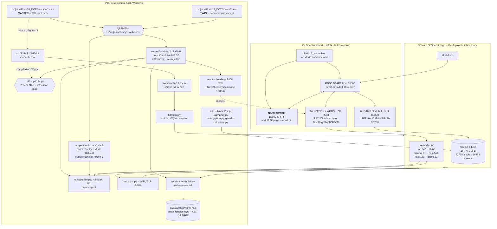
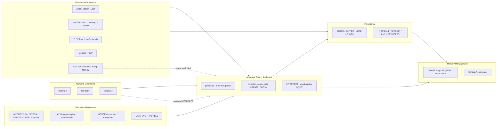

# vForth Next -- REVERSE ENGINEERING REPORT

**Repository:** `dev-F18` (`https://github.com/mattsteeldue/dev-F18`)
**Analysed at:** branch `main`, commit `02fffc4` ("fix: tutorial and help",
2026-09-23), 211 commits, working tree clean apart from the rename of the
previous edition of this report.
**Date of analysis:** 2026-09-24. **Core build analysed:** 2026-09-20.
**Host:** git root `D:\Zx\Forth\F18`, project subtree `tools/vForth/`.
**Language note:** English, per the repository's own convention
(`tutorial/CLAUDE.md` section 1: *"All source code, comments, and documentation:
English only"*), while author interaction happens in Italian.

**Predecessor:** `doc/ONBOARDING-2026-09-11.md` (formerly `doc/REVERSE-2026-09-11.md`) (the same report at commit
`7ef2c90`, build 2026-08-20). This edition re-derives every measurement from
scratch at the current commit; section 0 lists what actually changed, so a
reader who knows the old edition can start there.

---

## How to read this document

Every non-trivial claim carries a **confidence level** and the **file(s) it was
inferred from**. Where code and prose documentation disagree, the code wins and
the disagreement is called out explicitly:

> **DOC/CODE MISMATCH** -- what the document says vs. what the code does.

### Confidence legend

| Level | Meaning |
|---|---|
| **High** | Read directly from source or binaries, or produced by a command I ran in this session. |
| **Medium** | Inferred from consistent but indirect evidence (naming, structure, several corroborating files). |
| **Low** | Plausible reading with material gaps; stated as such, never asserted. |
| **Not determinable** | Explicitly declared unknown. No guess offered. |

### What was actually executed during this analysis

Unlike the previous edition, **the runtime was executed.** Concretely:

- `printf '.quit\n' | python emu/repl.py` -- full boot to the `ok` prompt,
  banner captured verbatim (see section 4.2). Exit code 0.
- `printf '1 2 + .\n1234 DUP * .\nWORDS\n.quit\n' | python emu/repl.py` --
  arithmetic verified (`3`, and `15428` = 1234*1234 truncated to 16 bits), and
  a **reproducible crash in `emu/repl.py` on `WORDS`** found (section 13.4, F5;
  **resolved 2026-09-25**).
- The same `WORDS` run with `PYTHONIOENCODING=utf-8` -- succeeded, dictionary
  listing captured.
- Mechanical counts and audits over `inc/`, `lib/`, `help/`, `test/`,
  `tutorial/`, the six assembled `.asm` files and the nine build-date
  locations; `md5sum` and banner extraction over every core binary in the tree;
  `diff` over all eight DOES/DOT source pairs.

**Not executed:** the SjASMPlus build (the assembler lives outside the repo at
`c:/Zx/sjasmplus/sjasmplus.exe`, absent on this host), CSpect, any sync, and
the release pipeline. Statements about build *output* derive from the committed
binaries and `list/main.lst`, not from a fresh assembly. Nothing outside
`doc/REVERSE.md` was written.

### Relationship to the other two analysis documents

| Document | Date / commit | Status |
|---|---|---|
| `doc/ONBOARDING-2026-09-04.md` (1764 lines; formerly `doc/ONBOARDING.md`) | 2026-09-04, `af403da` | Independent earlier pass. Still broadly accurate; its file counts and its `version/pkzip25.exe` note were partially refreshed by the author in `b53ae97`. Its stated git root (`/home/matteo/project/dev-F18`) matches neither this host nor `CLAUDE.md`. |
| `doc/ONBOARDING-2026-09-11.md` (1746 lines; formerly `doc/REVERSE-2026-09-11.md`) | 2026-09-11, `7ef2c90` | Direct predecessor of this file. Superseded; keep as the record of the 2026-08-20 build. |
| **this file** | 2026-09-24, `02fffc4` | Current. |

All three agree on the architecture. The divergences between this edition and
the 2026-09-11 one are in section 0 and section 13.4.

---

# 0. What changed since the 2026-09-11 edition

Fourteen substantive changes, each verified in this session. Sections in
brackets carry the detail.

1. **Core build 2026-08-20 -> 2026-09-20**, and the core *code* did not change:
   `forth18e.bin` is byte-identical to the August build (mtime 2026-08-20
   11:31, MD5 `a2485721dd10de7c46abfba7a87a26f9`); only `ram8.bin` changed.
   The reason is structural: the SPLASH banner text is emitted between
   `Start_Heap` / `End_Heap` in `L0.asm:60-70`, i.e. **into the heap page**, so
   a date-only bump moves bytes in `ram8.bin` alone. Every boot address is
   therefore unchanged from the previous edition. **Confidence: High** [4.2].
2. **`src/F18e.f` was promoted from "historical artifact" to verified readable
   core**, with a new skill `/check-f18e` and a new tool `util/cmp-f18e.py`
   (229 lines). The verification ran on 2026-09-20 and its log is in the tree:
   `ESITO: COERENTE`, 339 words, 7754 bytes compared, **0 unexplained bytes**,
   5 expected differences. This retires the worst part of the old risk R4
   ("three codebases, no tool enforces alignment") [2.2, 9.4, 13.1].
3. **`src/F18e.f` was reordered and linted** (commits `8ede761`, `5fbbacb`):
   162 805 -> **160 134 bytes**, 6648 lines. The lint found a real bug that the
   new tool caught: an unrenamed `mcod` where `code` was meant
   (`.claude/skills/check-f18e/SKILL.md` section 5) [13.5].
4. **A VS Code extension is now part of the product**: `tools/vforth-0.1.0`
   through `0.1.3` (`.vsix` + README, tracked). It is the *second consumer* of
   `src/F18e.f` -- its syntax highlighting is generated from that file's active
   `RENAME` table -- which is precisely why F18e.f had to become verifiable.
   It also introduces an `hdfmonkey`-based SD channel that works while CSpect
   is running, with no imdisk mount and no exclusive lock [2.2, 7.2, 10.2].
5. **`prompts/` was split into four directories** -- `planners/` (+`archive/`),
   `products/`, `situation/`, and a residual `prompts/` -- with **no
   documentation anywhere** and **no update to the three sync exclusion lists**
   [3.2, 13.4 D7].
6. **The `inc/` working-tree hazard flagged in the previous edition is closed.**
   The 24 stray untracked files are gone; 33 core-word reference copies were
   moved into `inc/doc/` (now 56 files, out of the `NEEDS` search path); the
   forbidden `NEEDS CODE` line no longer appears in any `.f` file; the
   never-implemented `inc/push.f` stub was deleted. `git status` is clean, 0
   untracked paths [13.5].
7. **`help/` grew 481 -> 551 files**, almost entirely core-word pages. Core
   coverage is now effectively complete: of the 335 core definitions carrying a
   literal name, **2 have no help page** (`.` and `\`, and `\` is in fact
   covered by the combined `help/_.txt`) [11.3].
8. **The `:` / `\` FAT filename collision is no longer latent.** It was
   resolved on 2026-08-26 exactly as `CLAUDE.md` prescribes -- `help/_.txt` is
   a combined entry pointing at `help/colon.txt` and `help/bslash.txt`. Both
   `CLAUDE.md` and the previous edition still describe it as latent
   [13.4 D2].
9. **The block-buffer starvation bug now has a designed fix**:
   `planners/PLAN-MITIGATION-BLOCK-1-BUG.md` (370 lines), status **PROPOSTO**,
   nothing implemented. It is the most rigorous document in the repository:
   a full audit of every core and library site that touches `BLK` or BLOCK 1,
   the two precedents in the core for special-casing BLOCK 1, the patch in both
   assembler and Forth form, and the memory cost (516 bytes, 2.5% of free
   dictionary) [13.3].
10. **A 67-tutorial audit was completed** (`planners/fix-tutorial-bugs-plan.md`,
    2026-09-23): 31 tabulated defects with file:line and fix, of which **4 are
    fixed** (commits `02fffc4` and the author's own). The rest are open, and
    the list is the best-specified backlog in the tree [11.4, 13.3].
11. **`pkzip25.exe` is now vendored in `util/` and tracked; poppler is not.**
    `util/pdftotext.bat` and `release-rebuild/SKILL.md` both now point at
    `util/poppler-26.02.0/...`, but `.gitignore` carries
    `tools/vForth/util/poppler*` and **the directory is absent from this
    checkout**. The release gate that checks the manual's internal PDF date
    therefore cannot run on a fresh clone. This *reverses* the previous
    edition's claim that poppler had been vendored [7.2, 10.3, 13.1 R2].
12. **`list/main.sld.txt` is two builds stale.** `list/main.lst` was
    regenerated for build 20260920 (`030e31c`); the SLD file was last committed
    at build 20260726 (`a4661f2`). DeZog consumes the SLD, so source-level
    debugging maps against an older core [13.4 D3].
13. **The dot-command is deployed in two places and both are stale**, at two
    different dates, while a third, current copy sits in the build output
    [8.4 mismatch #3, 10.2].
14. ~~**`emu/repl.py` crashes on any output containing a byte >= `$80`** when
    stdout is cp1252 -- `WORDS` triggers it every time.~~ **Resolved
    2026-09-25:** codes >= `$80` are now rendered by `emu/zxchars.py`
    (block graphics `$80-$8F` as quadrant glyphs or an ASCII approximation,
    `$90` and above as `<$NN>`), both in `repl.py` and in the default
    `emulator.py` `handle_emit`; `PYTHONIOENCODING=utf-8` is no longer needed
    [13.4 F5, 9.4].

Unchanged and re-verified: the 339-definition core, the boot addresses, the
memory map, the block-file arithmetic, the DOES/DOT source delta, the absence
of CI/CD, the absence of secrets, and the path divergence that stops the
tooling running on this host.

---

# 1. Executive Summary

## 1.1 Purpose of the software

**vForth Next** is a complete, self-contained **Forth implementation --
compiler, interpreter, editor, block filesystem and hardware library -- for the
Sinclair ZX Spectrum Next**, an FPGA re-implementation of the 1982 ZX Spectrum
with a Z80N CPU, 2 MB RAM, hardware sprites, several display layers and an
SD-card OS (NextZXOS / esxDOS).

It is not an application that happens to be written in Forth. It **is** the
language environment: the deliverable is a 9999-byte machine-code kernel plus an
8192-byte name-space page plus a 16 MB block file, which together turn the
machine into a Forth workstation.

- Evidence: `project/vForth18_DOES/source/main.asm:44`; `CLAUDE.md:16-22`;
  the two `SAVEBIN` directives at `main.asm:172-173`.
- Licence **MIT**, Copyright (c) **1990-2026 Matteo Vitturi** (`LICENSE.md`,
  `main.asm:18-37`, `src/F18e.f:4`). The 1990 start date, the `src/F15*.f`
  sources and the `project/vForth16_MDR_MGT/` tree evidence a **36-year
  lineage** carried forward from ZX Microdrive and MGT DISCiPLE hardware.
- **Confidence: High.**

## 1.2 Problems it solves

| Problem | How vForth solves it | Evidence |
|---|---|---|
| The Next ships no resident high-level language but NextBASIC, which is slow and cannot address memory at 8K-page granularity | A direct-threaded Forth whose primitives *are* Z80N machine code, plus `CODE` words and an on-machine `ASSEMBLER` vocabulary | `CLAUDE.md` "Compilation Model"; `lib/assembler.f`; `src/Z80N-Assembler-Dictionary.txt` |
| 64 KB Z80 address space vs. 2 MB of RAM | The dictionary is **split across two address spaces**: code at `$6366+` in the fixed window, names in an 8K MMU7-paged heap at `$E000-$FFFF` | `system.asm:123-176` (`New_Def`); `CLAUDE.md` "Memory Layout" |
| No editor and no source storage on a machine with no hosted development OS | A 16 MB **block file** (`!Blocks-64.bin`) holding 16383 1 KB Screens, edited in place by `EDIT`, interpreted by `LOAD` | `L3.asm` `BLOCK`/`LOAD`; `util/blocks2txt.pl` |
| A 10 KB kernel cannot contain everything | **`NEEDS`** -- a demand loader pulling `inc/<word>.f` or `lib/<module>.f` from the SD card only if the word is absent from the dictionary | `L3.asm:426` `Colon_Def NEEDS`; `inc/CLAUDE.md` |
| Next hardware (sprites, Layer 2/3, AY, DMA, UART, mouse, copper) is undocumented from Forth | 65 `lib/` modules, 67 numbered tutorials, 551 per-word `HELP` pages, all shipped on the SD card | `lib/`, `tutorial/`, `help/` |
| Self-hosted compilation on real hardware is too slow for daily work | The core was re-expressed in SjASMPlus Z80N assembly; the self-compiling Forth source is kept readable **and now machine-verified** against the assembled core | `project/CLAUDE.md`; `.claude/skills/check-f18e/SKILL.md`; `util/cmp-f18e.py` |
| A Forth source tree is hostile to ordinary editors (punctuation names, FAT mapping, `NEEDS` closure) | A VS Code extension generated *from the core source*: highlighting, `NEEDS` diagnostics, hover `HELP`, go-to-definition, and direct Screen/Block editing inside the SD image | `tools/vforth-0.1.3.README.md` |

**Confidence: High** for every row -- each traces to a named file.

## 1.3 Principal users

Inferred from artifacts; never declared anywhere in the repository.

1. **The author** -- effectively a single maintainer (211 commits, `mvitturi` /
   `mattsteeldue` dominant). He alone runs the release pipeline, which hardcodes
   `C:\Zx\...` paths on his own machine.
2. **ZX Spectrum Next hobbyists** who download the published ZIP
   (`vForth_18_NextZXOS_<build>.zip`, produced by `version/new-build.bat`) and
   unpack it onto an SD card. They consume `tutorial/`, `help/`, `demo/` and the
   PDF manual.
3. **Forth implementers and retro-computing students** reading `src/F18e.f` to
   study a complete Forth kernel written in idiomatic Forth.
4. **VS Code users of the extension** -- a new, distinct audience since the
   previous edition. They never read the assembler, but they read `src/F18e.f`
   indirectly through the extension's generated grammar, which is why
   `CLAUDE.md` now says a dirty F18e.f "is immediately visible to its users".
5. **LLM coding assistants** -- unusual but real: two `.claude` trees provide
   10 slash commands, **6** skills and a review agent, and six `CLAUDE.md` files
   act as the operating manual. The release pipeline is *implemented* as a
   skill, not as a script.

**Confidence: Medium-High.** (1), (2) and (4) are strongly supported by the
release scripts, the public-repo references and the extension README; (3) and
(5) are inferred from file purpose.

## 1.4 Principal functional flows

**A. Develop the core (PC side).**
Edit `project/vForth18_DOES/source/*.asm` -> `/build DOES` runs SjASMPlus ->
`output/forth18e.bin` (9999 B) + `output/ram8.bin` (8192 B) -> smoke-test in the
headless emulator -> copy both to `tools/vForth/` -> mirror the change into
`project/vForth18_DOT/` -> `/build DOT` -> concatenate `vforth.1` + `vforth.2`
-> `dot/vforth` (16384 B) -> update `src/F18e.f` by hand -> **`/check-f18e`**.
*Source: `.claude/commands/build.md`, `main.asm:172-173`,
`project/vForth18_DOT/output/concat.bat`, `.claude/skills/check-f18e/SKILL.md`.*

**B. Develop a library word (SD side).**
Write `inc/<word>.f` or `lib/<MODULE>.f` -> write `help/<word>.txt` -> write
`test/<word>.f` and register it in `test/CORE-TESTS.f` -> push it to the CSpect
SD image (either `/sync-cspect` for the whole tree, or *vForth: Send file to SD
image* from the extension for one file with CSpect still running) or to real
hardware over WiFi (`nextsync.py`) -> load with `NEEDS <WORD>` at the `ok`
prompt.
*Source: `inc/CLAUDE.md`, `help/CLAUDE.md`, `test/CLAUDE.md`,
`.claude/skills/sync-cspect/`, `tools/vforth-0.1.3.README.md`.*

**C. Boot on the machine.**
`Forth18_loader.bas` does `CD "C:/tools/vForth"`, `LOAD "ram8.bin" BANK 16`,
`LOAD "forth18e.bin" CODE 25446`, `RANDOMIZE USR 25446` -> `ColdRoutine` ->
`COLD` -> `WARM` -> `BLK-INIT` (opens `!Blocks-64.bin`) -> `ABORT` ->
`AUTOEXEC` (`11 LOAD`) -> `INCLUDE lib/autoexec.f` -> `SPLASH` -> `ok`.
*Source: the detokenised body of `Forth18_loader.bas` (read in this session),
`L0.asm:8-13`, `L2.asm`, `lib/AUTOEXEC.f`. Verified by execution, section 4.2.*

**D. Release.**
`/release-rebuild YYYYMMDD` -> gate on the hand-prepared `.odt`/`.pdf` manual ->
`/bump-build` (stamp the date in **nine** files, rebuild both variants) ->
`perl util/blocks2txt.pl` -> `/sync-cspect` -> `version/new-build.bat` copies
into the **separate public repository** `c:\Zx\GitHub\vforth-next` and builds the
download ZIP -> update `HISTORY.txt` there.
*Source: `.claude/skills/release-rebuild/SKILL.md`,
`.claude/skills/bump-build/SKILL.md:31-41`, `version/new-build.bat`.*

---

# 2. System Overview

## 2.1 High-level architecture

The system is a **cross-development pipeline plus a self-hosted runtime**, with
the SD-card filesystem as the boundary. Four properties are unusual enough that
you should internalise them before reading any code:

1. **The dictionary lives in two disjoint address spaces.** A word's *name*
   (name field, link, xt pointer) is written into an 8K page mapped at
   `$E000-$FFFF` through MMU7; the word's *code* is written at `HERE` in the
   fixed `$6366+` window. The `New_Def` macro in `system.asm:123` performs both
   writes by flipping the assembler's `org` back and forth at assembly time --
   so the dictionary link chain is literally a side effect of `include` order in
   `main.asm:150-155`. **Confidence: High.**
2. **There is no build system.** No Makefile, no CMake, no npm/pip manifest, no
   CI. The build is one SjASMPlus invocation documented in a Markdown slash
   command; the release is a `.bat` file plus a skill. **Confidence: High**
   (searched for `.github`, `Makefile`, `*.yml`, `*.yaml`, `package.json`,
   `pyproject.toml`, `requirements.txt`, `Dockerfile`, `Jenkinsfile`,
   `.gitlab-ci.yml` -- **all absent**).
3. **The block file is simultaneously the source repository, the error-message
   table, the boot script and a scratch buffer.** `!Blocks-64.bin` is 16 MB of
   512-byte blocks; Screens 2-9 are reserved for the system, Screen 11 is the
   autoexec hook, Screen 12 upwards is user source -- and BLOCK 1 doubles as the
   line buffer of `F_INCLUDE`. That last overload is the source of the system's
   worst bug. **Confidence: High** (`CLAUDE.md` reserved-screens table; BLOCK 1
   dumped in this session; `L3.asm:250`).
4. **Correctness of the readable core is now a tool, not a promise.** Since
   2026-09-20, `src/F18e.f` is compared against the assembled core through a
   relocation map rather than trusted. **Confidence: High**
   (`util/cmp-f18e.py`; `forth18-cmp.log` in the tree).

## 2.2 Principal components

| Component | Location | Size / count | Role |
|---|---|---|---|
| `system.asm` | `project/*/source/` | 245 lines | Z80 register contract, dictionary-entry macros (`New_Def`, `Colon_Def`, `Constant_Def`, `Variable_Def`, `User_Def`), memory-layout equates. **This file is the dictionary compiler.** |
| `L0.asm` | same | 2180 lines, **83 defs** | Origin block, SPLASH text (in the heap), inner interpreter (`Next_Ptr`), stack / arithmetic / memory primitives, `(FIND)`, `ENCLOSE`, `CMOVE`, `(EMITC)`, `(CLS)`, `KEY`, `SELECT`. Includes `next-opt0.asm` at line 1169. |
| `next-opt0.asm` | same | 252 lines, **9 defs** | esxDOS / NextZXOS file syscalls: `F_OPEN` `F_CLOSE` `F_READ` `F_WRITE` `F_SEEK` `F_FGETPOS` `F_SYNC` `F_OPENDIR` `F_READDIR`. |
| `L1.asm` | same | 1711 lines, **146 defs** | The compiler proper: `:` `;` `CONSTANT` `VARIABLE` `USER` `<BUILDS`/`DOES>` `CREATE` `LITERAL` `WORD` `NUMBER` `ERROR`, plus the MMU7 heap words `MMU7@` `MMU7!` `>FAR` `<FAR` `FAR` `HP@` `SKIP-HP-PAGE`. |
| `L2.asm` | same | 550 lines, **29 defs** | `INTERPRET`, `VOCABULARY`, `FORTH`, `DEFINITIONS`, `QUIT`, `ABORT`, `WARM`, `COLD`, `BASIC`, mixed-precision math (`M*` `SM/REM` `FM/MOD` `*/`), `MESSAGE`. |
| `next-opt1.asm` | same | 187 lines, **10 defs** | `REG@` / `REG!` (NextReg via ports `$243B`/`$253B`), `M_P3DOS`, `BLK-FH`, `BLK-FNAME`, `BLK-SEEK/READ/WRITE`, `BLK-INIT`. |
| `L3.asm` | same | 1021 lines, **62 defs** | Block I/O (`R/W` `+BUF` `UPDATE` `BUFFER` `BLOCK` `FLUSH` `LOAD` `-->`), file inclusion (`F_GETLINE` `F_INCLUDE` `OPEN<` `INCLUDE`), `NEEDS` and the FAT filename mapper `MAP-FN` (`NDOM_PTR`/`NCDM_PTR` at lines 366-379), pictured output, `WORDS` `LIST` `INDEX`, control structures, `SPLASH`, `AUTOEXEC`, `MARKER`, `FORGET`. |
| `src/F18e.f` | `tools/vForth/src/` | **160 134 B**, 6648 lines | The same kernel in self-compiling Forth. Readable reference, hand-maintained, **verified against the binaries by `/check-f18e`**. |
| `inc/` | repo | **247** tracked word files (226 plain + 21 dot-prefixed) + **56** in `inc/doc/` | One Forth word per file, demand-loaded by `NEEDS`. `inc/doc/` holds read-only copies of core words and is outside the search path. |
| `lib/` | repo | **65** modules (+15 in `lib/doc/`) | Multi-word feature modules: graphics layers, AY sound, mouse, floating point, fixed point, locals, editor, decompiler, persistence, UART/RPi0, sprites, tilemap. |
| `help/` | repo | **551** `.txt` (530 plain + 21 dot-prefixed) | One short help page per word, displayed by `HELP`. |
| `test/` | repo | **160** `.f`, 8 suites, **1158** `T{` assertions | ANS-Forth conformance and regression tests -- run **on the target**, not on the PC. |
| `tutorial/` | repo | **67** numbered `.f` (`000-HELP.f` .. `066-kempston-joystick.f`) + `afx/`, `bmp/` assets | Progressive guided tutorials, dispatched by `lib/TUTORIAL.f` (`TUT-MAX = 66`). |
| `emu/` | repo | 24 tracked files | Headless Z80N CPU + NextZXOS syscall model + REPL. The only PC-side test harness. |
| `util/` | repo | 23 tracked files (Perl / Python / PowerShell / `pkzip25.exe`) | Block dump, ODT hygiene, SD sync, asm-to-hex, maze generator, dictionary-structure generator, **`cmp-f18e.py`**. |
| `tools/` | repo | `vforth-0.1.0..0.1.3.vsix` + READMEs, `lint_tutorial.py` | The VS Code extension, shipped as built `.vsix`. **Its source is not in this repository** -- `prompts/SYNC-TREE-HDFMONKEY-PLAN.md:2-3` places it at `github.com/mattsteeldue/vscode-vforth`, locally `C:\Zx\GitHub\vscode-vforth\`. |
| `.claude/` | `tools/vForth/.claude/` | 10 commands, **6** skills, 1 agent | **The process automation.** This is where the CI/CD equivalent actually lives. |

> **Word-count method.** I counted uncommented `New_Def | Colon_Def |
> Constant_Def | Variable_Def | User_Def` macro invocations across the six
> assembled files: **339 total** (83 + 9 + 146 + 29 + 10 + 62). **335** of them
> carry a literal quoted name; the remaining 4 use a symbolic name byte (e.g.
> `Colon_Def NUL_WORD, $00, is_immediate` at `L1.asm:1660`). A handful create
> data buffers rather than callable words (`NEEDS-W`, `NEEDS-FN`, `NEEDS-INC`,
> `NEEDS-LIB` at `L3.asm:330-340`), so treat **339 as an upper bound** on
> user-visible core words. **Independently corroborated:** `forth18-cmp.log`,
> produced by `util/cmp-f18e.py` walking the heap chain in `ram8.bin`, reports
> `Parole : 339 nel riferimento`. **Confidence: High.**

## 2.3 Architecture diagram



## 2.4 Dependencies between components

**Build-time (breaking these breaks the assembly):**

- `main.asm` -> `system.asm` -> `L0.asm` (-> `next-opt0.asm`) -> `L1.asm` ->
  `L2.asm` -> `next-opt1.asm` -> `L3.asm`. **Include order is semantically
  significant**, not conventional: `system.asm`'s macros thread the `Heap_Ptr` /
  `Prev_Ptr` / `Dict_Ptr` / `Latest_Definition` assembler symbols through every
  subsequent definition, so the dictionary link chain and the heap watermark are
  assembly-time state. Reordering two includes silently produces a different --
  and wrong -- dictionary. **Confidence: High** (`main.asm:150-155`,
  `system.asm:123-176`).
- `emu/repl.py:27-28` **hardcodes** `project/vForth18_DOES/output/forth18e.bin`
  and `ram8.bin`. **There is therefore still no emulator harness for the DOT
  variant.** **Confidence: High.**
- `util/cmp-f18e.py` depends on `project/vForth18_DOES/output/{forth18e,ram8}.bin`
  being current: the skill states the prerequisite explicitly
  (`check-f18e/SKILL.md`, "Prerequisito"). A stale reference silently makes the
  comparison meaningless.

**Runtime (resolved on the machine, at load time):**

- `NEEDS X` -> try `inc/X.f`, then `lib/X.f`, else print the name and message 43
  ("File not found"). Path constants are counted strings `NEEDS-INC` /
  `NEEDS-LIB` created at `L3.asm:337-340`; `MAP-FN` (`L3.asm:380`) applies the
  FAT character mapping from the 9-entry `NDOM_PTR`/`NCDM_PTR` tables at
  `L3.asm:366-379`; the search itself is the threaded code at `L3.asm:426`.
  **Confidence: High** (read the `dw` thread, not the prose).
- `INCLUDE` / `NEEDS` -> `F_INCLUDE` -> **BLOCK 1 used as the line buffer**
  (`L3.asm:250`, `1 BLK !` at `L3.asm:259`) -> the shared 6-buffer pool ->
  `WORD` re-acquiring the buffer address on every token (`L1.asm:1200-1204`).
  This couples file inclusion to block I/O and produces the system's nastiest
  bug (13.3.2). **Confidence: High** (all four sites enumerated in
  `planners/PLAN-MITIGATION-BLOCK-1-BUG.md` section 3.1, which I spot-checked).
- `lib/*` -> `inc/*` via `NEEDS` headers. Mechanical count over the 312 files
  in `inc/` + `lib/` (386 `NEEDS` lines): most-depended-upon targets are
  `GRAPHICS-COMMON` (**21** referrers), `ASSEMBLER` (13), `FLIP` (11), `SPLIT`
  (10), `[']` (9), `FAR` / `IDE_MODE!` / `UART-SYS` / `.BORDER` (8 each),
  `PICK` / `BINARY` / `CASE` (7 each). Heaviest consumers: `lib/GRAPHICS.f`
  (14 `NEEDS`), `lib/AUTOEXEC.f` (11), `lib/GRAPHICS-COMMON.f` (10),
  `inc/line-editor.f` / `lib/see.f` / `lib/testing.f` (9 each).
  **Confidence: High.**
- **Two libraries patch the core at load time** -- `lib/floating.f` rewrites the
  `NUMBER` call inside `INTERPRET` to `FNUMBER`; `lib/assembler.f` replaces the
  `NOOP` placeholder inside `;CODE` with the ASSEMBLER vocabulary. This is the
  most invasive coupling in the system and the reason `MARKER` cannot unload
  them. **Confidence: High** (`lib/CLAUDE.md` "Patch-requiring libraries";
  corroborated by the still-open `TODO.md` entry on the missing
  `NO-ASSEMBLER`).

---

# 3. Repository Map

The git root (`D:\Zx\Forth\F18` on this host) is **not a normal source root**: it
is a **mirror of the ZX Spectrum Next SD-card filesystem**. The nextsync WiFi
utility copies it verbatim to the machine, which is why the root holds
`nextsync.py`, `syncpoint.dat` and `syncignore.txt` alongside the project.
`.gitignore` excludes `dot/`, `home/`, `nextzxos/`, `tools/vForth/version/`,
`tools/vForth/util/poppler*` and `tools/xxx_vForth/`, so several directories
present on disk are deliberately untracked. **Confidence: High**
(`CLAUDE.md` "General development principle"; `.gitignore`; `syncignore.txt`).

## 3.1 Git-root level

| Path | Contents | Why it exists | Importance |
|---|---|---|---|
| `tools/vForth/` | **The entire project.** | Its SD-card path is `C:/tools/vForth` on the Next; the loader does `CD "C:/tools/vForth"`. | **Critical** |
| `dot/` *(untracked)* | `vforth` (16 KB dot-command, **build 2026-01-01**), `term0` | NextZXOS dot-commands live in `/dot` at the SD root. This is the copy nextsync pushes to real hardware. | High |
| `nextsync.py`, `sync*`, `syncignore.txt`, `syncpoint.dat` | Jari Komppa's NextSync v4 server (2020), third-party, vendored | Pushes the tree to real hardware over WiFi (TCP 2048). | Medium |
| `home/` *(untracked)* | `vForth20/`, `exer/`, `tutorial/`, `Mouse/`, `RaspPI0/` | End-user SD content and the public-facing README. | Low for development |
| `nextzxos/` *(untracked)* | `browser.cfg`, `*.sys`, menus, `autoexec.bas` | NextZXOS configuration shipped on the card. The extension's *Run file in CSpect* swaps `autoexec.bas` temporarily. | Low |
| `tools/xxx_vForth/` *(gitignored)* | An older working copy | Historical. Ignore. | None |

## 3.2 `tools/vForth/` level

| Path | Contents | Why it exists | Importance |
|---|---|---|---|
| `project/` | `vForth18_DOES/` (master), `vForth18_DOT/` (twin), `vForth16_MDR_MGT/` (historical). Each has `source/`, `output/`, `list/`. | **The authoritative core source.** All core changes originate in `vForth18_DOES/source/`. | **Critical** |
| `src/` | `F18e.f` (current) plus `F15a/F15b/F15m/F16c/F16m/F17d/F17e`, `Z80N-asm.f`, `Z80N-Assembler-Dictionary.txt` | Self-compiling Forth form of the kernel; readable reference and historical archive. | High |
| `inc/` | **247** tracked word files + `inc/doc/` (**56** read-only copies of core words) | On-demand word loading; keeps the resident dictionary small. | **Critical** |
| `lib/` | **65** multi-word modules + `lib/doc/` (15) | Feature and hardware subsystems. | **Critical** |
| `help/` | **551** `.txt`, one per word, max 21 lines each | Backs the on-machine `HELP` command and the extension's hover. | High |
| `test/` | **160** `.f`; 8 suites; 1158 `T{` assertions | ANS conformance + regression, executed on the target. | High |
| `tutorial/` | **67** `NNN-slug.f` + `afx/`, `bmp/` assets (377 tracked paths in total) | Progressive learning path; dispatched by `lib/TUTORIAL.f`. | High |
| `emu/` | Python headless Z80N emulator, REPL, 9 `test_*.py` | The **only** automated PC-side verification. | **Critical for dev loop** |
| `util/` | `blocks2txt.pl`, `putscr.pl`, `asm2hex.py`, `odt-hygiene.py`, `gen-dict-structure.py`, **`cmp-f18e.py`**, `chomp-maze.py`, `patch0block.py`, `pkzip25.exe`, `sync2sd.ps1`, `verify2sd.ps1`, `mountw.ps1`, `sd-sync.config.ps1`, `blank-blocks.ps1` | Build-adjacent tooling. `sd-sync.config.ps1` is the single source of truth for sync paths and guards. | High |
| `tools/` | The VS Code extension `.vsix` (4 versions) + READMEs, `lint_tutorial.py` | Ships the editor integration. Note the confusing nesting: `tools/vForth/tools/`. | High |
| `dev/` | `DMA.f`, `IM2-HW.f` (tracked) | Staging area for modules not yet promoted to `lib/`. `dev/DMA.f` is what blocks tutorial 054. | Low but **actionable** |
| `demo/` | 23 `.f` + `chomp-chomp/`, `chomp-chomp-next/`, BMP assets | Example programs and games; also the proving ground for new libraries. | Medium |
| `doc/` | Reference conversions (`NextZXOS_and_esxDOS_APIs.md`, `zx-next-dev-guide-r3.md`, `tilemap.md`, `AY-3-8910.md`, ...), the `.odt`/`.pdf` manuals (three builds kept), `ONBOARDING-YYYY-MM-DD.md` (the dated editions of this report), `previous/`, `txt/`, `manual/` | The manual is **hand-maintained and must never be edited automatically**. | High |
| `planners/` | 9 plans + `archive/` (7 closed ones) | Design record for work in flight. **Not documented in `CLAUDE.md`.** | Medium (design rationale) |
| `products/` | 14 deliverable texts: manual paragraphs awaiting paste into the `.odt`, community posts, transcripts | Output destined for somewhere else. **Not documented.** | Medium |
| `situation/` | 5 status and gap-analysis snapshots | Point-in-time state. **Not documented.** | Low-Medium |
| `prompts/` | Residue after the split: `SYNC-TREE-HDFMONKEY-PLAN.md`, `grok/`, `mmu7-nasty-bug.txt` | The directory `CLAUDE.md` still names as *the* place for plans. | Low |
| `version/` *(gitignored)* | Dated build snapshots + `new-build.bat`, `new-version.bat`, a leftover unused `pkzip25.exe` | Historical releases; **never modify**. Holds the release pipeline scripts. | Medium |
| `forum/` | 36 community-contributed `.f` | Third-party/contributed samples. | Low |
| `.claude/` | 10 commands, **6** skills, 1 agent, `settings.json` | Executable process documentation. | High |
| `!Blocks-64.bin` | 16 777 216 B | The block/Screen store -- see section 6. | **Critical** |
| `forth18e.bin`, `ram8.bin` | 9999 B / 8192 B | **Deployed** core binaries; MD5-identical to `project/vForth18_DOES/output/` at this commit (verified). | **Critical** |
| `dot/` *(untracked)* | `vforth` (**build 2026-08-20**), `term0`, `sync` | The copy `/sync-cspect` pushes to the CSpect image (`$SyncDotSource = Join-Path $SyncSource 'dot'`, `util/sd-sync.config.ps1:61`). Distinct from the root `dot/`. | High |
| `forth18_.bin`, `forth18-cmp.log`, `out.txt`, `dump_main.bin` | 10127 B / 1491 B / 0 B / 0 B | Artifacts of the last `/check-f18e` run and older scratch files, **tracked in git although `check-f18e/SKILL.md` says not to commit them** (13.4 D6). | None |

> **Naming note.** This report was requested at `docs/REVERSE.md`. The
> repository's own convention is `doc/` under `tools/vForth/`, and the author
> moved the previous edition there (commit `17ff5a6`, `{docs => tools/vForth/doc}`).
> This edition is therefore written straight to `tools/vForth/doc/REVERSE.md`,
> with the predecessor kept beside it as `doc/REVERSE-2026-09-11.md`.
> **Confidence: High.**

---

# 4. Runtime Architecture

## 4.1 Entry points

| Entry | Address / trigger | Variant | Source |
|---|---|---|---|
| `Cold_origin` | `$6366` -- `and a` (clears carry = cold) then `jp ColdRoutine` | DOES | `L0.asm:8-10` |
| `Warm_origin` | `$636A` -- `scf` (sets carry = warm) then `jp WarmRoutine` | DOES | `L0.asm:11-13` |
| Dot-command | `.vforth` at `ORIGIN $2000` (`DEBUGGING equ 1`), one optional filename parameter parsed from BASIC's HL up to `:` or `$0D` | DOT | `project/vForth18_DOT/source/main.asm:83,106`; `L2.asm:283-330` (DOT only) |
| DeZog debug | `ORIGIN $8080` when `DEBUGGING equ 1` | DOES | `main.asm:115-116` |
| Binary-compare builds | `DEBUGGING equ -1` (`ORIGIN $6366-$80`, 128 padding bytes) or `-2` (`ORIGIN 38949-$80`) | both | `main.asm:85-99,127-129` |
| Headless emulator | `PC=$6366`, `SP=$D2F8`, carry clear | PC | `emu/emulator.py`; confirmed by the run in 4.2 |

The carry flag **is** the cold/warm selector -- `and a` versus `scf` before the
jump. **Confidence: High** (read directly).

> Correction to the previous edition: it attributed `Heap_Ptr $1F80` /
> `Heap_offset $2000` to the DOT variant. Those belong to DOT's
> `DEBUGGING == -2` branch (`main.asm:90`). The **active** branch of both
> variants uses `Heap_Ptr defl $0002` and `Heap_offset defl 0`
> (DOES `main.asm:109-110`, DOT `main.asm:107-108`). **Confidence: High.**

## 4.2 Startup sequence (classic / DOES variant), executed

Addresses are measured from this build's `project/vForth18_DOES/list/main.lst`,
not copied from prose. They are **unchanged from the previous edition**, because
`forth18e.bin` did not change between builds 2026-08-20 and 2026-09-20 (only the
heap page did -- see section 0.1).

```
Forth18_loader.bas
  CD "C:/tools/vForth"
  LOAD "ram8.bin" BANK 16        <- the name space / heap page
  LOAD "forth18e.bin" CODE 25446 <- $6366, the code space
  RANDOMIZE USR 25446
        |
        v
$6366  Cold_origin : and a ; jp ColdRoutine
        |   ColdRoutine self-initialises SP/DE/BC/IX from
        |   S0_origin/R0_origin/Cold_Start/Next_Ptr in the origin block
        v
$7622  COLD    -- EMPTY-BUFFERS, NMODE, FIRST/PREV/USE, then falls into WARM
        v
$7619  WARM    -- calls BLK-INIT, then ABORT
        v
$78DE  BLK-INIT -- close any open BLK-FH, then F_OPEN "!Blocks-64.bin"
        v
$75F6  ABORT   -- S0 SP! , R0 RP! , then AUTOEXEC (first time only)
        v
$800F  AUTOEXEC -- 11 LOAD   (Screen 11, user-configurable)
        |             -> INCLUDE lib/autoexec.f
        v
$7FEB  SPLASH  -- banner (see the captured output below)
        v
$75BA  QUIT    -- QUERY / ACCEPT loop -> the interactive `ok` prompt
                  ($7518 INTERPRET is the inner text interpreter)
```

**Captured verbatim from `printf '.quit\n' | python emu/repl.py` in this
session** (exit code 0):

```
Loaded 9999 bytes from ...\project\vForth18_DOES\output\forth18e.bin at $6366
Loaded 8192 bytes from ...\project\vForth18_DOES\output\ram8.bin at $E000
Cold start: PC=$6366 (entry runs ColdRoutine self-init)
Booting vForth ...
Autoexec  v-Forth 1.8 - NextZXOS version
 Heap Vocabulary - build 2026-09-20
 MIT License (c) 1990-2026 Matteo Vitturi

Core Version: 15.15.255
DOSVER M_DOSVERSION
NextZXOS v. : 3.7C
CPU Speed   : 28.0 MHz
Dictionary  : 20740 bytes free.
Heap        : 62175 bytes free.
Free space  : 6553.5 Mbytes free on default drive.
.NOW .FAT-TIME .FAT-DATE IDE_RTC
Current time: 2045-08-07 00:14
Autoexec asks: Do you wish to load utilities ? (Y/n)nok
```

Four observations from the run, all **Confidence: High**:

- The banner's build date is the single best health check for the whole
  pipeline; `.claude/commands/build.md` step 6 makes it the deploy gate.
- **20740 bytes of dictionary and 62175 bytes of heap are free at boot.** The
  heap figure exceeds one 8K page because a heap pointer spans up to 8 pages
  (see 5.3.7).
- `Current time: 2045-08-07` is the emulator's RTC model, not a defect of the
  core.
- The `(Y/n)` prompt is `ASK-Y/N`, defined inside `lib/AUTOEXEC.f` behind
  `MARKER FORGET-THIS-TASK-3` and forgotten before `QUIT` -- which is why
  `help/ask-y%n.txt` documents a word a user can never call (`TODO.md`,
  2026-09-23).

Three behaviours here are load-bearing and non-obvious:

1. **`BLK-INIT` failure is non-fatal but leaves the system inconsistent.** If
   `F_OPEN` on the block file fails, boot still proceeds to `ABORT` and reaches
   the `Ok` prompt -- with no working `BLOCK`/`LOAD`/`EDIT`. **Confidence: High**
   (`CLAUDE.md` Boot Sequence, consistent with `next-opt1.asm` `BLK_INIT`).
2. **`AUTOEXEC` self-disables by rewriting its own call site.** On first
   execution it patches the `dw AUTOEXEC` slot inside `ABORT` to a `NOOP`, so
   every subsequent `COLD`/`WARM`/`ABORT` skips it. This is why a second `COLD`
   does not re-print the banner. **Confidence: High** (`CLAUDE.md`; listing
   comment `dw AUTOEXEC // autoexec, patched to noop`).
3. **`ERROR` ends in `QUIT`, not `ABORT`.** `QUIT` resets `STATE` and the return
   stack but **not** `CONTEXT`/`CURRENT`. Code that temporarily switches
   vocabulary must restore it itself. **Confidence: High** (`CLAUDE.md`
   error-reporting section; `L2.asm`).

> **DOC/CODE MISMATCH #1 (unchanged, still open).**
> `CLAUDE.md` "Boot Sequence" lists `COLD $7616`, `WARM $760D`,
> `BLK-INIT $78D2`, `ABORT $75EA`, `AUTOEXEC $8003`, `SPLASH $7FDF`.
> The current build gives `COLD $7622`, `WARM $7619`, `BLK-INIT $78DE`,
> `ABORT $75F6`, `AUTOEXEC $800F`, `SPLASH $7FEB` -- **every address is exactly
> 12 (`$0C`) bytes higher**. Source: `list/main.lst:17066` (`>COLD:` at `7622`).
> *Impact:* a breakpoint set from the `CLAUDE.md` table lands 12 bytes early,
> inside the preceding word. Treat the listing as the only address authority.
> **Confidence: High.**

## 4.3 The inner interpreter and the two address spaces

vForth is **direct-threaded** (claimed +25% over indirect threading,
`CLAUDE.md`). The consequences are visible in three places:

- **`next` is `jp (ix)`**, and `IX` permanently holds `Next_Ptr`. The macro is
  two bytes and 2 T-states faster than `jp <addr>` (`system.asm:60-63`).
- **`Next_Ptr` itself** is `ld a,(bc) / inc bc / ld l,a / ld a,(bc) / inc bc /
  ld h,a / jp (hl)` -- fetch the next xt into HL from the IP, then jump straight
  into it (`L0.asm:88-105`). For a `CODE` word, HL points at real Z80 machine
  code; for a colon definition, at a 3-byte `call Enter_Ptr`.
- **Every dictionary entry is split.** `New_Def` (`system.asm:123`) writes the
  name-field part at `(Heap_Ptr & $1FFF) + $E000` and the code part at
  `Dict_Ptr`, linking them with a mirror pointer:

```
NAME SPACE ($E000-$FFFF, MMU7 8K page)     CODE SPACE (from $6366)
  [len | END_BIT | flags]                    [ mirror_Ptr - $E000 ]   <- back-pointer
  [name bytes, last byte | END_BIT]          [ call Enter_Ptr ]       <- if colon def
  [ link -> previous NFA ]                   [ actual Z80 code / dw thread ]
  [ xt -> Dict_Ptr + 2 ]  --------------->
```

Flag bits live in the length byte: `SMUDGE_BIT $20`, `IMMEDIATE_BIT $40`,
`END_BIT $80` (`system.asm:82-84`). The mirror pointer is also what
`util/cmp-f18e.py` reads to recover each word's heap displacement when
comparing two compilations. **Confidence: High.**

## 4.4 Z80 register contract

The single most important thing to learn before touching a `CODE` word.
Violating it corrupts the interpreter in ways that surface far from the cause.

| Register | Role | Rule |
|---|---|---|
| `BC` | **Instruction Pointer** (Forth IP) | Must be preserved across ROM/OS calls |
| `DE` | **Return Stack Pointer** | Must be preserved across ROM/OS calls |
| `HL` | W -- working register | Free |
| `SP` | **Data (calculation) stack pointer** | The Z80 hardware stack *is* the Forth data stack |
| `IX` | Inner-interpreter `next` address | Must always hold `Next_Ptr` |
| `IY` | ZX system variables base (`$5C3A`) | Reserved by the ROM's 50 Hz interrupt |
| `BC' DE' HL'` | Extra W registers | Customary to `EXX` into "machine-code scope" |

Source: `main.asm:52-67`, `system.asm:7-12`, `CLAUDE.md`. **Confidence: High.**

## 4.5 Memory layout -- computed, not hardcoded

`system.asm:230-236` derives the whole low-memory map from one constant:

```
LIMIT_system  = $E000                          ; first byte past the last buffer
BUFFERS       = 6
FIRST_system  = LIMIT_system - 516*BUFFERS = $D3E8  ; first block buffer
USER_system   = FIRST_system - 80          = $D398  ; user-variable area
R0_system     = USER_system                = $D398  ; return stack top (grows down)
TIB_system    = R0_system - 160            = $D2F8  ; terminal input buffer (grows up)
S0_system     = TIB_system                 = $D2F8  ; data stack top
```

`516 = 512 data + 4 bytes` of per-buffer bookkeeping (block number + flags).
Below that: BASIC RAMTOP `$61FF`, the IM-2 vector table at `$6200`, core origin
`$6366`. **Confidence: High.**

Two facts worth knowing about this block:

- **The equates are byte-identical in both variants.** `diff` over
  `system.asm` DOES vs DOT shows only an unused `psh2` macro and comments.
  So `CLAUDE.md`'s "only ... MMU7 8K page allocation differ" does *not* mean
  different equates: what differs is the DOT prologue's runtime **save and
  restore of MMU2..MMU7** (`Saved_MMU db 0,0,0, 0,0,0` at
  `project/vForth18_DOT/source/L2.asm:272`), together with `Saved_Speed` and
  `Saved_Layer`. **Confidence: High** (diff run in this session).
- **A 7-buffer layout is not hypothetical.** The commented-out block at
  `system.asm:239-244` holds `FIRST_system: equ $D1E4`, which is exactly
  `$E000 - 516*7` -- the layout the system used in the past, and the one
  `planners/PLAN-MITIGATION-BLOCK-1-BUG.md` proposes returning to. A stale
  comment in `src/F18e.f` still says *"There are 7 buffers"*.
  **Confidence: High** (both cited by the plan, section 4A).

**Banks versus pages -- the most common newcomer error.** NextBASIC and NextZXOS
allocate in **16K banks**; the MMU maps **8K pages**. One 16K bank = two 8K
pages. `MMU7!`/`MMU7@` take an **8K page** number (`L1.asm:419-433`, range
0..223); NextReg `$12` (Layer 2 RAM bank) takes a **16K bank** number. The
loader's `LOAD "ram8.bin" BANK 16` is a 16K-bank operation; the heap it feeds is
addressed as 8K pages. Never write "16K bank via MMU7". **Confidence: High**.

## 4.6 Inter-module communication

There is no message bus, no RPC, no IPC. Communication happens by four
mechanisms only:

1. **The data stack.** Every word's contract is its stack effect comment
   `( before -- after )`. This is the entire API surface.
2. **The dictionary.** `NEEDS` resolves a name; late binding via `DEFER`/`IS`
   (`inc/defer.f`, `inc/is.f`) where indirection is wanted.
3. **Direct thread patching.** `lib/floating.f` and `lib/assembler.f` overwrite
   cells inside already-compiled core definitions. `lib/TUTORIAL.f` uses the
   gentler "stub + patch" variant (`' LOAD-TUTORIAL ' TUTORIAL >BODY !`).
4. **NextZXOS syscalls** -- `rst $08` followed by a function byte
   (`$94` = M_P3DOS/terminal, `$9A`-`$A4` = file API). See section 7.

**Confidence: High** for all four.

---

# 5. Business Domains

No bounded context is declared anywhere in the repository -- there is no DDD
vocabulary, no module manifest, no package system. The contexts below are
**inferred** from directory structure, `NEEDS` dependency clusters, and the
distinct data each group owns. **Confidence: Medium** for the partitioning;
**High** for the membership of each file.

## 5.1 Bounded contexts



| Context | Owns | Key files | Stability |
|---|---|---|---|
| **Language Core** | The dictionary, the stacks, the text interpreter | `L0-L2.asm`, `system.asm` | Very stable -- a change here forces a build-number bump in nine files and a full re-release |
| **Persistence** | `!Blocks-64.bin`, file handles, the include mechanism | `L3.asm`, `next-opt0.asm`, `next-opt1.asm` | Stable, but the highest-risk area (13.3) |
| **Memory Management** | The MMU7 8K-page window and the name-space watermark | `L1.asm` (`MMU7!` `FAR` `HP@` `PAGE-WATERMARK`), `lib/heap.f` | Stable |
| **Hardware Abstraction** | NextReg state, display layers, sound chips, ports | `lib/LAYER*.f`, `lib/AY.f`, `lib/SPRITE.f`, `lib/MOUSE.f`, `lib/UART-SYS.f` | **Volatile** -- where most new work lands |
| **Numeric Extensions** | Alternate number representations | `lib/floating.f`, `lib/fixed88.f`, `lib/complex.f` | Stable but invasive (`floating` patches the core) |
| **Developer Experience** | Editor, decompiler, tutorials, tests, **and now the PC-side toolchain** | `lib/edit.f`, `lib/see.f`, `lib/TUTORIAL.f`, `lib/testing.f`, `tools/*.vsix`, `util/cmp-f18e.py` | Actively growing -- the fastest-moving context in 2026 |

## 5.2 Principal aggregates

| Aggregate | Root | Invariants it must preserve |
|---|---|---|
| **Dictionary entry** | NFA in the heap page | Length byte carries `END_BIT` + flags; last name byte has `END_BIT`; link points to the previous NFA; xt points to `Dict_Ptr+2`; the code side holds the mirror back-pointer |
| **Vocabulary** | `FORTH`, `ASSEMBLER`, `EDITOR`, ... | `CONTEXT` (search) and `CURRENT` (definition) are separate; `:` resets `CONTEXT` from `CURRENT` |
| **Screen** | Screen number N | = BLOCK `2N` + BLOCK `2N+1`; 16 lines x 64 bytes per block; space-padded, never NUL |
| **Block buffer** | One of six 516-byte slots | Round-robin via `FIRST`/`PREV`/`USE`; `UPDATE` marks dirty; `FLUSH`/`EMPTY-BUFFERS` reconcile with disk. **BLOCK 1 is the one buffer whose RAM content is not reproducible from disk** -- see 13.3.2 |
| **Heap string** | `ha` (heap address) | Produced by `H"`; lives in MMU7 name space; the top 3 bits of `ha` are a page number, so all of `FAR`/`>FAR`/`HP@` depend on the format |
| **Module** | `MARKER NO-<NAME>` or a stub word | Executing the marker must remove the module *and* undo any core patch it applied |

**Confidence: High** for dictionary entry, Screen and block buffer (read from
`system.asm`, `L3.asm`, `CLAUDE.md` offsets table); **Medium** for module.

## 5.3 Core business concepts a newcomer must learn

1. **Word** -- the unit of everything. A name, a stack effect, a body.
2. **xt (execution token)** -- since v1.2, `'` and `-FIND` return the **CFA**,
   not the PFA (`CLAUDE.md` "Breaking Changes Since v1.2"). Older Forth
   literature will mislead you here.
3. **PFA and `DOES>`** -- at runtime the `DOES>` body receives the PFA as TOS;
   caller arguments sit *beneath* it. Canonical example `inc/2constant.f`.
4. **`CHAR` vs `[CHAR]`, `'` vs `[']`** -- interpret-state vs compile-only
   immediate. Using `[CHAR]` at the top level is a real bug even when it appears
   to work (historical regression in `lib/DIR.f`; the tutorial audit found the
   same pattern again in tutorial 035).
5. **Screen vs Block** -- a Screen is what you `LOAD`; a Block is the 512-byte
   allocation unit. Two Blocks per Screen.
6. **`NEEDS` vs `INCLUDE`** -- `NEEDS` is idempotent and interpreter-only;
   `INCLUDE` always loads.
7. **The heap (MMU7 name space) is the scarce resource**, not the code space.
   Every name, every `H"` string and every `ABORT"` message competes for the same
   8K page -- the one currently mapped at `$E000-$FFFF`. **The heap address
   space, however, extends over 8 theoretical pages**: a heap pointer `ha` is a
   single 16-bit cell whose top 3 bits are a page number relative to the base
   heap page (`$20-$27`, i.e. 32-39) and whose low 13 bits are the byte offset
   from `$E000` within it -- so 8 x 8K = 64K is the structural ceiling of the
   heap, fixed by the `ha` format rather than by the MMU. Only one of those pages
   is visible at a time, which is why `FAR ( ha -- a )` must re-map before every
   access, and why widening the page count would break `ha` everywhere. The boot
   banner's "Heap : 62175 bytes free" (measured, 4.2) is this 64K space, not the
   8K window. Scarcity is per-page pressure inside a bounded 64K space, which is
   exactly why the library convention is `?ERROR` with a numbered message rather
   than `ABORT"` (`CLAUDE.md` "Error reporting"; `lib/CLAUDE.md` "Heap-pointer
   format"; `planners/HEAP-PAGE-PARAM-PLAN.md` "Vincolo strutturale").
8. **The page watermark.** `PAGE-WATERMARK = $1EFF`: when the heap pointer
   crosses it, `SKIP-HP-PAGE` leaves 257 bytes of grace and HP jumps from
   `$1F00` to `$2002`. This is visible as a +258-byte step in the `/check-f18e`
   log (`forth18-cmp.log`: the step occurs at `LSHIFT`), and a *different* step
   there means a definition was added or removed. **Confidence: High.**

---

# 6. Data Layer

**There is no database, no ORM and no migration framework.** Every conventional
data-layer question maps onto something else here; the mapping is given below.
**Confidence: High** (verified by absence: no SQL, no schema file, no driver, no
connection string anywhere in the tree).

## 6.1 Stores

| Store | Medium | Size | Accessed by |
|---|---|---|---|
| **Block file** `!Blocks-64.bin` | Single flat file on the SD card | **16 777 216 B** (verified) = 32768 blocks = 16383 Screens | `BLOCK`, `BUFFER`, `UPDATE`, `FLUSH`, `LOAD`, `EDIT` via `BLK-SEEK`/`BLK-READ`/`BLK-WRITE` (`next-opt1.asm`) |
| **Source files** | FAT filesystem on the SD card | ~1000 `.f`/`.txt` files | `F_OPEN`/`F_READ` via `INCLUDE`/`NEEDS` |
| **The dictionary** | RAM, at runtime | code space from `$6366` (20740 B free at boot); name space up to 8 MMU7 pages (62175 B free at boot) | `CREATE`, `,`, `ALLOT`, `FORGET`, `MARKER` |
| **Session snapshot** | Optional file | -- | `lib/PERSISTENCE.f` (`RESTORE-SYSTEM`, disabled by default in `lib/AUTOEXEC.f`) |
| **Frozen application** | Three binaries + a BASIC loader | -- | `lib/ZAP.f`: `NAME-core.bin` (`0 +ORIGIN` to `HERE`), `NAME-user.bin` (`R0 @` to `$E000`), `NAME-heap.bin` (two 8K pages = 16K bank 16), with `COLD` patched to the chosen word (`planners/ZAP-BASIC-LOADER-PLAN.md` section 1) |

## 6.2 Deducible schema of `!Blocks-64.bin`

This is the closest thing to a schema in the system, and getting it wrong is the
documented way to lose a day.

**Block 0 is not stored. The file begins with BLOCK 1.** Therefore:

| Target | File offset |
|---|---|
| BLOCK `b` | `(b - 1) * 512` |
| Screen `S` (= blocks `2S`, `2S+1`) | `(2S - 1) * 512` |
| Screen `S`, line `L` (0-15, 64 bytes each) | `(2S - 1) * 512 + L * 64` |
| Error message `#n` | `(n + 32) * 64 + 3 * 512` |

**Verified again in this session:** the first bytes of `!Blocks-64.bin` are

```
\ v-Forth 1.8 - NextZXOS versione - build 2026-09-20
\ MIT License (c) 1990-2026 Matteo Vitturi
\ Read LICENSE.md file for MIT License terms agreement or
\ at prompt type NEEDS VIEW and then VIEW LICENSE.MD
```

-- i.e. BLOCK 1 sits at offset 0, confirming the `(b-1)*512` rule, and carrying
the current build date (one of the nine canonical locations). Corroborated by
`util/blocks2txt.pl:39` and `util/blank-blocks.ps1:12`, which both use
`(n-1)*512`, and by `R/W`'s `n 1-` at `L3.asm:10-30`. **Confidence: High.**

**Reserved Screens** (from `CLAUDE.md`, structurally consistent with the dump and
with the block file's own self-describing text in BLOCK 1):

| Screen | Blocks | Contents |
|---|---|---|
| 0 | 0 | Not stored |
| 0.5 | 1 | System metadata + copyright; **doubles as the `F_INCLUDE` / `EVALUATE` line buffer** (max line ~511 bytes) |
| 2-3 | 4-7 | Error messages `#-32`..`#-1` (negative, THROW-aligned area) |
| 4-8 | 8-17 | Standard error messages `#0`..`#79`, read by `?ERROR` -> `ERROR` -> `MESSAGE` |
| 9 | 18-19 | `9 LOAD` prints the whole message table page by page, then `FORGET`s itself |
| 10 | 20-21 | Formerly `include src/f18e.f`; now free |
| 11 | 22-23 | **Autoexec hook** -- `AUTOEXEC` does `11 LOAD` |
| 12+ | 24+ | User source (e.g. Screens 590-595 hold the fixed-point Q8.8/12.4 material that `TODO.md` wants promoted to a tutorial; 882-886 hold the Starting-FORTH chapter 11 exercises) |

Lines are space-padded (`BLANK`) to 64 bytes. **The file size must never change.**
A NUL byte inside a Screen silently aborts interpretation mid-`LOAD` with no
error.

## 6.3 "Entities"

| Conventional concept | Here |
|---|---|
| Table | Screen |
| Row | A 64-byte line |
| Primary key | Screen number (the `n` in `n LOAD`) |
| Index | First line of each Screen -- `blocks2txt.pl` builds the index from it |
| Foreign key | `-->` (continue to the next Screen), `NEEDS`/`INCLUDE` (cross-file) |
| Constraint | 64 bytes/line, 16 lines/block, 7-bit ASCII, no NUL, no TAB |
| Schema validation | None in the core. The VS Code extension's *Open Screen #* command is the only thing that **validates before writing** (16 lines, <= 64 chars, 7-bit ASCII, no NUL) and refuses the save otherwise (`tools/vforth-0.1.3.README.md`, "Open Screen #") |

## 6.4 ORM and migration strategy

- **ORM:** none. The mapping is arithmetic (`(b-1)*512`) implemented once in
  `next-opt1.asm` (`BLK-SEEK`) and duplicated in `util/blocks2txt.pl`,
  `util/patch0block.py`, `util/blank-blocks.ps1`, `util/chomp-maze.py` and now
  also inside the VS Code extension. **This duplication is real technical
  debt** -- see 13.5.
- **Migration:** the file layout has never changed within v1.8. Content changes
  are made by editing Screens on the machine (`EDIT`), from VS Code, or via the
  `util/` scripts. There is **no schema-version field** and **no migration
  tool**.
- **"Backup":** `util/blocks2txt.pl` dumps the whole file to a dated text
  snapshot. `doc/txt/!Blocks-64.bin_20260920.txt` (22576 lines, added in this
  build) is the current one. That is the only versioned record of block
  contents that is human-readable; the binary itself is tracked but excluded from
  nextsync (`syncignore.txt:1`) and copied to the SD image only with an explicit
  `-WithBlocks` switch.
- **Curiosity worth knowing:** because `.gitattributes` is `* -text`, git still
  diffs the block file as text where it can. The build 2026-08-20 -> 2026-09-20
  change shows as **two text hunks** (line 1, the build date; line 9) plus
  binary content. **Confidence: High** (ran `git diff --unified=0`).

## 6.5 The data-layer trap that will cost you a day

**The off-by-one is silent.** Using `block * 512` instead of `(block-1) * 512`
shifts everything by one block -- eight lines within a Screen -- and the wrong
text reads as perfectly plausible (a *different* error message rather than
garbage). When touching the binary: verify by reading back through the real
`BLOCK` mechanism in the headless emulator, diff against a copy to confirm only
the intended byte ranges changed, and never let the file size change.
**Confidence: High** (`CLAUDE.md`, stated as hard-won experience).

A second trap, new since the previous edition: **the emulator writes real files.**
`planners/fix-tutorial-bugs-plan.md` ("How to verify") warns to back up
`!Blocks-64.bin` before running tutorials that `UPDATE` blocks (028, 055, 063)
and to check `git diff --quiet -- '!Blocks-64.bin'` afterwards. A test run can
therefore dirty a 16 MB tracked binary. **Confidence: High.**

---

# 7. External Dependencies

## 7.1 Runtime dependencies (on the target machine)

| Dependency | Interface | Used for | Evidence |
|---|---|---|---|
| **NextZXOS / esxDOS file API** | `rst $08` + function byte | `F_OPEN $9A`, `F_CLOSE $9B`, `F_SYNC $9C`, `F_READ $9D`, `F_WRITE $9E`, `F_SEEK $9F`, `F_FGETPOS $A0`, `F_OPENDIR $A3`, `F_READDIR $A4` | `next-opt0.asm` (9 defs); codes confirmed by the emulator's dispatcher in `emu/emulator.py` |
| **NextZXOS `M_P3DOS`** | `rst $08 / db $94` with `ld c,7`, interrupts disabled | Generic +3DOS gateway | `next-opt1.asm` `M_P3DOS` |
| **NextZXOS terminal channel** | `rst $08 / db $94`, dispatch on `C` (1=KEY, 2=EMIT, 7=CLS) | Console I/O | `emu/emulator.py` mirrors the core |
| **ZX Spectrum ROM** | `rst $10` (print), `call $1601` (CHAN-OPEN, via `SELECT`), `call $0DAF` (CL-ALL) | Character output and screen clear | `L0.asm:765` and around; `install_rom_stubs` in the emulator |
| **Next registers** | Ports `$243B` (select) / `$253B` (data) | `REG@` / `REG!` -- CPU speed, palette, Layer 2 config, core version | `next-opt1.asm` |
| **Hardware ports** | `$303B` (sprite slot), `$143B`/`$153B` (UART), `$FFFD`/`$BFFD` (AY) | Sprites, serial, sound | `CLAUDE.md` sprites section; `lib/UART-SYS.f`; `lib/AY.f` |
| **Raspberry Pi Zero** (optional) | UART at 115200 baud through the accelerator header | `lib/RPi0.f`, `demo/term10.f`. Note the side effect: `NEEDS RPI0` runs `RPI0-INIT` at load (`lib/RPi0.f:473`), switching to 28 MHz and selecting the RPi0 UART just by loading it | `planners/fix-tutorial-bugs-plan.md` section 3 |

**The critical calling convention:** NextZXOS file syscalls return
success/failure **in the CARRY flag** (`Fc=0` ok, `Fc=1` error), not in `HL`.
The Forth wrappers extract it with `sbc hl,hl`. The headless emulator originally
set only `HL` and had to be corrected. **Confidence: High.**

## 7.2 Build / tooling dependencies (development host)

| Tool | Where | Required for | Present on this host? |
|---|---|---|---|
| **SjASMPlus** | `c:/Zx/sjasmplus/sjasmplus.exe` (outside the repo) | The only way to build the core | **No.** Version not pinned or recorded anywhere. |
| **Python 3** | `CLAUDE.md` says `C:\Users\matteo\anaconda3\python.exe`; `check-f18e/SKILL.md` and the tutorial plan say `C:\Users\matteo\AppData\Local\Python\pythoncore-3.14-64\python.exe` | `emu/`, `util/*.py` | **Neither path exists here** (this host's user is `mvitturi`). Bare `python` resolves to pythoncore **3.14.7** and works. Standard library only; no `requirements.txt`, no third-party imports found. |
| **Perl** | System | `util/blocks2txt.pl`, `util/putscr.pl` | Not verified |
| **PowerShell** | Windows | `util/sync2sd.ps1`, `verify2sd.ps1`, `mountw.ps1`, `blank-blocks.ps1` | Yes (Windows-only tooling) |
| **imdisk** | System | Mounts the CSpect SD image as `W:` | Not verified |
| **hdfmonkey** | `C:\Zx\CSpect\hdfmonkey.exe` per the extension README | The extension's SD commands; **works with CSpect running, no exclusive lock** | Not verified |
| **CSpect** | `C:\Zx\CSpect\CSpect.exe`, image `cspect-next-2gb.img` | Emulated verification with real graphics/sound; **the sanctioned way to run `/check-f18e`** (3-4 minutes vs ~20 in the headless emulator) | Not verified |
| **MAME** (Next core) | System | Alternative emulator | Referenced only as a **conflict** to guard against |
| **poppler `pdftotext`** | `util/pdftotext.bat` -> `util/poppler-26.02.0/Library/bin/pdftotext.exe` | The release gate that checks the PDF manual's internal date | **No.** `.gitignore` carries `tools/vForth/util/poppler*` and the directory is absent. The gate cannot run on a clone. |
| **pkzip25** | `util/pkzip25.exe` (**tracked**, 429568 B), invoked as `%~dp0..\util\pkzip25.exe` | Builds the download ZIP | Yes |
| **NextSync** (Jari Komppa, 2020) | `nextsync.py` at the git root | WiFi deployment to real hardware, TCP 2048 | Yes (vendored, third-party) |
| **Node.js** | -- | Only for the extension's own `test/selftest.js` / `test/sweep.js`, in the *other* repository | n/a |
| **VS Code + DeZog** | -- | Source-level Z80 debugging (`DEBUGGING equ 1`, origin `$8080`) | `project/*/.vscode/` |
| **VS Code + the vforth extension** | `tools/vforth-0.1.3.vsix` | Language support and SD/Screen/Block editing | Shipped in-repo; source in `github.com/mattsteeldue/vscode-vforth` |

> **Risk (unchanged).** Every host tool is referenced by **absolute path on one
> developer's machine** (`c:/Zx/sjasmplus/...`, `C:\Users\matteo\...`,
> `C:\Zx\GitHub\vforth-next`, `C:\Zx\CSpect\`). There is no environment
> abstraction. A second developer cannot build without editing the slash
> commands and skills. **Confidence: High.** See 13.1 R2/R3.

## 7.3 Queues, event buses, storage services, authentication

**None.** No message queue, no event bus, no object storage, no authentication
or authorisation of any kind, no network service other than the optional NextSync
TCP listener and the optional RPi0 serial link. There are **no secrets** anywhere
in the repository. **Confidence: High** (verified by search).

---

# 8. Configuration Guide

## 8.1 Configuration files

| File | Scope | What it controls |
|---|---|---|
| `project/*/source/main.asm` | Build | `DEBUGGING` (0 release / 1 DeZog or dot-command / -1, -2 binary-compare), `ORIGIN`, `Heap_Ptr`, `Heap_offset`, and the `SAVEBIN`/`SAVENEX` output targets |
| `project/*/source/system.asm` | Build | `LIMIT_system`, `BUFFERS`, and the derived `FIRST`/`USER`/`R0`/`TIB`/`S0` map |
| `util/sd-sync.config.ps1` | Deploy | `$SyncSource`, `$SyncDest`, `$SyncImage`, `$SyncDotSource`/`$SyncDotDest`, the exclusion lists, the CSpect/MAME process guard, the 1980-timestamp guard, the HDFMonkey 2-hour skew tolerance. **Single source of truth for sync -- never duplicate it into a skill.** |
| `syncignore.txt` (git root) | Deploy | What NextSync must not push to real hardware |
| `.gitignore` (root + `tools/vForth/`) | VCS | Excludes `dot/`, `home/`, `nextzxos/`, `version/`, `util/poppler*`, `*.lnk`, `__pycache__`, `doc/manual/*`, `products/DISCORD*`, `products/FACEBOOK*` |
| `.gitattributes` | VCS | `* -text` -- git performs no line-ending conversion. Essential: the block file and the `.f` sources are byte-sensitive. |
| `.claude/settings.json` | Tooling | Pre-approved PowerShell commands and `additionalDirectories` (all three under `c:\zx\...` or `C:\Users\matteo\...`) |
| VS Code `settings.json` (user's own, documented in the extension README) | Editing | `vforth.root`, `vforth.sdImage`, `vforth.hdfmonkeyPath`, `vforth.sdDestPrefix`, `vforth.cspectPath`, `vforth.cspectArgs`, `vforth.preloaded`, `vforth.sdExcludeTopDirs` |
| **Screen 11** in `!Blocks-64.bin` | Runtime | The autoexec hook -- what runs at first `COLD` |
| `lib/AUTOEXEC.f` / `lib/AUTOEXEC-DOT.f` | Runtime | Banner, palette, which utilities to offer, whether `PERSISTENCE` restores a session |

## 8.2 Environment variables

**Almost none.** No `.env`; no `os.environ` read in `emu/` or `util/*.py`; no
`$env:` read in the PowerShell scripts other than `$env:TEMP` for scratch space
in the release gate.

The one environment variable that **mattered operationally** was
**`PYTHONIOENCODING=utf-8`**, without which `emu/repl.py` died on any Forth
output containing a byte >= `$80` (13.4 F5). **Resolved 2026-09-25:** the
emulator now renders those codes itself (`emu/zxchars.py`), so the variable is
optional -- set it only to see the real block-graphics glyphs. **Confidence:
High** (reproduced both ways in this session; fix verified with `WORDS` on a
cp1252 console).

## 8.3 Secrets

**None.** No credentials, tokens, keys or connection strings exist in the tree.
The only network endpoints are the NextSync listener (LAN, unauthenticated,
from the vendored 2020 third-party script) and an optional UART link to a
directly attached Raspberry Pi Zero. **Confidence: High.**

## 8.4 Configuration precedence, and where docs disagree with reality

Effective precedence, most specific first:

1. `main.asm` `DEBUGGING` -- overrides `ORIGIN`, `Heap_Ptr`, `Heap_offset` and
   selects the output artifacts. Nothing overrides it.
2. `system.asm` equates -- derive the runtime memory map at assembly time.
3. `util/sd-sync.config.ps1` -- overrides any path mentioned in a skill's prose.
4. Screen 11 -> `lib/AUTOEXEC.f` -- runtime behaviour at first cold start.
5. `CLAUDE.md` prose -- **lowest authority**; verified stale in several places.

> **DOC/CODE MISMATCH #2 -- repository root path (unchanged, still open).**
> `CLAUDE.md` states the nextsync root is `C:\Zx\Forth\F18`, and every
> `util/*.ps1`, `.bat` and skill hardcodes `C:\zx\forth\F18\...`
> (`sd-sync.config.ps1:5-6`, `version/new-build.bat`, `.claude/settings.json`,
> `release-rebuild/SKILL.md:84`). On this host the repository is at
> **`D:\Zx\Forth\F18`**, and the documented Python interpreters live under a
> different user profile. The build, sync and release tooling therefore **cannot
> run unmodified here**. Nothing derives the root dynamically.
> **Confidence: High** (observed working directory vs. the files named).

> **DOC/CODE MISMATCH #3 -- the dot-command is deployed twice and both copies
> are stale.** Three copies exist, at three different build dates (banner strings
> extracted in this session):
>
> | Path | Banner | MD5 (first 8) | Role |
> |---|---|---|---|
> | `project/vForth18_DOT/output/vforth` | **build 2026-09-20** | `d5c9318b` | Freshly built, current |
> | `tools/vForth/dot/vforth` | build 2026-08-20 | -- | What `/sync-cspect` pushes to `W:\dot` (`sd-sync.config.ps1:61-62`) |
> | `<git root>/dot/vforth` | **build 2026-01-01** | `9599aa8c` | What nextsync pushes to real hardware |
>
> Step 7 of `.claude/commands/build.md` ("copy `project/vForth18_DOT/output/vforth`
> to `./dot/vforth`") has not been performed for either target, and the
> instruction's `./dot/` is ambiguous between the two. Because both `dot/`
> directories are `.gitignore`d, **no version-control mechanism can catch this**.
> A user of the dot-command on real hardware is running a **nine-month-old**
> core. **Confidence: High.**
> *By contrast the DOES pair is correctly deployed:* `forth18e.bin` and
> `ram8.bin` at `tools/vForth/` are MD5-identical to
> `project/vForth18_DOES/output/`.

> **DOC/CODE MISMATCH #4 -- the build date lives in nine files, not five.**
> `CLAUDE.md` "Build number convention" and the `bump-build` skill's own
> `description:` line both name five locations. The skill's actual table
> (`.claude/skills/bump-build/SKILL.md:31-41`) lists **nine**: `L0.asm` and
> `main.asm` for *both* variants, `src/F18e.f:3`, `CLAUDE.md:21`, BLOCK 1 of
> `!Blocks-64.bin`, **and `Forth18.bas` and `Forth18_loader.bas`** (the
> tokenised +3DOS BASIC loaders, date in the first REM, patched in place so the
> file length and the 128-byte header checksum stay valid). All nine were
> verified consistent at `2026-09-20` in this session, and both `.bas` files did
> change in the build commit `030e31c`. **Confidence: High.**

---

# 9. Development Setup

## 9.1 Prerequisites

| Requirement | Notes |
|---|---|
| Windows | The sync, mount and release tooling is PowerShell/`.bat` only. The assembler build and the emulator are portable; **everything after the build is not.** |
| SjASMPlus | Expected at `c:/Zx/sjasmplus/sjasmplus.exe`. Version not pinned. |
| Python 3 | Standard library only. `PYTHONIOENCODING=utf-8` is optional since 2026-09-25 (13.4 F5). If bare `python` resolves to the Windows Store stub, use an explicit interpreter path. |
| Perl | For `util/blocks2txt.pl`. |
| CSpect + a Next SD image | `C:\Zx\CSpect\cspect-next-2gb.img`. Needed for `/check-f18e` and for anything visual. |
| imdisk | To mount that image as `W:` for the whole-tree sync. |
| hdfmonkey | For the extension's per-file and Screen/Block access, which works with CSpect running. |
| VS Code + DeZog | Optional, for source-level Z80 debugging. |
| VS Code + `tools/vforth-0.1.3.vsix` | Strongly recommended: it is the only thing that checks `NEEDS` closure and 7-bit ASCII as you type. |
| A real ZX Spectrum Next | Optional, but the **only** way to validate several subsystems (DMA, some Layer 2 modes, real sprite timing). |
| poppler `pdftotext` | Only for the release gate. **Not in the repo** (gitignored). |

## 9.2 Installation

There is nothing to install. `git clone` and you have the tree. The dependencies
that are *not* in the tree are the toolchain above.

**If your checkout is not at `C:\Zx\Forth\F18`** (as on this host,
`D:\Zx\Forth\F18`), reconcile the hardcoded paths in at least:
`util/sd-sync.config.ps1`, `util/mountw.ps1`, `util/sync2sd.ps1`,
`util/verify2sd.ps1`, `util/pdftotext.bat`, `version/new-build.bat`,
`.claude/settings.json`, and the prose of `.claude/commands/build.md`,
`.claude/skills/release-rebuild/SKILL.md` and
`.claude/skills/check-f18e/SKILL.md`.

## 9.3 Build

Portable form (the slash command wraps exactly this):

```powershell
& "c:/Zx/sjasmplus/sjasmplus.exe" `
    "--sld=project/vForth18_DOES/list/main.sld.txt" `
    "--fullpath" `
    "--zxnext" `
    "--lst=project/vForth18_DOES/list/main.lst" `
    "project/vForth18_DOES/source/main.asm"
```

Outputs (from `main.asm:172-173`):
- `project/vForth18_DOES/output/forth18e.bin` -- `ORIGIN $6366`, **9999 bytes**
- `project/vForth18_DOES/output/ram8.bin` -- `$E000`, **8192 bytes**

For the DOT variant, substitute the folder (outputs at
`project/vForth18_DOT/source/main.asm:148,165-166`: `main.nex`, `vforth.1`,
`vforth.2`), then concatenate:

```
cd project/vForth18_DOT/output
copy vforth.1 /b + vforth.2 /b vforth /b      # -> 16384 bytes
```

**Deploy after a verified build** (`build.md` steps 6-7):
- `project/vForth18_DOES/output/{forth18e.bin,ram8.bin}` -> `tools/vForth/`
- `project/vForth18_DOT/output/vforth` -> `tools/vForth/dot/vforth` **and**
  `<git root>/dot/vforth` (the first feeds `/sync-cspect`, the second feeds
  nextsync -- see mismatch #3; treat "copy to `./dot/`" as "copy to both").

Copy only if the MD5 differs. **If tests fail, do not deploy.**

## 9.4 Test

```bash
# 0. Optional since 2026-09-25 (13.4 F5) -- only to see block-graphics glyphs:
export PYTHONIOENCODING=utf-8

# 1. Headless smoke test -- must print the current build date in the banner
printf '.quit\n' | python emu/repl.py | grep build
#    VERIFIED in this session: prints " Heap Vocabulary - build 2026-09-20 "

# 2. Python regression scripts (emulator level)
python emu/test_emulator.py            # 1 000 instructions, boot sanity
python emu/test_extended.py            # 100 000 instructions, stress
python emu/test_include_phase.py       # INCLUDE path
python emu/test_interactive_phase.py   # keyboard/input queue
python emu/test_session_recording.py   # transcripts
python emu/test_benchmarking.py        # performance
python emu/test_words_stream.py        # the `13 SELECT WORDS` +3DOS-clobber case
python emu/test_tutorial_loading.py    # tutorial loadability
python emu/test_tutorial_suite.py

# 3. Forth conformance suite -- runs INSIDE vForth (emulator or CSpect)
#    At the vForth `ok` prompt:
#      INCLUDE TEST/CORE-TESTS.f      ( 133 INCLUDE lines )
#      INCLUDE TEST/MISSING-TESTS.f   ( 83 )
#      INCLUDE TEST/CUSTOM-TESTS.f    ( 16 )
#      INCLUDE TEST/FLOATING-TESTS.f
#      INCLUDE TEST/FIXED88-TESTS.f
#      INCLUDE TEST/LOCALS-TESTS.f
#      INCLUDE TEST/CHOMP-AI-TESTS.f  /  CHOMP-MAZE-TESTS.f
#    Then execute TESTING-DONE to unload the suite.

# 4. src/F18e.f against the assembled core -- /check-f18e
#    The author compiles on CSpect (INCLUDE SRC/F18E.F, ~3.5 min), notes the
#    HERE printed at the start, and saves with
#      SAVE "forth18_.bin" CODE <HERE+3 in decimal>,7754
#    then:
python util/cmp-f18e.py forth18_.bin --log forth18-cmp.log
#    exit 0 = coherent, 1 = unexplained differences, 2 = usage error
```

The smoke test takes minutes -- the emulator is a pure-Python instruction
interpreter. **Confidence: High** for items 0, 1 and 4 (executed / log present);
**High** for the commands of 2 and 3 (read from `emu/README.md`,
`test/CLAUDE.md`), **not executed** in this session.

A detail about item 4 worth internalising: the `SAVE` address is the **only**
manual step and the skill devotes a paragraph to how easy it is to get wrong
(`38948` instead of `38949` actually happened on 2026-09-20). `cmp-f18e.py`
searches -8..+8 for the best alignment and prints
`ATTENZIONE: i dati risultano sfasati di +N byte` rather than showing a false
disaster. **Confidence: High** (`check-f18e/SKILL.md` section 1).

## 9.5 Local debugging

Five mechanisms, in increasing fidelity:

1. **`emu/repl.py`** -- type Forth at a `vforth>` prompt on the PC; `.quit`
   exits. `--load` answers `y` to the utility question (slow).
2. **`emu/trace_words.py`** -- traces Forth word entry (gated on a chosen word,
   default `AUTOEXEC`) and spies on `KEY` (LASTK / FLAGS / queue).
3. **The driver snippet in `planners/fix-tutorial-bugs-plan.md`** ("How to
   verify") -- 8 lines that boot the emulator, answer the autoexec prompt, and
   feed an arbitrary list of Forth lines. This is the most practical harness in
   the repository for "does this file load and what does it print"; each
   boot+load costs 20-300 s.
4. **DeZog in VS Code** -- set `DEBUGGING equ 1` in `main.asm` (origin moves to
   `$8080`). `L0.asm` also contains a compiled-in `Next_Breakpoint_1` hook that
   fires when the IP matches a chosen value. **Caveat:** `list/main.sld.txt` is
   two builds stale (13.4 D3) -- regenerate before trusting it.
5. **CSpect** with the SD image -- the only way to see real graphics, sprites and
   sound, and the sanctioned environment for `/check-f18e`.

On-machine introspection: `SEE` (decompiler, `lib/see.f`), `DUMP`, `.S`, `WORDS`,
`WHERE` (Screen/row/column of a compile error, with a caret), `LOCATE`,
`USED-BY`. **Confidence: High.**

## 9.6 Starting the environment

```
/sync-cspect          # mounts W: via imdisk, robocopies, verifies, unmounts
                      # PREREQUISITE: CSpect AND MAME must both be closed
```
then launch CSpect against `cspect-next-2gb.img`, and inside it run the loader
(`Forth18_loader.bas`) or the dot-command (`.vforth`).

Since 0.1.x the extension offers a lighter loop that does **not** require
closing CSpect: *vForth: Send file to SD image* (one file, `hdfmonkey put`),
*vForth: Run file in CSpect* (pushes the file, temporarily swaps
`/nextzxos/autoexec.bas` so the machine boots straight into
`.cd <prefix>` + `.vforth <file>`, restores the original on the next run), and
*vForth: Open Screen #* / *Open Block # (hex)* for editing the block store in
place. Each Screen open or save round-trips the whole 16 MB file through
`hdfmonkey` (measured at ~0.3 s by the README). **Confidence: High** (read from
`tools/vforth-0.1.3.README.md`); **not executed** -- no CSpect on this host.

---

# 10. Deployment

## 10.1 There is no CI/CD

Verified by absence: no `.github/`, no `.gitlab-ci.yml`, no `Jenkinsfile`, no
`Dockerfile`, no `Makefile`, no `*.yml`/`*.yaml` anywhere in the tree.
**Confidence: High.**

What substitutes for CI is **`.claude/` -- a set of Markdown-described
procedures executed by an LLM agent**: 10 slash commands (`/build`,
`/check-sync`, `/sd-sync`, `/new-word`, `/new-code-word`, `/new-lib`,
`/new-tutorial`, `/review-word`, `/word-info`, `/fat-name`), **6** skills
(`/bump-build`, `/release-rebuild`, `/sync-cspect`,
`/regen-doc-dict-structure`, `/blank-blocks`, **`/check-f18e`**) and one review
agent (`.claude/agents/code-reviewer.md`). This is unusual but deliberate: the
procedures carry gates and rationale that a shell script could not express, and
the release skill in particular is written as a **hard-stop gate machine**.

The trend since the previous edition is toward **real tools behind the
procedures**: `/check-f18e` is a skill wrapping a 229-line Python comparator, not
prose. That is the pattern to continue.

## 10.2 Environments

| Environment | What it is | How code arrives |
|---|---|---|
| **PC working tree** | `tools/vForth/` | Direct editing |
| **Headless emulator** | `emu/` in Python | Reads `project/vForth18_DOES/output/*.bin` directly (DOES only) |
| **CSpect SD image** | `cspect-next-2gb.img` mounted as `W:` | `/sync-cspect` -> `util/sync2sd.ps1` (robocopy, whole tree, CSpect closed), or the extension via `hdfmonkey` (single file / single Screen, CSpect open) |
| **Real hardware** | ZX Spectrum Next + SD card | `nextsync.py` over WiFi (TCP 2048), filtered by `syncignore.txt` |
| **Public release** | `c:\Zx\GitHub\vforth-next` (**a separate repository, not in this tree**) + a download ZIP | `version/new-build.bat` |
| **VS Code marketplace / sideload** | `tools/vforth-0.1.3.vsix` | Manual install, or `npx @vscode/vsce package` in the extension's own repo |

## 10.3 Release process

`/release-rebuild YYYYMMDD` orchestrates, with a hard stop at step 1:

0. **Validate the argument** (`YYYYMMDD`); derive `YYYY-MM-DD`; detect the
   previous build date from `doc/vForth1.8-core-en-*.odt`.
1. **GATE (hard stop).** `doc/<PFX>YYYYMMDD.odt` and `.pdf` must already exist --
   the author prepares them by hand; the skill will never create or edit them.
   Existence is not enough: the content is checked (`.odt` via `content.xml`,
   `.pdf` via `pdftotext`) to contain the **new** date and **not** the old one,
   catching a rename without an internal edit. **On a fresh clone this step
   fails**, because `pdftotext` comes from the gitignored `util/poppler*`.
1c. **ODT hygiene gate** -- `util/odt-hygiene.py` fails the release if the manual
   still carries the `_Toc*`/`_Hlk*` bookmark residue Word accumulates on every
   TOC update (18 617 of them, 30% of `content.xml`, were removed on 2026-08-18).
2. **`/bump-build`** -- stamp the new date in **nine** files (8.4 mismatch #4) and
   rebuild both variants. Historical copies under `version/`,
   `project/*/source/version/`, `util/` and `doc/` **must never be touched**.
   Build dates inside `inc/`/`lib/` `.f` files are per-file last-edit dates,
   **not** the core build number -- never mass-update them.
3. **`perl util/blocks2txt.pl`** -- regenerate the block-file text dump
   (`doc/txt/!Blocks-64.bin_YYYYMMDD.txt`).
4. **`/sync-cspect`** -- push to the SD image.
5. **`version/new-build.bat YYYYMMDD`** -- copy into the public repo (twice: an
   `SD/` subtree and the repo root), copy `dot/*`, prune `doc/previous/` and
   stale block dumps, recreate the ZIP from scratch with
   `"%PKZIP%" -add -rec -times=all -dir=current` (an incremental add would leave
   stale entries), move older ZIPs to `download/older/`, and copy both projects'
   `source/`, `list/` and `output/`.
6. **Update `HISTORY.txt`** in the public repo, entries separated by two blank
   lines.

**A step the skill does not have and should:** `/check-f18e` before step 2.
`CLAUDE.md` says to run it "before a release", but `release-rebuild/SKILL.md`
does not gate on it. **Confidence: High** (read both).

**Confidence: High** for the pipeline as documented. **Confidence: Low** that it
is runnable on this host, given 8.4 mismatch #2 and the missing poppler.

## 10.4 Rollback

There is no automated rollback. The available mechanisms are:

- **Stable binaries kept in-tree:** `project/vForth18_DOES/output/forth18e_stable.bin`,
  `ram8_stable.bin`, `output/stable/`, plus `forth18e___.bin`/`ram8___.bin`, and
  `project/vForth18_DOT/output/vforth-20240616`. Rollback = copy these back over
  the deployed pair. The naming (`_stable` vs `___` vs `stable/`) is documented
  nowhere.
- **Listings kept for comparison:** `list/main_stable_20250719.lst` and the two
  `*_for_compare.lst` files.
- **`version/YYYYMMDD/`** snapshots of the whole source tree per build
  (gitignored, but present on disk).
- **`doc/previous/`** and the dated `doc/txt/!Blocks-64.bin_*.txt` dumps for the
  manual and block-file contents.
- **`download/older/`** in the public repo retains superseded ZIPs.
- **Git** for everything tracked -- which excludes `dot/`, `home/`, `nextzxos/`,
  `version/` and `util/poppler*`.

**Confidence: High.**

## 10.5 The CSpect-edited guard -- read this before your first sync

When you edit a Screen (or any file) **from inside CSpect**, the emulator writes
it back to the SD image but **zeroes the FAT timestamp to 1980-01-01**. A
destination file with that timestamp therefore holds the *newer* content and must
never be overwritten from the PC. This is implemented, not merely documented:
`Test-CSpectEdited` and `Get-CSpectProtectedSourcePaths` in
`util/sd-sync.config.ps1` are consumed by both `sync2sd.ps1` (skips the copy) and
`verify2sd.ps1` (does not count it as a difference); both print
`PROTETTO: <file> (editato in CSpect, ts 1980)`.

Two related guards live in the same file:
- **Emulator lock guard** -- CSpect and MAME must never run together, and neither
  may run during a mount/sync/unmount. `Get-RunningBlockingEmulators` enforces it.
- **HDFMonkey skew** -- that tool shifts timestamps by exactly 2 hours; if the
  MD5 matches and the delta is 2 h within FAT's 2-second granularity, it is not a
  real difference (`Test-HdfMonkeyShift`).

Also: `!Blocks-64.bin` is **excluded from sync by default**. Overwriting it
destroys Screens edited inside the emulator. It ships only with an explicit
`-WithBlocks` switch, and even then the 1980 guard still applies.

> **New wrinkle, and a real gap.** The extension's `hdfmonkey` channel **cannot
> apply the 1980 guard at all**: `prompts/SYNC-TREE-HDFMONKEY-PLAN.md` section 2
> records that `hdfmonkey ls` returns only size and name -- no timestamps -- and
> `hdfmonkey get` does not preserve them. Comparison on that channel can only be
> by content (size, then MD5), and the plan proposes replacing the 1980 guard
> with a manifest. So the newer, more convenient deployment path is the one
> **without** the protection that exists precisely because overwriting in-emulator
> edits destroys work. Today that channel writes one file at a time on explicit
> command, which limits the exposure; a bulk sync over it would not.
> **Confidence: High** (plan read directly; behaviour not re-verified here).

---

# 11. Testing Strategy

## 11.1 Test types present

| Type | Where | Runs on | Automated? |
|---|---|---|---|
| **Forth conformance / unit** | `test/` -- 160 `.f`, 1158 `T{` assertions | Inside vForth (emulator or CSpect) | Manual invocation (`INCLUDE TEST/...`) |
| **Emulator regression** | `emu/test_*.py` -- 9 scripts | PC, Python | Manual invocation |
| **Boot smoke test** | `printf '.quit' \| python emu/repl.py` | PC | Manual; **the one gate `build.md` requires before deploying**. Executed in this session, passed |
| **Readable-core equivalence** | `/check-f18e` -> `util/cmp-f18e.py` | CSpect compiles, PC compares | Semi-automated: one manual `SAVE`, then a tool with an exit code. **New since the previous edition** |
| **Tutorial load sweep** | `emu/test_tutorial_loading.py`, `emu/test_tutorial_suite.py`, plus the 2026-09-23 manual audit | PC | Partly |
| **Deployment verification** | `util/verify2sd.ps1` | PC vs. `W:` | Part of `/sync-cspect` |
| **Release content gates** | `/release-rebuild` steps 1, 1c | PC | Part of the skill |
| **Static source checks** | The VS Code extension (`NEEDS` closure, unresolvable `NEEDS`, 7-bit ASCII, `INCLUDE` paths) + `tools/lint_tutorial.py` + `node test/selftest.js` in the extension's repo | Editor / PC | Continuous while editing |
| **Manual hardware checklist** | Prose checklists inside tutorial files (e.g. 054 DMA) | Real Next / CSpect | Human |

## 11.2 Test notation

```forth
T{  3 4 +        ->  7   }T
T{  -1 ABS       ->  1   }T
T{  : BITSSET? IF 0 0 ELSE 0 THEN ;  ->  }T
```

Provided by `lib/testing.f`, pulled in with `NEEDS TESTING`. **A passing test is
silent; only failures print.** Each suite opens with `MARKER TESTING-DONE` so the
whole suite can be removed from the dictionary afterwards. Test filenames use the
same FAT character mapping as `inc/` (`?DUP` -> `^dup.f`, `/MOD` -> `%mod.f`,
`>R` -> `}r.f`, `U<` -> `u{.f`, `S"` -> `s~.f`).

## 11.3 Observed coverage -- measured, not estimated

| Surface | Population | Covered | Notes |
|---|---|---|---|
| Core definitions (assembler) | **339** (335 named) | -- | Exercised indirectly by `CORE-TESTS.f`; equivalence of the Forth form verified by `/check-f18e` |
| `test/` files included by `CORE-TESTS.f` | -- | **133** | Mechanical count (was 119 in the previous edition) |
| `test/` files included by `MISSING-TESTS.f` | -- | **83** | |
| `test/` files included by `CUSTOM-TESTS.f` | -- | **16** | |
| Suites | **8** | -- | `CORE`, `MISSING`, `CUSTOM`, `FLOATING`, `FIXED88`, `LOCALS`, `CHOMP-AI`, `CHOMP-MAZE` (the previous edition said 9) |
| Total assertions | -- | **1158** `T{` occurrences | Unchanged |
| `inc/` word files | **247** tracked (226 plain + 21 dot-prefixed) | ~150 have a `test/` counterpart | Upper bound; matched by filename |
| `lib/` modules | **65** | **4** have a dedicated suite | `FLOATING`, `FIXED88`, `LOCALS`, plus the two `CHOMP-*` game suites |
| **`help/` coverage of core words** | 335 named core defs | **333** | Only `.` and `\` lack a page of their own, and `\` is covered by the combined `help/_.txt`. `.` cannot have one under the naming scheme (the file would be `help/..txt`). **Big improvement since the previous edition** |
| `help/` coverage of `inc/` | 226 plain word files | **149** | 77 have no same-named page |
| `help/` coverage of `lib/` | 65 modules | **18** | 47 modules have no module-level page (`TODO.md` acknowledges this and explains why a partial pass was refused) |
| `help/` format compliance | 551 files | **551** | Audited in this session: **zero** files over 21 lines, **zero** non-ASCII bytes, **zero** TABs |
| `help/` with an "Available after NEEDS" line | 551 | 173 | The convention the extension's `--report` checks, but which `help/CLAUDE.md` does not document |
| `tutorial/` | **67** (`000-HELP` .. `066-kempston-joystick`) | `TUT-MAX = 66`, `TUT-TABLE` consistent | Audited 2026-09-23: 31 tabulated defects, 4 fixed |

**Confidence: High** for every number -- each is a count or audit I ran.

## 11.4 Under-tested areas

1. **The DOT variant still has zero automated coverage.** `emu/repl.py:27-28`
   hardcodes the DOES binaries. Nothing tests the dot-command's parameter
   parsing, its MMU/speed/layer save-restore, or its return path to BASIC --
   which is precisely where the two variants differ (`L2.asm` grows by 311 lines,
   550 -> 861, and the added block is that prologue). The triple-stale deployment
   in 8.4 is the predictable consequence. **Confidence: High.**
2. **61 of 65 `lib/` modules have no test suite.** Graphics layers, sprites,
   tilemap, AY, mouse, copper, UART, persistence, the editor and the decompiler
   are validated by eye on CSpect or hardware.
3. **The tutorials were tested for the first time in September 2026, and 31
   defects were found in 67 files** -- runtime bugs, wrong `=>` expected
   outputs, wrong prose, broken references. Four are fixed. This is the clearest
   evidence that "it loads" was the only bar being applied.
   **Confidence: High** (`planners/fix-tutorial-bugs-plan.md`).
4. **Hardware the emulator does not model.** The zxnDMA controller is explicitly
   unmodelled, so DMA can only be checked on real hardware/CSpect. Sprites,
   Layer 2/3 output and sound are likewise unverifiable headlessly; the audit
   lists 12 tutorials in that category.
5. **`LAYER24` remains experimental and unverified on real hardware** -- it
   works in the emulator but renders shifted 256 px right on CSpect
   (`CLAUDE.md` Known Bugs; `planners/LAYER24-PLAN.md`).
6. **No test asserts the documented invariants of `!Blocks-64.bin`** -- not the
   16 777 216-byte size, not the `(b-1)*512` offset rule, not the absence of NUL
   inside Screens. Given that 6.5 calls the off-by-one silent, this is still the
   gap I would close first -- and it is now easy, because the extension already
   implements exactly these three checks in JavaScript and the block-1 plan
   documents the arithmetic.
7. **No test enforces the source encoding rules** (ASCII/BOM/TAB, and "file must
   not end with space-then-newline"), both of which cause crashes. The extension
   checks the first for open files, which is not the same as a gate.
8. **`/check-f18e` cannot be run by CI and needs a human at CSpect.** The
   headless alternative works (verified byte-for-byte on 2026-09-20 per the
   skill's notes) but takes ~20 minutes and needs keys injected by hand into
   `Key_Wait`. **Confidence: High** (skill notes).

---

# 12. Observability

Conventional observability does not exist and cannot: the target is a Z80 with no
logging subsystem, no filesystem journal and no network by default. Verified by
search -- no `logging`, `logger`, `syslog`, `telemetry`, `metrics`, `prometheus`
or `opentelemetry` usage anywhere except Python `print()` in `emu/`.
**Confidence: High.**

What exists instead:

## 12.1 "Logging"

| Mechanism | Where | What it gives you |
|---|---|---|
| The SPLASH banner | `L3.asm` `SPLASH`, text in `L0.asm:60-70`, driven by `lib/AUTOEXEC.f` | Version, **build date**, core version, NextZXOS version, CPU speed, dictionary free, heap free, free disk space. This is the health check -- the build date in the banner is what `build.md` greps for (full capture in 4.2) |
| `.( ... )` load banners | Every `inc/` and `lib/` file | Prints the word name as the file loads, so a failed load is visible at the point it happens |
| `ERROR` / `MESSAGE` | `L1.asm`, `L2.asm`, block Screens 2-8 | Prints the offending token, then the numbered message text from the block file |
| `WHERE` | `inc/where.f` | After a compile error with `BLK` non-zero, shows Screen number, row, and a caret under the column. This is why the library convention is `?ERROR` over `ABORT"` -- `ABORT"` loses the position |
| Emulator stdout | `emu/emulator.py` | Loaded-binary confirmations, unimplemented-syscall notices, file-handle events |
| `forth18-cmp.log` | `util/cmp-f18e.py --log` | The one structured machine-readable report in the project: bytes equal / relocated / expected / unexplained, per-word heap displacement progression, and a verdict line |
| `nextsync.log` | Git root | NextSync transfer log |

## 12.2 "Monitoring" and "tracing"

| Tool | Purpose |
|---|---|
| `emu/emulator.py` `trace_enabled`, `pc_histogram`, `call_stack`, `loop_detector`, `print_trace_report()` | Instruction-level trace, hottest-PC histogram, CALL/RET depth |
| `emu/trace_words.py` | **Forth-level** tracing -- gates on entering a chosen word (default `AUTOEXEC`) and spies on `KEY` (LASTK / FLAGS / input queue) |
| `emu/test_benchmarking.py` + `start_benchmark`/`stop_benchmark` | Instructions/second and wall-clock measurement |
| `emu/_measure_chomp_hp.py` | Ad-hoc heap-pressure measurement for the chomp-chomp demo |
| `start_session_recording()` / `log_transcript()` | Records a full REPL session to a transcript file |
| On machine: `SEE`, `DUMP`, `.S`, `WORDS`, `LOCATE`, `USED-BY` | Live dictionary and stack introspection |
| In the editor: the extension's *Show log* command | Its own diagnostics channel |

## 12.3 What is missing

- **No structured record of a release.** The banner date, the nine canonical
  files and `HISTORY.txt` in the other repository are the only trace. Nothing
  records *which* binaries a given ZIP contained.
- **No health signal from real hardware.** Everything known about real-hardware
  behaviour arrives as prose in `TODO.md` or a tutorial's checklist.
- **No assertion that the deployed artifacts match their sources.** `/check-sync`
  audits `inc/` and `lib/` against the SD tree, and `verify2sd.ps1` compares the
  mounted image, but nothing compares `dot/vforth` with
  `project/vForth18_DOT/output/vforth` -- which is exactly the check that would
  have caught 8.4 mismatch #3. A four-line MD5 comparison would close it.

**Confidence: High.**

---

# 13. Technical Debt

## 13.1 Architectural risks

| # | Risk | Evidence | Severity | Change since 2026-09-11 |
|---|---|---|---|---|
| R1 | **Single point of knowledge.** 211 commits, effectively one committer; the release pipeline hardcodes one machine's paths. | `git log`; `version/new-build.bat`; `sd-sync.config.ps1:5-6` | **High** | Unchanged |
| R2 | **The toolchain is unpinned and out of tree.** SjASMPlus, Python and Perl live at absolute paths outside the repo with no version recorded; a different SjASMPlus release could change output bytes with nothing to detect it. `pkzip25.exe` is now vendored in `util/` and called by explicit path -- but **poppler went the other way**: the scripts now point inside `util/`, while `.gitignore` excludes it and the directory is absent, so the release gate is broken on a clone. `version/pkzip25.exe` remains as an unused duplicate. | `.claude/commands/build.md`; `util/pdftotext.bat`; `.gitignore:29`; absence of any manifest | **High** | Partly improved, partly regressed |
| R3 | **The repository cannot be built where it currently sits.** Every script assumes `C:\Zx\Forth\F18`; this checkout is at `D:\Zx\Forth\F18`, and both documented Python paths are under a different user profile. | Working directory vs. hardcoded paths | **High** (blocks a newcomer immediately) | Unchanged |
| R4 | **Triple maintenance of the same kernel.** `vForth18_DOES` (master), `vForth18_DOT` (twin, aligned "immediately") and `src/F18e.f` (aligned by hand). | `CLAUDE.md` "The Three Codebases" | **Medium** (was High) | **Materially reduced.** `/check-f18e` + `util/cmp-f18e.py` now *prove* F18e.f matches the core (last run coherent, 0 unexplained bytes). The DOT leg is still unverified by anything. |
| R5 | **The DOT variant is untested and mis-deployed in two places.** No emulator harness; two deployed copies, at builds 2026-08-20 and 2026-01-01, against a source at 2026-09-20. | `emu/repl.py:27-28`; banner + MD5 extraction | **High** (was Medium-High) | **Worse**: the gap widened from 7 to 9 months and a second stale copy came to light |
| R6 | **Core patching by libraries.** `lib/floating.f` rewrites `INTERPRET`; `lib/assembler.f` rewrites `;CODE` and has **no** `NO-ASSEMBLER` to undo it. | `lib/CLAUDE.md`; `TODO.md` (open, 2026-06-03) | **Medium** | Unchanged |
| R7 | **A 16 MB binary blob is the source repository.** `!Blocks-64.bin` is tracked and now edited from **three** directions (PC scripts, in-emulator `EDIT`, and VS Code via `hdfmonkey`), with conflict resolution by FAT-timestamp heuristic on only one of them. | `sd-sync.config.ps1` `Test-CSpectEdited`; `prompts/SYNC-TREE-HDFMONKEY-PLAN.md` section 2 | **Medium-High** (was Medium) | **Worse**: a third writer with no timestamp guard |
| R8 | **A global, shared error-message number space.** Modules reserve ranges by comment (`lib/locals.f` took #57-#60). A module shipped against an older block file prints the wrong text. | `CLAUDE.md` "Error reporting" | **Medium** | Unchanged |
| R9 | **`.gitignore` hides deployment outputs.** Both `dot/` directories and `version/` are untracked, so release artifacts and snapshots have no version-control safety net -- which is why R5 went unnoticed. | `.gitignore` | **Medium** | Unchanged |
| R10 | **The VS Code extension is a product dependency whose source is in another repository.** `src/F18e.f`'s `RENAME` table is now a published interface: renaming a core word silently changes the extension's grammar, and the two repos have no shared test. | `tools/vforth-0.1.3.README.md` ("Model", "Build and checks"); `prompts/SYNC-TREE-HDFMONKEY-PLAN.md:2-3` | **Medium** | **New** |
| R11 | **Scratch artifacts are committed.** `forth18_.bin` (10127 B), `forth18-cmp.log`, `out.txt` and `dump_main.bin` (both 0 B) are tracked at `tools/vForth/`, although `check-f18e/SKILL.md` ends with *"Non committare `forth18_.bin` ne' i log"*. | `git ls-files`; the skill's Note section | **Low** | **New** |

## 13.2 Coupling hot-spots

- **`system.asm` -> everything.** Its macros are the dictionary compiler; the link
  chain is assembly-time state threaded by include order. Highest-blast-radius
  file in the repository.
- **`F_INCLUDE` -> BLOCK 1 -> the 6-buffer pool -> `WORD`.** File inclusion and
  block I/O are not separable. The plan enumerates 4 core sites and 7
  out-of-core users of BLOCK 1 as a scratch buffer
  (`inc/evaluate.f`, `inc/source.f`, `inc/VIEW-FILE-PAD.f`,
  `inc/screen-from-file.f`, `lib/LED.f`, `lib/RPi0.f` x2).
- **`lib/GRAPHICS-COMMON.f`** -- 21 dependents, the widest fan-in in the library.
- **`lib/floating.f` / `lib/assembler.f` -> the core thread.** Load order becomes
  semantically significant once either is loaded.
- **`util/sd-sync.config.ps1`** -- the only file three scripts and one skill all
  depend on. Correctly factored; keep it that way.
- **`src/F18e.f` -> the extension's grammar.** New coupling, and the reason the
  file's tidiness is now a functional requirement rather than an aesthetic one.
- **The `(b-1)*512` arithmetic -> five or six implementations** (13.5).

## 13.3 Known bugs still open

From `TODO.md`, `CLAUDE.md` and `planners/`, all verified present at this commit.

1. **`INCLUDE`/`NEEDS` crash on a trailing space before the final newline.** The
   file's last byte must be `0x0A` and the second-to-last must not be `0x20`.
   Only the final two bytes matter; interior trailing spaces are harmless.
2. **Block-buffer starvation -- the worst bug in the system.** `F_INCLUDE` holds
   the source line being interpreted in the **BLOCK 1 buffer**, inside the same
   round-robin pool of six buffers that user code draws from. An included file
   that reads six distinct blocks while interpreting recycles the buffer holding
   its own current line; `WORD` (`L1.asm:1200-1204`) then re-reads BLOCK 1 from
   disk and the interpreter walks into the block file's metadata. **What you see
   is a random word reported "is undefined" -- a different word each run** -- and
   the file is usually blameless. Budget ~4-5 distinct blocks per included file.
   Found 2026-08-24 via `test/CHOMP-MAZE-TESTS.f`.
   **New:** a complete fix is designed but **not implemented**
   (`planners/PLAN-MITIGATION-BLOCK-1-BUG.md`, status PROPOSTO 2026-09-12):
   (A) `BUFFERS` 6 -> 7 in both variants' `system.asm` -- one line each, the whole
   memory map is derived, cost 516 bytes (2.5% of the 20740 free), and the
   7-buffer layout is the one the system historically used
   (`system.asm:243` commented `FIRST_system: equ $D1E4`); (B) pin BLOCK 1 in
   `BUFFER` (`L3.asm:80`, the only eviction site, so `BLOCK` inherits the
   protection), with both the assembler thread and the `src/F18e.f` form written
   out. The plan also establishes **why BLOCK 1 is genuinely special** -- it is
   the only block whose RAM content is not reproducible from disk, because
   nothing ever `UPDATE`s it -- and that the core already special-cases it twice
   (`NUL_WORD` at `L1.asm:1661` via `blk @ 1 >`, and `\` at `L3.asm:993` via
   `blk @ 1-`). It also settles a design question: the pin must be
   **unconditional**, because `EVALUATE` sets `SOURCE-ID` to -1 while
   `F_INCLUDE` sets a positive handle, so a `SOURCE-ID`-gated pin would miss
   `EVALUATE`. **This is the single highest-value piece of work available in the
   repository, and it is fully specified.**
3. **`LOAD`: a definition cannot straddle the two Blocks of a Screen.**
4. **`LOAD`: a NUL byte silently stops interpretation** with no error.
5. **`OPEN<` works only in interpretation mode.**
6. **`?VOCAB` / `.VOCAB` are broken** on real hardware; removed from tutorial 018.
7. **`ASSEMBLER` cannot be unloaded** -- no `NO-ASSEMBLER` (`TODO.md`, open).
8. **Tutorial 054 (DMA) is unloadable** -- it does `NEEDS DMA`, but `dev/DMA.f`
   was never promoted to `lib/DMA.f`. The slot is registered in `lib/TUTORIAL.f`,
   so `54 TUTORIAL` resolves a file that then fails. `TODO.md` now adds a
   follow-up: the 12 `help/dma-*.txt` files carry an "Under development ...
   INCLUDE dev/DMA.f" tail that must become "Available after NEEDS DMA".
9. **`LAYER24` is experimental** -- unverified on real hardware.
10. **`LED` + `[BREAK]`** can lose data mid-I/O.
11. **31 tutorial defects, 27 open** (`planners/fix-tutorial-bugs-plan.md`,
    2026-09-23). The highest-priority ones are genuine runtime bugs: 013 `CASE`
    default double-drop, 030:181 the same, 026 `TRY-SQRT` missing `ELSE DROP`,
    026 `WITH-CLEANUP` wrong on both paths, 036:158 `I J PLOT` transposed,
    057 a saved dot-command that crashes because `PRINT` is compiled outside the
    saved range. Plus housekeeping: four dangling file references (one of them
    caused by the `prompts/` -> `planners/` move), CRLF in 25 lines of tutorial
    039, and `NEEDS REG!`/`REG@` for words that are in the core.
12. **`help/ask-y%n.txt` documents an unreachable word** -- `ASK-Y/N` exists only
    inside `lib/AUTOEXEC.f` behind a `MARKER` that forgets it before `QUIT`
    (`TODO.md` 2026-09-23, with a designed but deliberately unimplemented fix).

**Closed since the previous edition:** the `:`/`\` FAT filename collision (now a
combined `help/_.txt` plus `help/colon.txt` and `help/bslash.txt`), and the
stray-untracked-`inc/`-files hazard.

## 13.4 Documentation debt and drift (my own findings)

| # | Finding | Evidence | Confidence |
|---|---|---|---|
| D1 | **Boot-chain addresses in `CLAUDE.md` are 12 bytes stale** (still). | `list/main.lst:17066` vs. `CLAUDE.md` Boot Sequence | High |
| D2 | **`CLAUDE.md` says the `:`/`\` filename collision is "latent, not live"**, and that neither word has a `help/` file. Both statements are false since 2026-08-26: `help/_.txt` is a combined entry and `help/colon.txt` / `help/bslash.txt` exist. The prescribed resolution was applied; only the prose lagged. The previous edition of this report repeated the error. | `help/_.txt` contents; `git log -1 help/_.txt` = `8099b26`, 2026-08-26 | High |
| D3 | **`list/main.sld.txt` is two builds stale.** `main.lst` was regenerated at `030e31c` (build 20260920); the SLD file's last commit is `a4661f2` (build 20260726), and its mtime confirms it. DeZog reads the SLD, so source-level debugging maps against an older core -- the same class of trap as D1, one level deeper. | `git log` on both files; `ls -l list/` | High |
| D4 | **`CLAUDE.md` "Directory Structure" documents only `prompts/`.** The tree now has `planners/` (+`archive/`), `products/`, `situation/` and a residual `prompts/`, created by `127c2f0` with no documentation of what belongs where. The author is aware: `planners/fix-tutorial-bugs-plan.md` section 4 lists *"Root CLAUDE.md says plans go in `prompts/`, repo now uses `planners/`"* as an open item. Note also that `prompts/SYNC-TREE-HDFMONKEY-PLAN.md` is a plan that stayed in `prompts/`. | `CLAUDE.md` Directory Structure; `git show --stat 127c2f0`; directory listings | High |
| D5 | **The three sync exclusion lists were not updated for that reorg.** Each names `prompts` and none of the three new directories: `syncignore.txt` has `tools/vForth/prompts/*`; `util/sd-sync.config.ps1` `$SyncExcludeTopDirs` is `dev, doc, dot, emu, forum, project, prompts, tools, version`; the extension's `vforth.sdExcludeTopDirs` default is the same nine names. So `planners/`, `products/` and `situation/` -- 35 PC-only documents -- are now pushed to the CSpect image and to a real machine's SD card. Three places to fix. | `syncignore.txt:39`; `sd-sync.config.ps1:15-24`; `tools/vforth-0.1.3.README.md` settings table | High |
| D6 | **`check-f18e/SKILL.md` says not to commit `forth18_.bin` or the logs; they are committed.** Also `out.txt` and `dump_main.bin`, both 0 bytes, and `out.txt` is simultaneously in `$SyncExcludeFiles`. | `git ls-files`; the skill's Note section | High |
| D7 | **`CLAUDE.md` and the `bump-build` description say five canonical build-date locations; the skill's table lists nine** (8.4 mismatch #4). | `.claude/skills/bump-build/SKILL.md:31-41` vs. its own `description:` and `CLAUDE.md:24-38` | High |
| D8 | **Two different Python interpreter paths are documented, and neither exists on this host.** `CLAUDE.md` says `C:\Users\matteo\anaconda3\python.exe`; `check-f18e/SKILL.md` and the tutorial plan say `...\pythoncore-3.14-64\python.exe`. Bare `python` here is pythoncore 3.14.7 and works. | `CLAUDE.md` Building and Testing; `check-f18e/SKILL.md` section 2 | High |
| D9 | ~~**`PYTHONIOENCODING=utf-8` is an operational requirement documented in one plan only.** Without it `emu/repl.py` aborts on `WORDS` (F5 below). Neither `emu/README.md` nor `CLAUDE.md` mentions it.~~ **Resolved 2026-09-25** together with F5: no longer a requirement; `emu/README.md` now documents the rendering of codes >= `$80`. | `planners/fix-tutorial-bugs-plan.md` "How to verify"; reproduced in this session | High |
| D10 | **`CLAUDE.md` says the variants differ in "MMU7 8K page allocation"**, which reads as different equates. The `system.asm` equates are byte-identical; the real difference is the DOT prologue's runtime save/restore of MMU2..MMU7 plus speed and layer. Directionally true, misleadingly phrased. | `diff` of both `system.asm`; `vForth18_DOT/source/L2.asm:264-279` | High |
| D11 | **`help/CLAUDE.md` does not document the "Available after NEEDS" line**, although 173 help files carry it, `TODO.md` treats it as the required form for `help/dma-*.txt`, and the extension reports inconsistencies in it. | `help/CLAUDE.md`; `tools/vforth-0.1.3.README.md` "Build and checks" | High |
| D12 | **`CLAUDE.md`'s directory listing still names `project/DIRECT/`, `DIRECT_RP/` and `INDIRECT/`, which are not on disk.** Only `vForth16_MDR_MGT`, `vForth18_DOES` and `vForth18_DOT` exist. | `ls project/`; `CLAUDE.md` Directory Structure | High |
| D13 | **`tutorial/CLAUDE.md` section 1 allows TAB while the root `CLAUDE.md` forbids it.** | Named as an open item in `planners/fix-tutorial-bugs-plan.md` section 5 | High (the plan's own finding) |
| F5 | **`emu/repl.py` crashes on Forth output containing a byte >= `$80`.** Reproduced: `WORDS` at the `vforth>` prompt raises `UnicodeEncodeError: 'charmap' codec can't encode character '\x80'` at `emu/repl.py:107` (`sys.stdout.write(text)`), taking the whole REPL down mid-session. With `PYTHONIOENCODING=utf-8` the same command prints the full dictionary. The fix belongs in `repl.py` (wrap stdout with `errors='replace'` or reconfigure the encoding), not in every caller's environment. **RESOLVED 2026-09-25:** the byte is the null word's name (`NUL_WORD`, `L1.asm:1660`, `$00|END_BIT` = `$80`). New `emu/zxchars.py` (`zx_char()`) renders the Spectrum set: `$80-$8F` block graphics as Unicode quadrant glyphs when the stream can encode them, else as ASCII (`'` `.` `:` `#`); `$90`+ (UDG, tokens) as `<$NN>`. Used by `repl.py` `_drain()` and by the default `emulator.py` `handle_emit`, which had the same defect. `WORDS` now exits 0 on cp1252. | Two runs in this session, one failing and one passing | High |

## 13.5 Dead and redundant code

- **`src/F15a.f`, `F15b.f`, `F15m.f`, `F16c.f`, `F16m.f`, `F17d.f`, `F17e.f`** --
  historical kernels, ~1 MB total, kept deliberately as archive.
- **`project/vForth18_DOES/output/`** carries five superseded binaries
  (`forth18e___.bin`, `forth18e_stable.bin`, `ram8___.bin`, `ram8_stable.bin`,
  `stable/`) alongside the current pair, plus three historical listings in
  `list/`. Intentional rollback material, but the naming convention
  (`_stable` vs `___` vs `stable/`) is documented nowhere.
- **`tools/vforth-0.1.0/0.1.1/0.1.2.vsix`** (124 KB of superseded builds) plus
  two byte-identical READMEs (0.1.1 and 0.1.2 are both 13451 bytes). Only
  0.1.3 is current. Note the 0.1.3 README still tells the reader to copy the
  directory to `...\mattsteeldue.vforth-0.1.2`.
- **`version/pkzip25.exe`** -- superseded by `util/pkzip25.exe`, left in place.
- **`tools/xxx_vForth/`** -- an entire gitignored duplicate working copy.
- **The `(b-1)*512` block-offset arithmetic is reimplemented five or six times**
  (`next-opt1.asm` `BLK-SEEK`, `util/blocks2txt.pl`, `util/patch0block.py`,
  `util/blank-blocks.ps1`, `util/chomp-maze.py`, and the VS Code extension).
  Given 6.5's warning that the off-by-one is silent, this is the duplication most
  worth consolidating -- and the extension moved it into a second language and a
  second repository.
- **`lib/ZAP.f` / `ZAP~.f`, `lib/AFXFRAME{-asm,-code,-exx,-forth}.f`,
  `lib/afxplay.f` / `afxplay-ASM.f`, `lib/mouse-tester.f` /
  `mouse-ay-tester.f`** -- parallel implementations of the same feature
  (different optimisation strategies). Legitimate as comparative material; a
  maintenance multiplier.
- **The `MCOD` archaeology** -- `inc/CLAUDE.md:71-77` now records why
  `NEEDS CODE` and `\ CODE = RENAME MCOD CODE` existed (during the original
  self-bootstrap, assembler words were defined via `MCOD`, renamed to `CODE` only
  at the end of compilation, so the fresh `CODE` was used rather than the
  previous compilation's). The idiosyncrasy survives only in `src/F18e.f` and is
  to be left there. `/check-f18e` caught one unrenamed `mcod` on 2026-09-20 --
  a good illustration of what the tool is for.

**Closed since the previous edition:** the 24 stray untracked `inc/` files (33
reference copies relocated into `inc/doc/`, which now holds 56 files); `NEEDS CODE`
no longer appears in any `.f` file; `inc/push.f` (a stub for a never-implemented
word) deleted along with `help/push.txt`; `lib/doc/see.f` removed.
**Confidence: High** (`grep` and `git status` in this session).

## 13.6 Circular dependencies

- **Build-time:** none. `main.asm`'s include chain is strictly linear
  (`main.asm:150-155`, with `next-opt0.asm` nested inside `L0.asm:1169`).
- **Runtime:** `NEEDS` is idempotent by construction (it checks the dictionary
  first), so a mutual `NEEDS` between two files terminates rather than looping.
  I found no evidence of one across the 312 files and 386 `NEEDS` lines, but did
  not exhaustively verify the graph. **Confidence: Medium.**
- **Conceptual cycle (real):** `INCLUDE` -> `F_INCLUDE` -> `BLOCK 1` -> the
  buffer pool -> `BLOCK` -> `R/W` -> file I/O -> `INCLUDE`. This is bug 13.3.2,
  and the pin in the mitigation plan is what breaks it.
  **Confidence: High.**
- **Cross-repository cycle (new):** `src/F18e.f` -> the extension's generated
  grammar -> the extension's diagnostics -> the author's edits to `src/F18e.f`.
  Benign, but it means the two repositories must be released in step when the
  `RENAME` table changes. **Confidence: Medium-High.**

---

# 14. Knowledge Transfer

## 14.1 The assembler core (`project/vForth18_DOES/source/`)

**What you must know.** `system.asm` is the dictionary compiler -- its macros
write a word's name into the MMU7 heap page and its code into the `$6366+` window
in a single expansion, threading assembler symbols (`Heap_Ptr`, `Prev_Ptr`,
`Dict_Ptr`) through every subsequent definition. Include order in `main.asm` is
therefore semantic. The register contract (BC=IP, DE=RSP, SP=data stack, IX=next,
IY=ROM) is absolute.

**Common mistakes.**
- Clobbering BC or DE across a ROM/OS call. The failure appears much later.
- Editing `L0.asm` and forgetting `L0.asm` exists **twice** -- DOES and DOT.
- Trusting the address table in `CLAUDE.md` (12 bytes stale, D1) or
  `list/main.sld.txt` (two builds stale, D3). Use `list/main.lst`.
- Assuming `next-opt0.asm` is unused because `main.asm` does not include it --
  it is included from `L0.asm:1169`.
- Expecting a date-only change to move `forth18e.bin`. The SPLASH text lives in
  the heap (`Start_Heap` at `L0.asm:60`), so only `ram8.bin` changes -- and a
  reviewer who checks the wrong binary concludes the bump did not happen.
- Forgetting that changing the core means a build-number bump in **nine** files
  plus a `src/F18e.f` update plus `/check-f18e`.

**Checklist for a core change.**
1. Edit `project/vForth18_DOES/source/`.
2. Mirror into `project/vForth18_DOT/source/`.
3. `/build DOES`; check exit code and output sizes (9999 / 8192).
4. Smoke test: `printf '.quit\n' | python emu/repl.py | grep build`.
5. Run the `emu/test_*.py` scripts.
6. `/build DOT`; concatenate; **verify the banner in the concatenated binary**.
7. Deploy: the DOES pair to `tools/vForth/`, the DOT binary to **both**
   `tools/vForth/dot/` and `<git root>/dot/`. MD5-compare first; do not deploy if
   tests failed.
8. Update `src/F18e.f` by hand, then run **`/check-f18e`** and expect
   `ESITO: COERENTE`.
9. `/bump-build` if the deliverable changed -- and confirm all nine locations.

## 14.2 Library and word authoring (`inc/`, `lib/`)

**What you must know.** One word per file in `inc/`; coherent modules in `lib/`.
The filename is the **FAT-mapped** word name (`: -> _`, `? -> ^`, `/ -> %`,
`* -> &`, `| -> $`, `\ -> _`, `< -> {`, `> -> }`, `" -> ~` -- nine entries,
source of truth `NDOM_PTR`/`NCDM_PTR` at `L3.asm:366-379`). Always write the
**real Forth name** in prose, help text and `NEEDS` lines. `inc/doc/` and
`lib/doc/` are reference copies of core words, outside the `NEEDS` search path --
put nothing there that you expect to load.

**Common mistakes.**
- **Ending a file with a space before the final newline** -- crashes `INCLUDE`.
- **Using a TAB** -- forbidden; it breaks the tokeniser.
- **Non-ASCII or a BOM** -- forbidden. Only `0x20`-`0x7E`, LF, CR and `0x7F`
  (copyright) are allowed.
- **`ABORT"` in `inc/`/`lib/`** -- use `f n ?ERROR`. `ABORT"` costs ~12 bytes plus
  the string *permanently in the scarce MMU7 heap*, loses the error position that
  `WHERE` needs, and pulls in `S"` -> `H"` -> the heap. End-user application
  sources may use `ABORT"` freely.
- **`NEEDS` inside a colon definition** -- interpreter-only, always pointless.
- **`NEEDS CODE`** -- `CODE` is a core word; the guard is noise. As of this
  commit no `.f` file contains it; keep it that way.
- **`[CHAR]` at the top level** where `CHAR` belongs.
- **Writing an `inc/` file for a word already in the core** -- it will never load.
- **Reading more than four or five distinct blocks while a file is being
  INCLUDEd** -- that is bug 13.3.2, and it will blame an innocent word.

**Checklist for a new word.**
1. `inc/<fat-name>.f` with the `.( NAME )` banner, `NEEDS` deps, the definition.
2. File ends with a newline, second-to-last byte not a space, 7-bit ASCII, no TAB.
3. `help/<fat-name>.txt`, **max 21 lines**, ending with a blank line, and with an
   "Available after NEEDS <WORD>" line if the word is not in the core.
4. `test/<fat-name>.f` with `T{ ... -> ... }T` assertions.
5. Register the test in `test/CORE-TESTS.f` (or the right suite).
6. For `CODE` words: develop with the ASSEMBLER vocabulary, then convert to
   release hex form with `python util/asm2hex.py in.f -o out.f` (`C;` becomes
   `SMUDGE`, `NEXT` becomes `$DD C, $E9 C,`).
7. Open the file in VS Code with the extension enabled and clear every
   diagnostic before syncing -- it catches missing `NEEDS` and non-ASCII for free.
8. Sync (whole tree with `/sync-cspect`, or one file with *Send file to SD image*)
   and load on the machine with `NEEDS <WORD>`.

## 14.3 The block file

**What you must know.** `(block - 1) * 512`. Screen `S` = blocks `2S`, `2S+1`.
Lines are 64 bytes, space-padded. The file is exactly 16 777 216 bytes and that
must never change. BLOCK 1 is metadata **and** the `F_INCLUDE`/`EVALUATE` line
buffer. Screens 2-9 are the error-message table; Screen 11 is the autoexec hook.

**Common mistakes.**
- Using `block * 512` -- silently wrong, plausible-looking output.
- Writing a NUL into a Screen -- `LOAD` stops silently.
- Letting a definition straddle the two Blocks of one Screen.
- Syncing `!Blocks-64.bin` over a copy edited inside CSpect -- the
  1980-timestamp guard exists precisely because this destroys work, and it does
  **not** apply on the `hdfmonkey` channel.
- Adding an error message without recording the number in the module header --
  the number space is global.
- Running emulator tests that `UPDATE` blocks (028, 055, 063) without backing the
  file up first.

**Checklist for touching the binary.**
1. Copy the file first.
2. Apply the change.
3. Read it back **through the real `BLOCK` mechanism** in the headless emulator --
   not through your own arithmetic.
4. Binary-diff against the copy; confirm only the intended ranges moved.
5. Confirm the size is unchanged, and `git diff --stat` shows only what you meant.
6. `perl util/blocks2txt.pl !Blocks-64.bin 16383` to refresh the text dump.

For edits you can express as text, prefer the extension's *Open Screen #*: it is
the only path that validates 16 lines x 64 columns, 7-bit ASCII and no NUL
*before* writing, and it patches exactly 1024 bytes.

## 14.4 Emulator and testing

**What you must know.** `emu/` is a pure-Python Z80N interpreter plus a model of
the NextZXOS syscalls it needs. It is slow but it is the only automated gate. It
boots the full chain and prints the complete banner (verified, 4.2). Five
non-obvious fixes were required and you should know them, because the same classes
of bug recur: (1) file syscalls must return status in **carry**, not just `HL`;
(2) `(CLS)` queries the layer via `rst $08/$94` and must be told it is not layer
0; (3) real ZX ROM entry points are stubbed with `RET`; (4) **keys are delivered
on `HALT`**, not on a fixed instruction interval, because the key-wait loops
`ei halt` each frame; (5) MMU7 paging is real -- `Z80CPU.mmu7_page` swaps the
`$E000` window and the NextReg read-back ports `$243B`/`$253B` are modelled.

**Common mistakes.**
- ~~Forgetting `PYTHONIOENCODING=utf-8`, then losing a session to a
  `UnicodeEncodeError` the moment anything prints a byte >= `$80` (D-F5).~~
  Resolved 2026-09-25: the emulator renders those codes itself.
- Expecting a graphics/sound/DMA test to mean anything headlessly.
- Testing the DOT variant with `emu/repl.py` -- it loads DOES binaries only.
- Forgetting `TESTING-DONE` after a suite, then puzzling over a polluted
  dictionary.
- Running `python` when it resolves to the Windows Store stub.
- Forgetting that the emulator writes real files, including the 16 MB tracked
  block store.

## 14.5 `src/F18e.f` and `/check-f18e`

**What you must know.** F18e.f is no longer an archive: it feeds the VS Code
extension's grammar and it is machine-compared with the assembled core. Editing
rules (`CLAUDE.md` Building and Testing): 7-bit ASCII, no TAB, lines <= 80 bytes,
and for a tidy-up pass the **code tokens must stay identical** -- compare code
with comments and blanks stripped before asking for a CSpect run, because a
comment-only diff cannot change the binary and does not deserve 3.5 minutes of
someone's CSpect time.

**How to read the comparison log.** Word boundaries come from the reference
heap chain in `ram8.bin`. Code differences must all equal `reference + T` with
`T = ORG - $6366` (one constant). Heap differences equal `reference + displacement`,
where the displacement is read from the 2-byte mirror pointer before each CFA and
is **not** constant: it starts at `$1B51` (the ASSEMBLER compiled earlier occupies
the heap) and steps by +258 at `LSHIFT`, which is the jump to the second 8K heap
page. A step of a different size means auxiliary definitions were added or
removed. Five byte differences are expected and filtered (saved BASIC SP,
R0, and one literal in `AUTOEXEC` that depends on whether ORIGIN is below
`$8000`). **Never widen the relocation rules to make a new difference pass** --
add it to the `EXPECTED` dictionary in `util/cmp-f18e.py` with the reason written
down.

## 14.6 Release

**What you must know.** The `.odt`/`.pdf` manual is prepared **by hand** and the
skill refuses to start without it. `util/odt-hygiene.py` is the one sanctioned
automatic edit of the manual, and only in `content.xml`, only on request. The
build number goes in nine files; historical copies are untouchable. The public
repository is a **separate tree** at `c:\Zx\GitHub\vforth-next`. Before you try:
`pdftotext` comes from a gitignored `util/poppler*` that may not be on your disk.

**Checklist.** Follow `/release-rebuild YYYYMMDD` and do not skip the gates --
they exist because renaming a manual without editing its internal date is a
mistake that has actually been made. Add `/check-f18e` before step 2 yourself;
the skill does not.

---

# 15. First Week Survival Guide

## Day 1 -- Get it running and read the boot path

**Morning.**
1. Resolve the path problem first (R3). Either move the checkout to
   `C:\Zx\Forth\F18` or reconcile `util/sd-sync.config.ps1`, `util/mountw.ps1`,
   `util/pdftotext.bat`, `version/new-build.bat` and `.claude/settings.json`.
   Nothing after the build works until this is done.
2. ~~`export PYTHONIOENCODING=utf-8` in your shell profile.~~ No longer
   needed since 2026-09-25 (D-F5 resolved).
3. Read, in this order: `CLAUDE.md` (all of it -- the single densest document in
   the repository), then `inc/CLAUDE.md`, `lib/CLAUDE.md`, `test/CLAUDE.md`,
   `help/CLAUDE.md`, `project/CLAUDE.md`, `tutorial/CLAUDE.md`.
4. Install SjASMPlus, Python 3, Perl. Build: `/build DOES`. Confirm
   `forth18e.bin` is 9999 bytes and `ram8.bin` is 8192.

**Afternoon.**
5. `printf '.quit\n' | python emu/repl.py` -- wait for it, then confirm the
   banner shows `build 2026-09-20` and note the dictionary/heap free figures.
6. `python emu/repl.py` and type `1 2 + .`, then `WORDS`, then `.quit`.
7. Install `tools/vforth-0.1.3.vsix`, set `vforth.root`, and open
   `inc/.border.f` and `lib/GRAPHICS-COMMON.f`. Watching the `NEEDS` diagnostics
   is the fastest way to internalise the dependency model.
8. Open `system.asm` and read `New_Def` (line 123) until you can explain, out
   loud, why a dictionary entry exists in two places at once. **This is the
   single highest-leverage 30 minutes in the whole codebase.**

**Day 1 done when:** you have built the core, seen the banner, and can explain
the split dictionary.

## Day 2 -- Understand the runtime

1. Trace the boot chain in `list/main.lst`: find `COLD` (`$7622`), `WARM`,
   `BLK-INIT`, `ABORT`, `AUTOEXEC`, `SPLASH`, `QUIT`. **They do not match the
   table in `CLAUDE.md`** -- confirming D1 yourself is the fastest way to learn
   that the listing is the only address authority, and D3 teaches you that the
   SLD file is not either.
2. Read `lib/AUTOEXEC.f` end to end. It is the best worked example of idiomatic
   vForth: `MARKER` task scoping, `REG@`/`REG!`, pictured numeric output,
   `NEEDS`, and the `ASK-Y/N` pattern.
3. Read the `NEEDS` implementation as threaded code: `L3.asm:330-441`, including
   `MAP-FN` and the two mapping tables. Once you can read `dw` threads, you can
   read the whole kernel.
4. Compute the memory map yourself from `system.asm:230-236` and check you get
   `$D3E8 / $D398 / $D2F8`. Then read the commented 7-buffer block at line 239
   and section 4 of `planners/PLAN-MITIGATION-BLOCK-1-BUG.md`.
5. Run `python emu/trace_words.py` and watch a real word execute.

## Day 3 -- Write something

1. Pick a trivial word. Follow the 14.2 checklist end to end: `inc/`, `help/`,
   `test/`, register in `CORE-TESTS.f`.
2. Verify the byte-exact rules on your file: last byte `0x0A`, second-to-last not
   `0x20`, ASCII only, no TAB, help file <= 21 lines.
3. Load it in the emulator with `NEEDS <YOURWORD>` and run its tests.
4. Deliberately break it: put a trailing space before the final newline and watch
   `INCLUDE` crash. Knowing that failure shape by sight will save you hours.
5. Read `test/CORE-TESTS.f` and run the suite. Note what silence means.

## Week 1 -- Depth

- **Day 4 -- the block file.** Dump it (`perl util/blocks2txt.pl`). Find the
  error messages in Screens 4-8 and verify message `#0` lands at offset `0xE00`.
  Read `util/blocks2txt.pl` and `next-opt1.asm` `BLK-SEEK` side by side and see
  the same arithmetic written twice (then find the other four copies).
- **Day 5 -- the bug that defines the system.** Read
  `planners/PLAN-MITIGATION-BLOCK-1-BUG.md` in full with `L3.asm` open. It is the
  best-written document in the repository and it teaches the block layer, the
  include mechanism and the core's existing special cases in one pass.
- **Day 6 -- the two variants and the readable core.** `diff` all eight `.asm`
  pairs. Understand exactly what the DOT prologue does (BASIC parameter parsing,
  `Saved_Speed`/`Saved_MMU`/`Saved_Layer` save-restore, loading
  `C:/dot/vforth.bin`, `CD C:/tools/vForth/`) and why there is no emulator
  harness for it. Then read `forth18-cmp.log` and
  `.claude/skills/check-f18e/SKILL.md` and make sure you could interpret a
  failing run.
- **Day 7 -- close a real gap.** In descending order of value:
  1. **Implement the BLOCK 1 pin** (13.3.2). Fully specified, two files per
     variant plus `src/F18e.f`, and it removes the system's worst failure mode.
     Verify with `test/CHOMP-MAZE-TESTS.f`, which is the test that found the bug.
  2. ~~**Fix `emu/repl.py`'s stdout encoding** (D-F5).~~ Done 2026-09-25
     (`emu/zxchars.py`).
  3. **Re-deploy both `dot/vforth` copies** (8.4 #3) and add an MD5 check to
     `/check-sync` so it cannot silently rot again.
  4. **Promote `dev/DMA.f` to `lib/DMA.f`** so tutorial 054 becomes loadable,
     then fix the tail of the 12 `help/dma-*.txt` files.
  5. **Work the tutorial audit backlog** -- 27 open items with file:line and fix
     already written.

**Do not, in week 1:** touch `system.asm`'s macros; edit the `.odt`/`.pdf`
manual; run `/release-rebuild`; sync with `-WithBlocks`; or mass-strip trailing
whitespace anywhere (the repository's stated principle is minimal diffs, and only
a file's final two bytes are actually constrained).

---

# 16. FAQ

**1. Where do I start reading?**
`CLAUDE.md`, then `system.asm`'s `New_Def` macro. Those two explain 80% of the
architecture. `src/F18e.f` is the readable form of the same kernel if assembler is
not your first language -- and since 2026-09-20 it is verified to match the
binaries, so you can trust it.

**2. What is the difference between the DOES and DOT variants?**
Same kernel, two delivery mechanisms. DOES loads from BASIC
(`Forth18_loader.bas` + `forth18e.bin` + `ram8.bin`, origin `$6366`,
`DEBUGGING equ 0`); DOT is a NextZXOS dot-command (`.vforth`, origin `$2000`,
`DEBUGGING equ 1`, outputs `vforth.1` + `vforth.2` concatenated to 16384 bytes,
plus `main.nex`). Divergence is confined to startup/closedown: `L2.asm` grows
550 -> 861 lines with BASIC parameter parsing and
`Saved_Speed`/`Saved_MMU`/`Saved_Layer` save-restore. The `system.asm` memory
equates are identical.

**3. Why are there three codebases for the same kernel?**
`vForth18_DOES` is the master; `vForth18_DOT` is the twin (aligned immediately on
every core change); `src/F18e.f` is the self-compiling Forth form kept for
readability, aligned by hand and then **verified** with `/check-f18e`. Only DOES
is directly bootstrap-verifiable; F18e.f is verifiable through the comparator.

**4. What is `/check-f18e` and when must I run it?**
It proves `src/F18e.f` still compiles to the same core as the `.asm` sources. Run
it after any non-comment-only change to F18e.f, after any core change, and before
a release. You compile on CSpect (`INCLUDE SRC/F18E.F`, ~3.5 min), save with
`SAVE "forth18_.bin" CODE <HERE+3>,7754`, then run
`python util/cmp-f18e.py forth18_.bin`. Exit 0 means coherent.

**5. Why did my date-only build change `ram8.bin` but not `forth18e.bin`?**
Because the SPLASH banner text is emitted into the heap page
(`Start_Heap` / `End_Heap`, `L0.asm:60-70`), and the heap page is `ram8.bin`. This
is correct, not a failed build. Check the banner, not the code binary.

**6. Do I need real hardware?**
For core and language work, no -- the headless emulator suffices. For graphics,
sprites, sound, DMA, UART and anything timing-sensitive, yes (or CSpect). CSpect
is also where `/check-f18e` compiles.

**7. How do I run the tests?**
Two separate worlds. PC side: `python emu/test_*.py`. Target side: boot vForth and
`INCLUDE TEST/CORE-TESTS.f`. The Forth suite does **not** run on the PC directly.

**8. A test passed but printed nothing. Is that right?**
Yes. `T{ ... }T` is silent on success and prints only on failure.

**9. My REPL died with `UnicodeEncodeError: 'charmap' codec can't encode
character '\x80'`. Did I break the emulator?**
No -- up to 2026-09-24 `emu/repl.py:107` wrote Forth output straight to a
cp1252 stdout, and any byte >= `$80` (which `WORDS` produces) killed it.
Fixed 2026-09-25 (13.4 F5): update your checkout; `PYTHONIOENCODING=utf-8`
was the old workaround.

**10. My file loads and then the machine shows a vertical grid / crashes. Why?**
Almost certainly a space immediately before the file's final newline. The last
byte must be `0x0A` and the second-to-last must not be `0x20`.

**11. A random word is reported "undefined", and it is a different word each run.**
Block-buffer starvation (13.3.2). Your included file reads too many distinct
blocks while interpreting and recycled the buffer holding its own source line.
Budget 4-5 distinct blocks per included file; move heavy work into a word that is
compiled by the file and executed from the `ok` prompt. The fix is designed but
not implemented -- `planners/PLAN-MITIGATION-BLOCK-1-BUG.md`.

**12. Why is the word's file called `^dup.f` and not `?dup.f`?**
FAT filenames cannot hold Forth's punctuation. Nine characters are mapped:
`: -> _`, `? -> ^`, `/ -> %`, `* -> &`, `| -> $`, `\ -> _`, `< -> {`, `> -> }`,
`" -> ~`. Source of truth: `NDOM_PTR`/`NCDM_PTR` at `L3.asm:366-379`. Always use
the **real** word name in prose and in `NEEDS` lines.

**13. `:` and `\` both map to `_`. Which one owns `help/_.txt`?**
Both. `help/_.txt` is a combined entry documenting the two words and pointing at
`help/colon.txt` and `help/bslash.txt` for the full text, because `HELP` for
either word resolves to the same filename. (`CLAUDE.md` still calls this
collision "latent"; it was resolved on 2026-08-26.)

**14. `NEEDS FOO` prints the name and an error. What happened?**
Neither `inc/FOO.f` nor `lib/FOO.f` exists, or the file exists but does not define
`FOO`. Message 43 is "File not found". Check the FAT mapping of the filename, and
check you did not put the file in `inc/doc/`, which is outside the search path.

**15. What is the difference between `NEEDS` and `INCLUDE`?**
`NEEDS` is idempotent -- it checks the dictionary first and skips the load if the
word is present. `INCLUDE` always loads. `NEEDS` is interpreter-only.

**16. Why should I use `?ERROR` instead of `ABORT"` in a library?**
`ERROR` prints the offending token and leaves `>IN BLK` on the stack, which
`WHERE` turns into Screen/row/column with a caret. `?ERROR` is a core word
(no `NEEDS`) and costs ~5 bytes; `ABORT"` costs ~12 bytes **plus the string,
permanently, in the scarce MMU7 heap**. Application code may use `ABORT"` freely.

**17. Is it a 16K bank or an 8K page?**
Both units name the same RAM at different granularities. NextBASIC and the
NextZXOS allocator work in **16K banks** (and NextReg `$12` is a bank number);
the MMU maps **8K pages**, and `MMU7!`/`MMU7@` take a page number (0..223). One
bank = two pages. Never write "16K bank via MMU7".

**18. Where does the compiled code go, and where do the names go?**
Code at `HERE` in the fixed window from `$6366` (20740 bytes free at boot). Names
in 8K pages mapped at `$E000-$FFFF` through MMU7 (62175 bytes free at boot across
up to 8 pages, because a heap pointer's top 3 bits are a page number). The heap is
the scarce resource per page, not the code space.

**19. Screen or Block?**
A **Screen** is what `n LOAD` takes (1 KB = two Blocks). A **Block** is the
512-byte allocation unit. Screen `N` = Block `2N` + Block `2N+1`. File offset of
Block `b` is `(b-1)*512` -- **not** `b*512`.

**20. Can I edit `!Blocks-64.bin` with a hex editor?**
Yes, carefully. Copy first, keep the size exactly 16 777 216 bytes, then verify by
reading back through the real `BLOCK` mechanism in the emulator and
binary-diffing against your copy. Easier: use the VS Code extension's
*Open Screen #* (validated text) or *Open Block # (hex)* (raw 512 bytes, size
enforced).

**21. Is there CI?**
No. No `.github/`, no pipeline file of any kind. The equivalent is `.claude/` --
10 slash commands and 6 skills executed by an LLM agent, with the release skill
written as a hard-stop gate machine. The trend is toward real tools behind those
skills (`util/cmp-f18e.py` is the model).

**22. How do I cut a release?**
`/release-rebuild YYYYMMDD`. Prepare `doc/vForth1.8-core-en-YYYYMMDD.odt` and
`.pdf` **by hand first** (with the internal date actually edited, not just the
filename), or the skill stops at its first gate -- and make sure you have
`pdftotext`, which comes from a gitignored `util/poppler*`.

**23. Where does the build number live?**
Nine files: the SPLASH string in `L0.asm` and the header comment in `main.asm` for
**both** variants, `src/F18e.f:3`, `CLAUDE.md:21`, BLOCK 1 of `!Blocks-64.bin`,
and the two tokenised BASIC loaders `Forth18.bas` / `Forth18_loader.bas`.
`/bump-build` updates all of them. (`CLAUDE.md` says five; the skill's own table
says nine.) Dates inside `inc/`/`lib/` `.f` files are per-file edit dates,
**not** the build number -- never mass-update them.

**24. Why did the machine drop to BASIC instead of returning to the `ok` prompt?**
`EMITC` is `rst $10` -- it goes through the ZX ROM's ordinary character-output
routine, where BASIC's control-code parser lives. A malformed argument (an
out-of-range colour, say) raises a **ROM** error, and you land in BASIC with an
error letter and the **loader's** BASIC line number (e.g. `K Invalid colour,
150:1`). The `150` is not a vForth address. Type `RUN` to resume vForth. Prefer
`.INK`/`.AT` wrappers over hand-built control sequences.

**25. Why is my sprite the wrong colour, or why are there extra sprites?**
Two classic gotchas. **Slot vs pattern:** attribute 3 bits 5:0 select the
*pattern*; the *slot* comes only from the write to port `$303B`. Animating by
changing the slot lights up extra sprites. **Palette offset:** attribute 2 bits
7:4 are added to the high nibble of every colour index -- garbage there (typically
a struct `ALLOT`ed but never `ERASE`d) shifts every hue. Shifted colours mean
offset, not a corrupted palette.

**26. Why can I not `MARKER`-unload `FLOATING` or `ASSEMBLER`?**
Both patch core words at load time (`INTERPRET`'s `NUMBER` call, and `;CODE`'s
`NOOP` placeholder). `FORGET` would remove the library words and leave the core
patched. `NO-FLOATING` undoes the floating patch; **there is no `NO-ASSEMBLER`** --
an open `TODO.md` item since 2026-06-03. Restart the session.

**27. Do I have to strip trailing whitespace?**
No, and please do not do it repo-wide. Only the final two bytes of a file are
constrained. The guiding principle is minimal diffs between commits.

**28. Why is `.gitattributes` just `* -text`?**
So git performs no line-ending conversion: the block file and the `.f` sources are
byte-sensitive and a CRLF rewrite would corrupt them. Note that git may still
*diff* the mostly-ASCII block file as text.

**29. Can two people work on this?**
Not without work. Every script and skill hardcodes absolute paths on one
developer's machine (`c:/Zx/sjasmplus/`, `C:\Zx\GitHub\vforth-next`,
`C:\Users\matteo\...`). Introducing a single path-configuration file -- the way
`util/sd-sync.config.ps1` already does for sync -- is still the highest-value
structural improvement available.

**30. Why does `/sync-cspect` refuse to run?**
CSpect or MAME is running. Both hold the SD image; they must never run
simultaneously, and neither may run during mount/sync/unmount. Close them, wait
2-3 seconds, retry. If you only need to push one file, use the extension's
`hdfmonkey` path instead -- it needs no lock and works with CSpect open.

**31. The sync says `PROTETTO ... ts 1980`. Did something fail?**
No -- that is the guard working. A destination file with a 1980 FAT timestamp was
edited **inside CSpect** and therefore holds the newer content; the PC copy is
deliberately not written over it. Be aware the guard does not exist on the
`hdfmonkey` channel (`hdfmonkey` reports no timestamps at all).

**32. Where do I put a design document or plan?**
In practice: `planners/` for plans in flight (`planners/archive/` when closed),
`products/` for text destined for the manual or a post, `situation/` for status
snapshots. `CLAUDE.md` still says `prompts/`, which is now a residue -- expect the
convention to be tidied. Never the project root.

**33. Which document should I trust when they disagree?**
Code first, then the build listing, then `util/sd-sync.config.ps1` and the
skills, then `CLAUDE.md`, then this report. Where this report disagrees with
`CLAUDE.md`, the disagreements are enumerated in 13.4 with the evidence, so you
can re-check them in a minute each.

---

## Appendix A -- Quick command reference

```bash
export PYTHONIOENCODING=utf-8        # optional since 2026-09-25 (F5)

# Build (portable form)
& "c:/Zx/sjasmplus/sjasmplus.exe" --sld=project/vForth18_DOES/list/main.sld.txt \
    --fullpath --zxnext --lst=project/vForth18_DOES/list/main.lst \
    project/vForth18_DOES/source/main.asm

# Concatenate the DOT halves
cd project/vForth18_DOT/output && copy vforth.1 /b + vforth.2 /b vforth /b

# Smoke test (allow several minutes)
printf '.quit\n' | python emu/repl.py | grep build

# Interactive headless REPL
python emu/repl.py            # answers 'n' to the utilities question
python emu/repl.py --load     # answers 'y' (slow)

# Forth-level tracing
python emu/trace_words.py

# Compare src/F18e.f with the assembled core (after a CSpect compile + SAVE)
python util/cmp-f18e.py forth18_.bin --log forth18-cmp.log

# Dump the block file to text
perl util/blocks2txt.pl !Blocks-64.bin 16383

# Convert a dev-form CODE word to release hex form
python util/asm2hex.py input.f -o output.f

# ODT hygiene report (read-only; exits 1 when residue is found)
python util/odt-hygiene.py doc/vForth1.8-core-en-20260920.odt

# Extract the build banner from any core binary (high bit is set on the last char)
python -c "import re,sys; d=open(sys.argv[1],'rb').read(); \
t=bytes(b&0x7f for b in d); \
print([m.group().decode() for m in re.finditer(rb'build [0-9-]{8,10}', t)])" ram8.bin

# ASCII / line-count check for a help file
python -c "d=open('help/word.txt','rb').read(); \
print([(i,b) for i,b in enumerate(d) if b>0x7E and b!=0x7F][:5] or 'OK', \
      len(d.decode('ascii').split(chr(10)))-1, 'lines')"
```

Slash commands: `/build`, `/check-sync`, `/sd-sync`, `/new-word`,
`/new-code-word`, `/new-lib`, `/new-tutorial`, `/review-word`, `/word-info`,
`/fat-name`.
Skills: `/bump-build`, `/release-rebuild`, `/sync-cspect`,
`/regen-doc-dict-structure`, `/blank-blocks`, `/check-f18e`.

## Appendix B -- Key measurements taken in this session

| Measurement | Value | Method |
|---|---|---|
| Boot, end to end | **Passed**, banner `build 2026-09-20`, exit 0 | `printf '.quit\n' \| python emu/repl.py` |
| Runtime arithmetic | `1 2 + .` -> `3`; `1234 DUP * .` -> `15428` (correct 16-bit truncation) | REPL run |
| `WORDS` | **Crashes** `repl.py:107` with `UnicodeEncodeError` on cp1252; **passes** with `PYTHONIOENCODING=utf-8`. **Passes on cp1252 too after the 2026-09-25 fix** (13.4 F5) | Two REPL runs; re-run 2026-09-25 |
| Free space at boot | Dictionary **20740** bytes, heap **62175** bytes | Banner |
| Environment reported by the core | Core Version 15.15.255, NextZXOS 3.7C, CPU 28.0 MHz | Banner |
| Core word definitions | **339** (L0 83, next-opt0 9, L1 146, L2 29, next-opt1 10, L3 62); **335** with a literal name | Definition-macro count; corroborated by `forth18-cmp.log` ("339 nel riferimento") |
| `forth18e.bin` / `ram8.bin` | 9999 B / 8192 B, MD5 `a2485721...` / `675a7c55...`, identical to `project/vForth18_DOES/output/` | `ls`, `md5sum` |
| `forth18e.bin` unchanged across builds | mtime 2026-08-20, absent from the build-20260920 commit's diffstat | `ls -l`, `git diff --stat` |
| Dot-command copies | `project/.../output/vforth` **2026-09-20**; `tools/vForth/dot/vforth` 2026-08-20; `<root>/dot/vforth` **2026-01-01** (MD5 `d5c9318b` vs `9599aa8c`) | Banner extraction + `md5sum` |
| `!Blocks-64.bin` | 16 777 216 B; BLOCK 1 header at offset 0 carrying `build 2026-09-20` | `ls -l`, byte dump |
| Build date consistency | `2026-09-20` in **all nine** canonical locations | `grep` across `L0.asm` x2, `main.asm` x2, `F18e.f`, `CLAUDE.md`, BLOCK 1, `Forth18.bas`, `Forth18_loader.bas` |
| Boot addresses | COLD `$7622`, WARM `$7619`, ABORT `$75F6`, QUIT `$75BA`, INTERPRET `$7518`, BLK_INIT `$78DE`, SPLASH `$7FEB`, AUTOEXEC `$800F` | `list/main.lst` |
| `list/main.sld.txt` staleness | last commit `a4661f2` (build 20260726) vs `main.lst` at `030e31c` (20260920) | `git log` per file |
| `inc/` | **247** tracked word files (226 plain + 21 dot-prefixed) + **56** in `inc/doc/`; **0** untracked; **0** occurrences of `NEEDS CODE` | `git ls-files`, `glob`, `grep` |
| `lib/` | **65** modules + 15 in `lib/doc/` | `git ls-files` |
| `help/` | **551** `.txt`; **0** over 21 lines; **0** non-ASCII bytes; **0** TABs; 173 carry "Available after NEEDS" | Full audit script |
| Help coverage | core 333/335; `inc/` 149/226; `lib/` 18/65 | FAT-mapped filename cross-match |
| `test/` | **160** `.f`, **8** suites, **1158** `T{`; includes 133 / 83 / 16 in CORE / MISSING / CUSTOM | `git ls-files`, `grep -c` |
| `tutorial/` | **67** `.f`, `000-HELP` .. `066-kempston-joystick`; `TUT-MAX = 66` -- consistent | `glob`, `lib/TUTORIAL.f:125` |
| `NEEDS` graph | 386 `NEEDS` lines over 312 files; top targets `GRAPHICS-COMMON` 21, `ASSEMBLER` 13, `FLIP` 11, `SPLIT` 10 | Script over `inc/` + `lib/` |
| DOES vs DOT source delta | `L0` 133, `L1` 10, `L2` **345** (550 -> 861 lines), `L3` 40, `system` 16, `next-opt0` 19, `next-opt1` 33, `main` 64 changed lines | `diff` on all eight pairs |
| `system.asm` equates | **Identical** in both variants; `BUFFERS = 6`, `FIRST $D3E8`, `USER/R0 $D398`, `TIB/S0 $D2F8` | `diff`, arithmetic check |
| `src/F18e.f` | 160 134 B, 6648 lines (was 162 805 B) | `ls -l`, `wc -l` |
| `/check-f18e` last result | `ESITO: COERENTE` -- 7754 bytes compared, 3235 equal, 4514 relocated, 5 expected, **0 unexplained**, 338/339 words difference-free | `forth18-cmp.log` in the tree |
| Git history | **211** commits, branch `main`, remote `github.com/mattsteeldue/dev-F18` | `git log`, `git remote` |
| CI/CD artifacts | **none found** | Search for 10 manifest/pipeline filename patterns |
| Committed scratch artifacts | `forth18_.bin`, `forth18-cmp.log`, `out.txt`, `dump_main.bin` all tracked | `git ls-files` |

## Appendix C -- Confidence summary by section

| Section | Confidence | Basis |
|---|---|---|
| 0 What changed | High | Every item re-measured at this commit |
| 1 Executive Summary | High | Source headers, LICENSE, git log, binary contents |
| 2 System Overview | High | Assembler sources read directly; all counts mechanical and cross-checked against `forth18-cmp.log` |
| 3 Repository Map | High | Filesystem enumeration + `git ls-files` + the sync configs |
| 4 Runtime Architecture | High | `system.asm`, `L0`-`L3`, the build listing, **and an executed boot** |
| 5 Business Domains | **Medium** for the partitioning, High for membership | Bounded contexts are inferred; nothing in the repo declares them |
| 6 Data Layer | High | `!Blocks-64.bin` dumped; offsets cross-checked against three implementations |
| 7 External Dependencies | High for the interfaces; High for the host-tool absences (checked on disk) | Syscall map read in core and emulator; `ls` for each tool |
| 8 Configuration | High | Config files read; all four mismatches verified by direct comparison |
| 9 Development Setup | **Medium-High** | Test commands 0, 1 and 4 executed; **the build was not executed** |
| 10 Deployment | High for the documented pipeline; **Low** for its runnability on this host | Skills and `.bat` read verbatim; path divergence and missing poppler observed |
| 11 Testing | High for counts and the help audit; Medium for gap interpretation | Mechanical counting + the author's own tutorial audit |
| 12 Observability | High | Absence verified by search; substitutes read in source |
| 13 Technical Debt | High for the measured findings and the `TODO.md`/`planners/` items; Medium for severity ratings | Direct measurement, two reproductions, and the plans |
| 14 Knowledge Transfer | Medium-High | Distilled from conventions and recorded incidents |
| 15 First Week | **Medium** | Judgement, anchored to real files and real open items |
| 16 FAQ | Inherits the sections it draws on | -- |

---

*Produced by reverse-engineering the repository at commit `02fffc4` on 2026-09-24.
The headless emulator was executed three times; the SjASMPlus build, CSpect, the
sync and the release pipeline were not. Nothing outside this file was modified.
Nothing here is invented: where something could not be determined it is stated as
such, and every conclusion cites the file it came from.*
