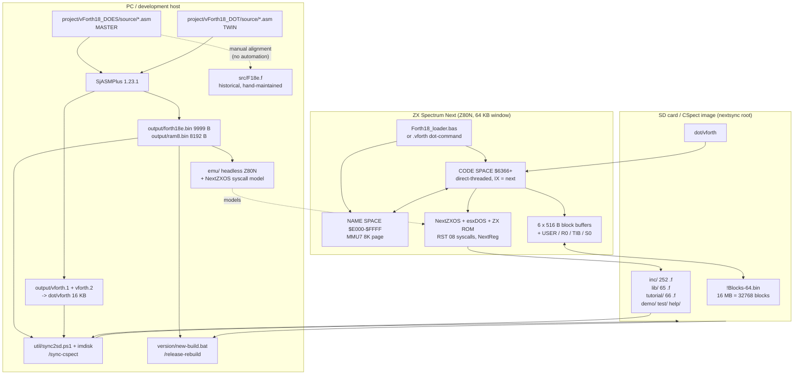

# vForth Next -- ONBOARDING

Reverse-engineering of the repository, written for a senior developer joining the
project. Every statement below is anchored to the file it was inferred from.
Where the code and the prose documentation disagree, the code wins and the
divergence is called out explicitly.

- **Repository analysed:** git root `/home/matteo/project/dev-F18`, working
  subtree `tools/vForth/`
- **Analysis date:** 2026-09-04, at commit `af403da` ("chomp-chomp-next stage 2")
- **Language:** English, per `tutorial/CLAUDE.md` section 1 ("Interaction with
  the author: Italian. All source code, comments, and documentation: English
  only"). 7-bit ASCII, per root `CLAUDE.md` "Character Encoding".

### Confidence legend

| Level | Meaning |
|---|---|
| **High** | Verified by executing something (build, emulator, byte comparison) or read directly in source. |
| **Medium** | Consistent across several files, but not executed or only partially cross-checked. |
| **Low** | Single source, or plausible inference that a maintainer should confirm. |

### What was actually executed during this analysis

| Check | Result | Section |
|---|---|---|
| `sjasmplus --zxnext .../vForth18_DOES/source/main.asm` in a scratch dir | 0 errors, 2 warnings; `forth18e.bin` md5 `a2485721...`, `ram8.bin` md5 `253e6412...` -- **byte-identical to the committed binaries** | 9, 10 |
| Same for `vForth18_DOT` | 0 errors; `vforth.1`+`vforth.2` concatenated md5 `02f2ff41...` -- **byte-identical to `project/vForth18_DOT/output/vforth`** | 9, 10 |
| `printf '.quit\n' \| python3 emu/repl.py` | **Passed.** Full boot to the `ok` prompt; SPLASH shows `build 2026-08-20`; `ASK-Y/N` answered `n`; exit code 0 | 9, 11 |
| Toolchain probe on this machine | `sjasmplus` 1.23.1 (in `~/.local/bin`), `python3` 3.13.5, `perl` present, `pdftotext` present, `pwsh` **absent** | 9 |

---

# 1. Executive Summary

## 1.1 Purpose of the software

**vForth Next** is a complete, self-hosting **Forth compiler and runtime system
for the Sinclair ZX Spectrum Next**, an 8-bit Z80N home computer. It is not an
application that happens to be written in Forth: it *is* the language
implementation -- inner interpreter, dictionary, text interpreter, block
storage, assembler -- plus the library ecosystem, documentation and tutorials
that make it usable as a development environment on the machine itself.

Evidence: `project/vForth18_DOES/source/main.asm` header ("This is the complete
compiler for v.Forth for SINCLAIR ZX Spectrum Next"); root `CLAUDE.md` "Project
Overview"; `LICENSE.md` (MIT, 1990-2026, Matteo Vitturi).
**Confidence: High.**

- **Version:** 1.8, build **2026-08-20**.
- **Provenance:** the version string appears identically in
  `project/vForth18_DOES/source/main.asm:9` (`build 20260820`), in the first 512
  bytes of `!Blocks-64.bin` (`\ v-Forth 1.8 - NextZXOS versione - build
  2026-08-20`), and in `Forth18_loader.bas` / `Forth18.bas`. Verified by reading
  the binaries. **Confidence: High.**
- **License:** MIT, `LICENSE.md`, restated in every `.asm` and most `.f` headers.

## 1.2 Problems it solves

| Problem | How vForth addresses it | Evidence |
|---|---|---|
| The Next has no resident high-level programming environment beyond BASIC | A resident Forth compiler that fits in ~10 KB of main RAM plus an 8 KB paged dictionary | `SAVEBIN "output/forth18e.bin", ORIGIN, 9999` and `SAVEBIN "output/ram8.bin", $E000, $2000` in `main.asm:169-170` |
| 64 KB address space is too small for a growing dictionary | Name-space is moved into a paged 8 K MMU7 window at `$E000-$FFFF`, separate from code-space at `$6366` | `New_Def` macro, `project/vForth18_DOES/source/system.asm:123-170` |
| Threaded-code interpreters are slow | Direct-threaded code (`jp (ix)` inner interpreter, 2 T-states faster than `jp addr`) | `next` macro, `system.asm:63-65`; rationale in `main.asm:60-65` |
| Persistent source storage without a filesystem-heavy editor | Classic Forth BLOCK/SCREEN storage in a single flat 16 MB file | `!Blocks-64.bin` (16777216 bytes = 32768 blocks); `LOAD`, `BLOCK`, `-->` in `L3.asm` |
| Reaching Next hardware (sprites, layers, AY, DMA, UART) from a high-level language | ~65 library modules in `lib/` wrapping NextReg / esxDOS / ROM | `lib/LAYER2-GRAPHICS.f`, `lib/AY.f`, `lib/SPRITE.f`, `lib/UART-SYS.f`, ... |
| Loading only what you need on a 64 KB machine | `NEEDS` -- a load-if-undefined mechanism searching `inc/` then `lib/` | `NEEDS` colon definition, `L3.asm` (NEEDS-INC/NEEDS-LIB path constants) |

## 1.3 Principal users

**Confidence: Medium** (inferred from artefacts, not from a stated user model).

1. **The author/maintainer** -- Matteo Vitturi. `git log` shows 184 commits,
   183 by the author under three identities (`Matteo Vitturi` 131, `Matteo` 41,
   `mvitturi` 11) and 1 by `Claude`. This is a **single-maintainer project**.
2. **ZX Spectrum Next hobbyist programmers** -- the target of `tutorial/`
   (66 numbered tutorials), `help/` (461 on-machine help files), `demo/`, and
   the public release pipeline that produces
   `download/vForth_18_NextZXOS_YYYYMMDD.zip`
   (`.claude/skills/release-rebuild/SKILL.md` step 4).
3. **Forth-language readers/archaeologists** -- `src/F18e.f` is explicitly kept
   as a human-readable rendition of the core ("Its primary value is
   **readability**", root `CLAUDE.md` "The Three Codebases").

## 1.4 Principal functional flows

```
A. AUTHORING (PC side)
   edit .asm  ->  /build DOES  ->  smoke test in headless emulator
              ->  copy binaries to repo base  ->  /sync-cspect  ->  test in CSpect

B. LIBRARY AUTHORING (PC side, no rebuild)
   write inc/word.f or lib/MODULE.f  ->  write help/word.txt
              ->  add test/word.f  ->  /sync-cspect  ->  test on CSpect/hardware

C. RUNTIME (machine side)
   BASIC loader  ->  COLD  ->  WARM  ->  BLK-INIT  ->  ABORT  ->  AUTOEXEC
              ->  11 LOAD  ->  INCLUDE lib/autoexec.f  ->  SPLASH  ->  QUIT/ok

D. USER PROGRAMMING (machine side)
   ok prompt  ->  NEEDS <word>   (pull inc/ or lib/ source from SD)
              ->  INCLUDE file   |   n LOAD (screen)   |   EDIT (screen editor)

E. RELEASE
   author prepares .odt/.pdf by hand  ->  /release-rebuild YYYYMMDD
              ->  gates  ->  /bump-build  ->  blocks dump  ->  /sync-cspect
              ->  new-build.bat  ->  public zip + HISTORY.txt
```

Evidence: `.claude/commands/build.md`, `.claude/skills/release-rebuild/SKILL.md`,
`.claude/skills/sync-cspect/SKILL.md`, root `CLAUDE.md` "Boot Sequence",
`lib/AUTOEXEC.f`. **Confidence: High** for A, C, E; **Medium** for B and D
(reconstructed from conventions rather than a single script).

---

# 2. System Overview

## 2.1 High-level architecture

vForth is a **four-tier system with two build variants**, and the tiers do not
correspond to processes -- they correspond to *memory regions and load times* on
a single-address-space 8-bit machine.

| Tier | Artefact | Lives at | Built by | Loaded when |
|---|---|---|---|---|
| **T0 -- Core (code)** | `forth18e.bin`, 9999 bytes | `$6366` onward | SjASMPlus | at boot, by the BASIC loader or dot-command |
| **T1 -- Core (names)** | `ram8.bin`, 8192 bytes | MMU7 page at `$E000-$FFFF` | SjASMPlus (same pass) | at boot, into 16K bank 16 / page 32 |
| **T2 -- Library source** | `inc/*.f` (252), `lib/*.f` (65) | SD card, compiled into the dictionary on demand | text, no build step | at `NEEDS`/`INCLUDE` time |
| **T3 -- Block store** | `!Blocks-64.bin`, 16 MB | SD card, paged 512 B at a time through 6 RAM buffers | `EDIT` on the machine, or PC-side tools | at `BLOCK`/`LOAD` time |

The two variants of T0/T1 are described in root `CLAUDE.md` "The Three Codebases
and Their Roles" and in `project/CLAUDE.md` "Intentional Divergences":

- **`vForth18_DOES`** -- the **master**. Launcher-based (`Forth18_loader.bas`
  loads `ram8.bin` into BANK 16 and `forth18e.bin` at 25446 = `$6366`). All
  changes originate here.
- **`vForth18_DOT`** -- the near-identical twin, packaged as a NextZXOS
  dot-command (`dot/vforth`, 16 KB = two 8 KB halves concatenated). Differs in
  startup/shutdown, MMU7 page allocation, ROM-call interrupt discipline, and the
  AUTOEXEC strategy.
- **`src/F18e.f`** -- a **historical artifact**: the same compiler written in
  idiomatic Forth using a postfix ASSEMBLER vocabulary. Not maintained in sync
  automatically; kept for readability.

## 2.2 Principal components

| Component | Where | Role |
|---|---|---|
| `system.asm` (245 lines) | `project/*/source/` | Register map, bit flags, and the `New_Def` / `Colon_Def` / `Constant_Def` / `Variable_Def` / `User_Def` macros that *are* the dictionary compiler. Also defines `LIMIT_system`/`FIRST_system`/`USER_system`/`R0_system`/`TIB_system`/`S0_system`. |
| `L0.asm` (2180 lines, 83 defs) | same | Origin area and level-0 primitives: stack ops, arithmetic, `(EMITC)`, `(CLS)`, `ENCLOSE`, `CMOVE`, `SELECT`. Includes `next-opt0.asm` at line 1169. |
| `L1.asm` (1711 lines, 146 defs) | same | Level-1 derived words: `:` `;` `CONSTANT` `VARIABLE` `DOES>` `IF/THEN` `DO/LOOP`, `EMITC`, `CR`, `CURS`. |
| `L2.asm` (550 lines, 29 defs) | same | `INTERPRET`, `VOCABULARY`, `FORTH`, `DEFINITIONS`, `QUIT`, `ABORT`, `WARM`, `COLD`, `BASIC`, mixed-precision math, `MESSAGE`. |
| `L3.asm` (1021 lines, 62 defs) | same | Block I/O (`R/W`, `+BUF`, `UPDATE`, `BLOCK`, `LOAD`, `-->`), file inclusion (`F_GETLINE`, `F_INCLUDE`, `OPEN<`, `INCLUDE`), `NEEDS` and its FAT filename mapper `MAP-FN`, `AUTOEXEC`, `MARKER`, `SPLASH`. |
| `next-opt0.asm` (252 lines, 9 defs) | same | esxDOS/NextZXOS file syscalls: `F_OPEN` `F_CLOSE` `F_READ` `F_WRITE` `F_SEEK` `F_FGETPOS` `F_SYNC` `F_OPENDIR` `F_READDIR`. |
| `next-opt1.asm` (187 lines, 10 defs) | same | Next-specific: `REG@`/`REG!` (NextReg via ports `$243B`/`$253B`), `MMU7!`/`MMU7@`, `BLK-INIT`. |
| `inc/` (252 files + `inc/doc/` 19) | repo | One Forth word per file, loaded on demand by `NEEDS`. |
| `lib/` (65 modules + `lib/doc/`) | repo | Multi-word feature modules: graphics layers, sound, mouse, floating point, locals, editor, decompiler, persistence. |
| `emu/` (Python) | repo | Headless Z80N + NextZXOS emulator used as the PC-side test harness. |
| `util/` | repo | Perl/Python/PowerShell build-adjacent tooling: block dumps, ODT hygiene, SD sync, asm-to-hex conversion. |
| `.claude/` | repo | The **executable process documentation**: 11 slash commands, 5 skills, 1 review agent. This is where the CI/CD equivalent lives (see section 10). |

Word counts obtained by counting `New_Def|Colon_Def|Constant_Def|Variable_Def|
User_Def` macro invocations: **339 core words total** (L0 83, L1 146, L2 29,
L3 62, next-opt0 9, next-opt1 10). **Confidence: High** (mechanical count; a
handful of `New_Def`s create data buffers such as `NEEDS-W` rather than callable
words, so treat 339 as an upper bound on user-visible core words).

## 2.3 Architecture diagram



## 2.4 Inter-component dependencies

**Hard dependencies (build breaks without them):**

- `main.asm` -> `system.asm` -> `L0.asm` (-> `next-opt0.asm`) -> `L1.asm` ->
  `L2.asm` -> `next-opt1.asm` -> `L3.asm`. **Order is significant**: the macros
  in `system.asm` thread `Heap_Ptr`/`Prev_Ptr`/`Dict_Ptr` state through every
  subsequent `New_Def`, so the dictionary link chain is literally an
  assembly-time side effect of include order. Verified by reading
  `system.asm:123-170` and `main.asm:150-155`. **Confidence: High.**
- `emu/repl.py` -> `emu/emulator.py` -> `emu/z80_instructions.py`, and hardcodes
  `project/vForth18_DOES/output/forth18e.bin` + `ram8.bin`
  (`emu/repl.py:28-29`). The emulator therefore tests **DOES only**; there is no
  DOT harness. **Confidence: High.**

**Runtime dependencies (resolution happens on the machine):**

- `NEEDS X` -> `inc/X.f`, else `lib/X.f`, else message 43. Path constants
  `NEEDS-INC` = `"inc/"` and `NEEDS-LIB` = `"lib/"` in `L3.asm`.
- `INCLUDE` / `NEEDS` -> `F_INCLUDE` -> **BLOCK 1** as line buffer -> the 6-buffer
  pool. This creates a non-obvious coupling between file inclusion and block I/O
  (see section 13, "Block-buffer starvation").
- `lib/*` -> `inc/*` via `NEEDS` at the top of each module (e.g. `lib/heap.f`
  needs `FAR`, `HP@`, `SKIP-HP-PAGE`).
- `lib/floating.f` and `lib/assembler.f` **patch core words at load time**
  (`INTERPRET`'s `NUMBER` call, and `;CODE`'s `NOOP` placeholder respectively) --
  documented in `lib/CLAUDE.md` "Patch-requiring libraries". This is the single
  most invasive coupling in the system.

---

# 3. Repository Map

Git root is `/home/matteo/project/dev-F18`; it mirrors an SD-card tree (root
`.gitignore` ignores `dot/`, `home/`, `nextzxos/`, `version/`, so several
directories present on disk are deliberately untracked). Root `CLAUDE.md` names
the same tree as `C:\Zx\Forth\F18` -- see section 8.4 for that divergence.

## 3.1 Git-root level

| Path | Contents | Why it exists | Importance |
|---|---|---|---|
| `tools/vForth/` | The whole project | The nextsync mirror places vForth under `tools/` on the SD card, so the path is the deployment path | **Critical** |
| `home/` | ZX-side user files (RaspPI0, tutorial assets, Mouse, vForth20) | SD-card `home` directory; untracked | Low |
| `nextzxos/` | `browser.cfg`, `esxemu.sys` and friends | NextZXOS configuration on the SD card; untracked | Low |
| `sh/last_sign.sh` | One shell script | Peripheral utility; no reference found from the rest of the tree | Low |

## 3.2 `tools/vForth/` level

| Path | Contents | Why it exists | Importance |
|---|---|---|---|
| `project/` | 3 SjASMPlus projects: `vForth18_DOES`, `vForth18_DOT`, `vForth16_MDR_MGT` (v1.6 historical), each with `source/`, `output/`, `list/`, `.vscode/` | The actual compiler source and its build outputs. `list/main.lst` is described in root `CLAUDE.md` as one of the three sources of truth for the working core | **Critical** |
| `inc/` | 252 single-word `.f` files + `inc/doc/` (19 reference-only copies of core words) | On-demand word loading; keeps the resident dictionary small | **Critical** |
| `lib/` | 65 multi-word modules + `lib/doc/` | Feature/hardware subsystems | **Critical** |
| `emu/` | Python headless emulator (`emulator.py` 35 KB, `z80_instructions.py` 69 KB), `repl.py`, 9 `test_*.py`, `trace_words.py` | The only automated way to run vForth without hardware or CSpect | **High** |
| `test/` | 159 `.f` files: 7 suites plus per-word tests | ANS-Forth conformance and regression, run *on the machine* | **High** |
| `help/` | 461 `.txt` files, one per word, max 21 lines each | Consumed by the on-machine `HELP` command (`inc/help.f` -> `VIEW-FILE-PAD`) | **High** |
| `tutorial/` | 66 numbered `.f` tutorials + `bmp/`, `afx/` assets | The teaching track; banded 000-029 language, 030-059 hardware, 060+ advanced | **High** |
| `util/` | `blocks2txt.pl`, `putscr.pl`, `asm2hex.py`, `gen-dict-structure.py`, `odt-hygiene.py`, `chomp-maze.py`, `sync2sd.ps1`, `verify2sd.ps1`, `mountw.ps1`, `sd-sync.config.ps1`, `blank-blocks.ps1` | PC-side tooling: block file <-> text, ODT maintenance, SD deployment | **High** |
| `.claude/` | 11 commands, 5 skills, 1 agent, settings | **The process automation layer.** In the absence of CI, these encode the build/release/deploy procedures | **High** |
| `doc/` | The reference manual (`.odt` + `.pdf`, two dated generations), `doc/previous/` (older manuals), `doc/txt/` (dated `!Blocks-64.bin` dumps), plus hardware notes (`AY-3-8910.md`, `tilemap.md`, `NextZXOS_and_esxDOS_APIs.md`, `zx-next-dev-guide-r3.md`), `memory-map.txt`, `RELEASE-BUILD.md` | The published documentation. **The `.odt`/`.pdf` must never be edited automatically** (root `CLAUDE.md`) | **High** |
| `src/` | `F18e.f` (163 KB) plus F15/F16/F17 ancestors, `Z80N-asm.f`, `Z80N-Assembler-Dictionary.txt` | The historical self-hosting Forth form of the core | Medium |
| `prompts/` | 30 plans/analyses (`LOCALS-PLAN.md` 101 KB, `CHOMP-CHOMP-*`, `LAYER24-PLAN.md`, `REVIEW-*`), plus `done/` and `grok/` | Design record. Root `CLAUDE.md`: "Plans go in `prompts/`, never the project root" | Medium |
| `demo/` | Example programs and games: `chomp-chomp` (with a standalone binary triple), `raycast.f`, `brot.f`, `cosmic-conquest.f`, `Fedora.f`, dot-command demos | Showcase + source of tutorial material | Medium |
| `version/` | 9 dated build snapshots + `new-build.bat`, `new-version.bat`, `pkzip25.exe` | Historical archive and the public-release scripts. **Never modify the snapshots** (root `CLAUDE.md` build-number convention). Untracked | Medium |
| `forum/` | 36 `.f` files: community/forum snippets (`aydemo.f`, `copper-bmp.f`, `draw-line.f`, several `brot*.f` variants) | Scratch/experimental corner | Low |
| `dev/` | `DMA.f`, `IM2-HW.f` | Staging area for modules not yet promoted to `lib/`. `dev/DMA.f` blocks tutorial 054 (`TODO.md`) | Low but **actionable** |
| `!Blocks-64.bin` | 16 MB block store, at the repo root next to the binaries | The Forth screen filesystem; also the error-message table | **Critical** |
| `forth18e.bin`, `ram8.bin` | Deployed copies of the DOES output | `/build` step 6 copies them here so `/sync-cspect` carries them to the SD image | **Critical** |
| `Forth18_loader.bas`, `Forth18.bas`, `Standard-Loader.bas` | Tokenised `+3DOS` BASIC loaders (note the `PLUS3DOS` header -- these are **binary**, not text) | The classic-variant boot path | High |
| `CLAUDE.md` (33 KB) + 6 subdirectory `CLAUDE.md` | The de-facto developer handbook | **This is the primary written documentation of the system.** | **Critical** |
| `TODO.md` / `TODO-DONE.md` | Open and closed defects, with dates and root-cause write-ups | Issue tracker (there is no external one) | High |

**Notable absence:** there is **no `README.md`** anywhere in `tools/vForth/` and
none at the git root. A newcomer's entry point is `CLAUDE.md`, which is addressed
to an AI assistant rather than to a human reader. **Confidence: High**
(`ls README*` returns nothing). Flagged again in section 13.

---

# 4. Runtime Architecture

## 4.1 Entry points

There are **three distinct entry points**, one per variant plus one for testing.

| # | Entry point | Path | Confidence |
|---|---|---|---|
| 1 | **BASIC loader (DOES)** | `Forth18_loader.bas` -> `.CD "C:/tools/vForth"` -> `LOAD "ram8.bin" BANK 16` -> `LOAD "forth18e.bin" CODE 25446` -> `RANDOMIZE USR 25446` (`$6366`) | High -- read from the tokenised BASIC, whose plaintext fragments are legible |
| 2 | **Dot-command (DOT)** | `dot/vforth`, invoked as `.vforth` from NextZXOS; can take a filename parameter (`Param_From_Basic`) | Medium -- `project/CLAUDE.md` "AUTOEXEC (L3.asm:780)"; the binary itself is untracked here |
| 3 | **Headless emulator** | `emu/repl.py` -> `VForthEmulator.load_binary(BIN, 0x6366)`, `load_binary(RAM, 0xE000)`, `initialize_cold_start()` | High -- executed |

`Forth18.bas` is a second, smaller BASIC wrapper offering `RUN` = WARM (`USR
25450`) and `RUN 20` = COLD (`USR 25446`), plus the "You're back to BASIC"
recovery message. This matters: **any ROM error thrown through `EMITC` drops the
machine into BASIC, and `RUN` resumes vForth from there** (root `CLAUDE.md`,
"EMITC and ROM errors"). **Confidence: High.**

## 4.2 Startup sequence (classic variant)

Addresses from `project/vForth18_DOES/list/main.lst` as quoted in root
`CLAUDE.md`; the control flow re-verified against `L2.asm` and `L3.asm`.

```
$6366 entry
  |
  +-> ColdRoutine self-init
        |
        v
COLD  ($7616)  -- L2.asm:234
  | copies 22 bytes of the origin's initial USER area over the live USER area
  | restores Forth vocabulary LATEST from the origin image
  | NMODE=0 ; FIRST/PREV/USE reset ; PLACE=4 ; EMPTY-BUFFERS
  | BLK=0 ; SOURCE-ID=0 ; EMITC 26 / EMITC 0  (unlimited scroll)
  | falls through into  ->
        v
WARM  ($760D)  -- L2.asm:224
  | BLK-INIT
  |   -> close any open block handle (BLK-FH), then F_OPEN "!Blocks-64.bin"
  |      DOES: on failure raises message $2C via QERROR and CONTINUES to ABORT
  |      DOT : on failure patches Exit_with_error and returns to BASIC
  |   (next-opt1.asm; divergence documented in project/CLAUDE.md)
  v
ABORT ($75EA)  -- L2.asm:204
  | S0 @ / SP! ; DECIMAL ; FORTH ; DEFINITIONS ; [ ; R0 @ / RP!
  | then, at label Autoexec_Ptr:
  v
AUTOEXEC ($8003)  -- L3.asm
  | DOES: 11 LOAD          (Screen 11, user-configurable)
  | DOT : F_OPEN <param or c:/tools/vforth/lib/autoexec.f> then F_INCLUDE
  | *** AUTOEXEC REWRITES ITS OWN CALL SITE IN ABORT TO A NOOP ***
  |     so it runs exactly once per power-on; later ABORT/WARM/COLD skip it
  v
Screen 11 -> INCLUDE lib/autoexec.f
  | SPLASH banner, palette tweaks, Core version, NextZXOS version,
  | CPU speed (REG@ 7), dictionary free (SP@ PAD -), heap free (-1 HP @ -),
  | free disk space, current time
  | ASK-Y/N: "Do you wish to load utilities ? (Y/n)"
  |    y -> NEEDS REMOUNT / WHERE / .S / EDIT / DUMP / HEAP / S" / SEE
  |    n -> QUIT immediately
  v
QUIT  -- L2.asm:175
  loop: R0 @ RP! ; CR ; QUERY ; INTERPRET ; if STATE=0 print " ok"
```

**Two behaviours worth internalising before you debug a boot:**

1. **AUTOEXEC is self-disarming.** `L2.asm:218` carries the comment
   `dw AUTOEXEC // autoexec, patched to noop`. If you are wondering why your
   change to Screen 11 "did not take" after typing `ABORT`, this is why. You
   need a fresh COLD from the loader. **Confidence: High.**
2. **A failed block-file open does not stop the boot** in the DOES variant. You
   reach `ok` in an inconsistent state (root `CLAUDE.md` Boot Sequence, point 1).
   A confusing `BLOCK`-related failure later is often really this.
   **Confidence: High** (documented; the `QERROR` path is visible in
   `next-opt1.asm`).

## 4.3 The inner interpreter and the two address spaces

This is the single most important thing to understand about the codebase.

**Direct threading.** A word's Code Field Address contains *executable Z80*, not
a pointer to executable Z80:

- a **CODE word**'s CFA is the machine code itself;
- a **colon definition**'s CFA is a 3-byte `call Enter_Ptr` (`Colon_Def` macro,
  `system.asm:206-210`);
- `EXECUTE` is therefore just `jp (hl)`;
- "next" is `jp (ix)` (`next` macro, `system.asm:63`), 2 T-states cheaper than a
  direct `jp`, which is why **IX is reserved and must never be clobbered**.

**Split dictionary.** Every `New_Def` writes into *two* address ranges in one
macro expansion (`system.asm:123-170`):

```
  NAME SPACE (heap, MMU7 page mapped at $E000-$FFFF, image = ram8.bin)
    [ len|END_BIT|flags ][ name bytes, last byte |END_BIT ][ link ][ xt ]
                                                                    |
  CODE SPACE (main RAM from ORIGIN $6366, image = forth18e.bin)      |
    [ mirror-ptr ][ call Enter_Ptr (colon defs only) ][ Z80 code ] <-+
      |
      +--> points back at the name-space entry
```

The macro achieves this by `org`-hopping: it saves `$` into `Dict_Ptr`, `org`s to
`(Heap_Ptr & $1FFF) + $E000` to emit the name entry, then `org`s back to
`Dict_Ptr` to emit the code entry. `Prev_Ptr` carries the link chain forward,
`Heap_Ptr` the heap allocation pointer. **Consequence: the assembler's include
order literally builds the dictionary linked list.** Reordering includes
reorders the dictionary. **Confidence: High** (read directly).

Flag bits live in the length byte (`system.asm:85-88`):
`SMUDGE_BIT = $20`, `IMMEDIATE_BIT = $40`, `END_BIT = $80`. The name's *last*
character also carries `END_BIT` -- names are delimited at both ends by the high
bit, which is what makes backward name traversal possible and, per
`prompts/manual-par-3.20-nfa-ambiguity.txt`, also what makes NFA detection
ambiguous in edge cases.

## 4.4 Z80 register contract

| Register | Meaning | Rule |
|---|---|---|
| `BC` | Instruction Pointer | **Preserve across ROM/OS calls** |
| `DE` | Return Stack Pointer | **Preserve across ROM/OS calls** |
| `HL` | W (working) | free |
| `SP` | Calculation (data) stack pointer | the hardware stack *is* the Forth data stack |
| `IX` | inner-interpreter "next" address | **never clobber** |
| `IY` | ZX system interrupt base | **never clobber** |
| `BC'/DE'/HL'` | extra working registers | reached via `EXX`; by convention `EXX` marks the boundary between "Forth VM scope" and "machine-code scope" |

Source: `main.asm:57-70`, `system.asm:5-11`, root `CLAUDE.md`. **Confidence: High.**

Note the consequence of `SP` being the data stack: **an unbalanced stack is a
corrupted machine stack**. `ABORT` explicitly repairs it (`S0 @ ... SP!`).

## 4.5 Memory layout, computed not hardcoded

`system.asm:225-232` derives the whole low-memory layout downward from a single
constant:

```asm
LIMIT_system   equ  $E000                        ; first byte past the last buffer
BUFFERS        equ  6
FIRST_system   equ  LIMIT_system - 516*BUFFERS   ; = $D2F8
USER_system    equ  FIRST_system - 80            ; = $D2A8
R0_system      equ  USER_system                  ; return stack top
TIB_system     equ  R0_system - 160              ; TIB grows up, RS grows down
S0_system      equ  TIB_system                   ; data stack top
```

516 = 512 data + 4 bytes of per-buffer bookkeeping (block number + flags), as
stated in root `CLAUDE.md` "Memory Layout". `doc/memory-map.txt` gives the same
picture with slightly different absolute addresses (`S0 @` at `D3A2`, `R0 @` at
`D398`, `FIRST` at `D3E8`) and says "There are 7 buffers (516 * 6 = 3096 bytes)"
-- the count in prose contradicts its own arithmetic and the assembler constant.
**Trust `system.asm`.** (Incoherence logged in section 8.4.)

## 4.6 Inter-module communication

There is no IPC, no network, no message bus. "Communication" means four things:

1. **The Forth data stack** -- the universal calling convention. Every word's
   contract is its stack effect comment `( in -- out )`.
2. **USER variables** -- per-task/per-system state at a fixed offset table
   (`User_Def` macro writes a one-byte offset into the PFA): `BLK`, `>IN`,
   `STATE`, `BASE`, `DP`, `CONTEXT`, `CURRENT`, `SOURCE-ID`, `HP`, ...
3. **Vectored words / self-modifying code** -- the system patches itself at
   runtime in at least three documented places:
   - `AUTOEXEC` NOOPs its own call site in `ABORT` (`L2.asm:218`);
   - `lib/floating.f` swaps `NUMBER` for `FNUMBER` inside `INTERPRET`;
   - `lib/assembler.f` overwrites the `NOOP` placeholder in `;CODE`.
   The library convention "stub + patch" (`lib/CLAUDE.md`) is the same trick used
   deliberately: define a stub early as a `FORGET` anchor, patch `>BODY` later.
4. **Block buffers** -- the six-buffer round-robin pool is shared by `BLOCK`,
   `LOAD`, `EDIT` **and** `F_INCLUDE` (which commandeers BLOCK 1 as its line
   buffer). This shared resource is the source of one of the nastiest bugs in the
   system (section 13.3).

---

# 5. Business Domains

There is no "business" domain in the enterprise sense -- no customers, orders or
accounts. The equivalent bounded contexts are **the layers of a language
implementation plus the hardware subsystems it exposes**. The boundaries below
are inferred from directory structure, `NEEDS` dependency edges and the assembler
layer split; they are not declared anywhere as such. **Confidence: Medium.**

## 5.1 Bounded contexts

| # | Context | Owns | Ubiquitous language | Where |
|---|---|---|---|---|
| **C1** | **Execution kernel** | Inner interpreter, stacks, primitives | `next`, `EXECUTE`, `xt`, `psh1`/`psh2`, W register | `L0.asm`, `system.asm` |
| **C2** | **Dictionary & compiler** | Word creation, search order, compile/interpret state | `NFA`/`LFA`/`CFA`/`PFA`, `SMUDGE`, `IMMEDIATE`, `LATEST`, `CONTEXT`/`CURRENT`, `VOCABULARY`, `DOES>` | `L1.asm`, `L2.asm` |
| **C3** | **Text interpreter** | Parsing input, number conversion, error reporting | `INTERPRET`, `WORD`, `NUMBER`, `>IN`, `BLK`, `STATE`, `QUERY`, `?ERROR`/`MESSAGE`/`THROW` | `L2.asm` |
| **C4** | **Mass storage** | Blocks, screens, buffers, source inclusion | `BLOCK`, `BUFFER`, `UPDATE`, `FLUSH`, `LOAD`, `-->`, `SCR`, `B/BUF`, `B/SCR`, `INCLUDE`, `NEEDS` | `L3.asm`, `!Blocks-64.bin` |
| **C5** | **Host OS interface** | esxDOS/NextZXOS syscalls, ROM calls, paging | `F_OPEN`..`F_READDIR`, `M_P3DOS`, `MMU7!`, `REG@`/`REG!`, `+ORIGIN` | `next-opt0.asm`, `next-opt1.asm` |
| **C6** | **Display & graphics** | ULA, Layer 2 (several resolutions), Layer 3 tilemap, sprites, copper, palettes | `LAYERnn`, `PLOT`, `DRAW`, `PAINT`, `SPRITE`, `TILE-MODE:`, `COPPER` | `lib/LAYER*.f`, `lib/GRAPHICS*.f`, `lib/SPRITE.f`, `lib/copper.f`, `lib/TILE80*.f`, `lib/layer3.f` |
| **C7** | **Audio** | Beeper, AY-3-8912, AFX sound board | `BLEEP`, `AY!`, `AFX>AY`, `AFXFRAME` | `lib/bleep.f`, `lib/AY.f`, `lib/AFXFRAME*.f`, `lib/afxplay*.f` |
| **C8** | **Input** | Keyboard, keyboard matrix, mouse | `KEY`, `CURS`, `MOUSE` | `L0.asm` (KEY), `lib/MOUSE.f`, `lib/mouse-*tester.f` |
| **C9** | **Numeric extensions** | Floating point, fixed-point Q8.8, complex, double | `F+` `F>D`, `FIXED88`, `C*` | `lib/floating.f`, `lib/fixed88.f`, `lib/complex.f`, `lib/FP-INTERFACE.f` |
| **C10** | **Development tools** | Editor, decompiler, dump, tracing, testing, locals | `EDIT`, `SEE`, `DUMP`, `WORDS`, `WHERE`, `.S`, `LOCATE`, `USED-BY`, `T{`/`}T`, `{ ... }` | `lib/edit.f`, `lib/editor.f`, `lib/see.f`, `lib/testing.f`, `lib/LOCALS.f`, `lib/locate.f`, `lib/used-by.f` |
| **C11** | **Session persistence** | Snapshotting the whole live system to blocks | `SAVE-SYSTEM`, `RESTORE-SYSTEM`, `PERSISTENCE` | `lib/PERSISTENCE.f` |
| **C12** | **Communications** | UART, Raspberry Pi Zero accelerator, ESP | `UART-SYS`, `RPi0` | `lib/UART-SYS.f`, `lib/RPi0.f` |
| **C13** | **Packaging** | Turning a session into a standalone artefact | `ZAP`, `ZAP"` | `lib/ZAP.f`, `lib/ZAP~.f`, tutorial 059 |

## 5.2 Principal aggregates

The nearest analogues to aggregates -- the data structures with invariants that
several words must jointly maintain:

| Aggregate | Root | Invariants | Guardians |
|---|---|---|---|
| **Dictionary entry** | NFA in name space | length byte carries `len\|END_BIT\|flags`; last name char has `END_BIT`; link points to previous NFA; mirror pointers agree in both directions | `New_Def` (build time), `CREATE`/`:`/`SMUDGE`/`FORGET`/`MARKER` (run time) |
| **Vocabulary chain** | `FORTH` (and any `VOCABULARY`) | `CONTEXT`/`CURRENT` search order; a vocabulary's `LATEST` is patched by `COLD` from the origin image | `VOCABULARY`, `DEFINITIONS`, `COLD` |
| **Block buffer** | `FIRST`..`LIMIT`, 6 x 516 B | each buffer holds block# + dirty flag + 512 B; `PREV`/`USE` rotate round-robin; `UPDATE` marks dirty; `FLUSH` writes back | `BLOCK`, `BUFFER`, `+BUF`, `R/W`, `UPDATE`, `EMPTY-BUFFERS`, `FLUSH` |
| **Input source** | `SOURCE-ID`, `BLK`, `>IN`, TIB | `BLK`=0 means TIB; `BLK`=1 means F_INCLUDE line buffer; `BLK`>1 means a screen; `>IN` is the offset within it. Nested inclusion saves/restores all three on the return stack | `F_INCLUDE`, `LOAD`, `QUERY`, `INTERPRET`, `QUIT` |
| **Heap allocation** | `HP` user variable, MMU7 pages `$20`-`$27` | names grow up from `$E000` in the current page; `H"` strings share the same space | `lib/heap.f`, `HP@`, `FAR`, `SKIP-HP-PAGE` |
| **Error message table** | `!Blocks-64.bin` screens 2-8 | message #n is line n of screen 4 counted straight through; negative area 2-3 mirrors THROW codes | `?ERROR` -> `ERROR` -> `MESSAGE` |

## 5.3 Core business concepts a newcomer must learn

1. **A word is data plus behaviour split across two address spaces.** (4.3)
2. **`NEEDS` is idempotent by construction:** it looks the word up first, so
   loading is a no-op if it is already defined. This is what makes deeply nested
   library dependencies safe.
3. **A Screen is 2 Blocks; a Block is 512 bytes; BLOCK 0 is not stored.** File
   offset of block *b* is `(b - 1) * 512`. Getting this wrong is silent (root
   `CLAUDE.md` states this in bold, and it is the reason `util/blocks2txt.pl`
   seeks 512 before counting).
4. **Error text lives in blocks, not in code.** `f n ?ERROR` costs ~5 bytes and no
   string; `ABORT"` costs ~12 bytes plus a permanent heap string. In `inc/` and
   `lib/`, use `?ERROR`. In end-user applications, `ABORT"` is fine.
5. **`MARKER` is the unload primitive.** Nearly every library and tutorial is
   designed to be forgotten wholesale.

---

# 6. Data Layer

> **There is no database, no ORM, no migration framework, and no schema
> definition language in this project.** Persistence is three flat files and one
> filesystem. **Confidence: High** -- searched the tree for `.yml`/`.yaml`,
> `Dockerfile`, `Makefile`, and found none; no SQL, no ORM dependency anywhere.

## 6.1 Stores

| Store | Format | Size | Purpose |
|---|---|---|---|
| `!Blocks-64.bin` | Flat, unindexed, fixed 512-byte records | 16,777,216 B = **32,768 blocks = 16,384 screens** | Forth source screens, error-message table, system metadata, application assets, session snapshots |
| SD-card files (`inc/`, `lib/`, `tutorial/`, `demo/`, ...) | 7-bit ASCII Forth source | ~600 files | Loaded through `INCLUDE`/`NEEDS` via esxDOS file syscalls |
| `forth18e.bin` / `ram8.bin` / `dot/vforth` | Raw memory images | 9999 / 8192 / 16384 B | The bootable core; `ram8.bin` *is* the serialised initial dictionary |

## 6.2 Deducible schema of `!Blocks-64.bin`

The file has no header, no directory and no free-list. Its "schema" is an offset
convention plus a reserved-range table. From root `CLAUDE.md` and verified
against the file:

```
file offset of BLOCK b            = (b - 1) * 512        <-- NOT b * 512
file offset of SCREEN S           = (2S - 1) * 512       (S = blocks 2S, 2S+1)
file offset of SCREEN S line L    = (2S - 1) * 512 + L * 64     (L = 0..15)
file offset of error message #n   = (n + 32) * 64 + 3 * 512
```

| Screen | Blocks | Contents | Verified |
|---|---|---|---|
| 0 | 0 | not stored / unused | -- |
| 0.5 | 1 | System metadata + copyright; **doubles as the `F_INCLUDE` line buffer** | **Yes** -- read the first 512 bytes: `\ v-Forth 1.8 - NextZXOS versione - build 2026-08-20`, MIT notice, and the sentence "This file provides persistency for BLOCK/Screen facility / The first 512 bytes of this file aren't used by BLOCK." |
| 2-3 | 4-7 | Error messages #-32..#-1, aligned with standard THROW codes (-1 ABORT, -2 ABORT", -13 undefined word) | Documented |
| 4-8 | 8-17 | Standard messages #0..#79 (16 per screen; first line of screens 5-8 spent on a header comment) | Documented |
| 9 | 18-19 | `9 LOAD` prints the message table then FORGETs itself | Documented |
| 10 | 20-21 | Formerly `include src/f18e.f`; now free | Documented |
| 11 | 22-23 | **AUTOEXEC screen** -- runs `INCLUDE lib/autoexec.f` | Cross-checked against `L3.asm` AUTOEXEC (`LIT 11, LOAD`) |
| 590-595 | -- | Fixed-point Q8.8/12.4 arithmetic (no tutorial yet) | `TODO.md` |
| 800-905 | -- | Transcription of *Starting FORTH* (Brodie) chapters 1-11 | `tutorial/CLAUDE.md` section 3, `prompts/tutorial-vs-screens.md` |
| 32000-32375 | -- | **PERSISTENCE snapshot area**: user data, 40 core blocks, 128 heap blocks; DOT variant offsets +200 | `lib/PERSISTENCE.f` lines 19-27 and the `PERSISTENCE` constant computation |

Line records are **fixed 64 bytes, space-padded** (`BLANK`); a screen is 16 such
lines. **The file size must never change.** A NUL byte inside a screen silently
aborts interpretation with no error (root `CLAUDE.md` "Known Bugs / LOAD").

## 6.3 "Entities"

| Entity | Physical form | Identity |
|---|---|---|
| Screen | 1024 bytes = 16 lines x 64 chars | screen number |
| Block | 512 bytes | block number (1-based in the file) |
| Message | one 64-byte line in screens 4-8 | message number (global namespace) |
| Word | dictionary entry (name + code) | its name, resolved through `CONTEXT`/`CURRENT` |
| Session snapshot | 176 blocks from 32000 (or 32200) | fixed offsets, not addressed by name |

## 6.4 "ORM" and "migrations"

- **ORM equivalent:** `BLOCK ( n -- a )` returns the address of a 512-byte
  buffer; `UPDATE` marks it dirty; `FLUSH` writes back. That is the entire
  persistence API. Higher-level access is `LOAD`/`-->` (interpret a screen) and
  `EDIT` (the screen editor, `lib/edit.f` / `lib/editor.f`).
- **Migration strategy:** there is none, and none is needed as long as the file
  size and offsets never change. What exists instead is:
  - **versioned text dumps** -- `util/blocks2txt.pl` renders the whole file to
    `doc/txt/!Blocks-64.bin_YYYYMMDD.txt`, one per release, going back to
    2022-11-16. This is effectively a schema-history archive.
  - **`util/patch0block.py`** and the `/bump-build` skill, which rewrite the
    build date inside BLOCK 1 in place.
  - **`/blank-blocks` skill** and `util/blank-blocks.ps1`, which `BLANK` ranges
    of screens while preserving the file size.
  **Confidence: High.**

## 6.5 The data-layer trap that will cost you a day

**BLOCK 0 is not stored.** Every tool that touches the binary directly must use
`(b - 1) * 512`. Using `b * 512` shifts everything by exactly one block -- eight
lines within a screen -- and the wrong text reads as perfectly plausible content,
not garbage. Root `CLAUDE.md` calls this out in bold and prescribes the remedy:
verify by reading back through the real `BLOCK` mechanism in the headless
emulator, and diff against a copy of the file to confirm only the intended byte
ranges changed.

---

# 7. External Dependencies

## 7.1 Runtime dependencies (on the target machine)

| Dependency | Interface | Used for | Evidence |
|---|---|---|---|
| **NextZXOS / esxDOS** | `RST $08` + function byte | File I/O: `F_OPEN $9A`, `F_CLOSE $9B`, `F_SYNC $9C`, `F_READ $9D`, `F_WRITE $9E`, `F_SEEK $9F`, `F_FGETPOS $A0`, `F_OPENDIR $A3`, `F_READDIR $A4` | `next-opt0.asm`; the same map is reimplemented in `emu/emulator.py:270-295` |
| **NextZXOS terminal** | `RST $08`, func `$94`, dispatch on `C` | `C=1` KEY, `C=2` EMIT/EMITC, `C=7` CLS | `emu/emulator.py:262-270`, mirroring the core |
| **ZX Spectrum ROM** | direct `call` / `rst $10` / `rst $08` | `$1601` CHAN-OPEN (via `SELECT`), `$0DAF` CL-ALL, `$03B6`, and `rst $10` for `(EMITC)` | `L0.asm:765` (`(EMITC)` = `rst $10`), `L0.asm:1147`, `project/CLAUDE.md` divergence table; stubbed in the emulator by `install_rom_stubs` |
| **NextZXOS memory allocator** | `M_P3DOS` -> ROM 3 `$01BD`, A=2 alloc / 3 free | Claiming 8 K pages `$20`-`$27` for the heap | `lib/heap.f` lines 31-40 (eight explicit alloc calls) |
| **ZX Next hardware registers** | ports `$243B` (select) / `$253B` (data) | `REG@`/`REG!`; CPU speed (reg 7), core version (reg 1, 14), palette (64/65/67), Layer 2 bank (reg `$12`), MMU7 (reg 87) | `next-opt1.asm`, `lib/AUTOEXEC.f`, `emu/emulator.py` NextReg model |
| **ZX system variables** | fixed addresses | `LASTK $5C08`, `FLAGS $5C3B` bit 5 for keyboard | `emu/emulator.py:308-310` |
| **The 50 Hz frame interrupt** | `ei halt` loops | `KEY`/`CURS`/`ONE-FRAME` wait on it; the emulator delivers queued keys **on HALT**, which was fix #4 in the emulator bring-up | root `CLAUDE.md` Boot Sequence; `emu/emulator.py` `service_frame_interrupt` |

**There is no network, no queue, no event bus, no authentication and no
authorisation anywhere in the system.** `lib/UART-SYS.f` and `lib/RPi0.f` speak
to a serial port / Raspberry Pi Zero accelerator; that is the extent of external
communication. **Confidence: High.**

## 7.2 Build/tooling dependencies (on the development host)

| Tool | Version seen | Required for | Present on this machine? |
|---|---|---|---|
| **SjASMPlus** | 1.23.1 | Assembling both variants | **Yes** -- `~/.local/bin/sjasmplus`. `.claude/commands/build.md` hardcodes `c:/Zx/sjasmplus/sjasmplus.exe` |
| **Python 3** | 3.13.5 here; skills reference `C:\Users\matteo\anaconda3\python.exe` and a 3.14 install | Headless emulator, `asm2hex.py`, `gen-dict-structure.py`, `odt-hygiene.py`, `patch0block.py`, `chomp-maze.py` | **Yes** |
| **Perl** | present | `util/blocks2txt.pl` (block dump), `util/putscr.pl` | **Yes** |
| **PowerShell 5+** | -- | `sync2sd.ps1`, `verify2sd.ps1`, `mountw.ps1`, `blank-blocks.ps1` -- i.e. **all deployment** | **No** (`pwsh` not found) |
| **imdisk** | -- | Mounting the CSpect SD image as `W:` | Windows-only |
| **CSpect** | 2.12.30 (per `main.asm` header) | Primary interactive test environment | Not present here |
| **MAME (Next core)** | -- | Secondary test environment; must not run concurrently with CSpect | Not present here |
| **poppler `pdftotext`** | -- | Release gate: verifying the manual's internal date | **Yes** (`/usr/bin/pdftotext`) |
| **pkzip25.exe** | bundled in `version/` | Building the public release zip | Windows-only |
| **nextsync** | -- | WiFi sync from the repo root to a real Next's SD card | Not in repo |
| **VS Code + DeZog** | -- | Source-level debugging (`DEBUGGING equ 1` sets ORIGIN to `$8080`) | `main.asm:120-125`, `project/*/.vscode/` |

**Notable:** the project has **zero package-manager dependencies**. No
`requirements.txt`, no `package.json`, no vendored libraries. The Python emulator
uses only the standard library (`os`, `sys`, `struct`, `time`).
**Confidence: High.**

---

# 8. Configuration Guide

## 8.1 Configuration files

| File | Scope | Key settings |
|---|---|---|
| `project/*/source/main.asm` | **Build-time, the only real "config"** | `DEBUGGING` (0 = release, 1 = DeZog at `$8080`, -1/-2 = binary-comparison modes), `ORIGIN` ($6366 release), `Heap_Ptr`, `Heap_offset`, `DEVICE ZXSPECTRUMNEXT`, `OPT --zxnext`, and the two `SAVEBIN` output paths |
| `project/*/source/system.asm` | Build-time memory layout | `LIMIT_system`, `BUFFERS`, and the derived `FIRST`/`USER`/`R0`/`TIB`/`S0` |
| `util/sd-sync.config.ps1` | Deployment | Paths, exclusions, SD image location, `Test-CSpectEdited` / `Get-CSpectProtectedSourcePaths` / `Get-RunningBlockingEmulators` |
| `.claude/settings.json` | Assistant tooling | `permissions.allow` entries and `additionalDirectories` -- **all Windows paths** |
| `.claude/settings.local.json` | Local overrides | not inspected in detail |
| `.gitignore` (root) | VCS | ignores `dot/`, `home/`, `nextzxos/`, `version/`, `syncpoint.dat`, `nextsync.*`, some large PDFs |
| `.gitattributes` | VCS | `* -text` at the git root; `tools/vForth/.gitattributes` also `* -text` -- **line-ending normalisation is fully disabled**, which matters given the CRLF warnings in the release skill |
| **Screen 11** in `!Blocks-64.bin` | **Runtime** | The user-editable autoexec screen; by default `INCLUDE lib/autoexec.f` |
| `lib/AUTOEXEC.f` / `lib/AUTOEXEC-DOT.f` | Runtime | Banner, palette, which utilities to auto-load, whether PERSISTENCE restores a session |

## 8.2 Environment variables

**None.** No `.env`, no `os.environ` read in the emulator, no env-var lookup in
the assembler sources. The only environment-ish item is
`NoDefaultCurrentDirectoryInExePath=1`, mentioned in
`.claude/skills/release-rebuild/SKILL.md` as a Windows sandbox gotcha requiring
absolute paths when invoking `.bat` files. **Confidence: High.**

## 8.3 Secrets

**None required.** No credentials, tokens, keys or connection strings anywhere.
The only personal datum in the tree is the author's e-mail address in headers.
**Confidence: High.**

## 8.4 Configuration precedence, and where docs disagree with reality

Effective precedence, highest first:

1. `DEBUGGING` in `main.asm` -- selects `ORIGIN` and heap constants; overrides everything downstream.
2. `system.asm` constants -- derive the whole low-memory map.
3. Runtime: **Screen 11** -- the last word on what the machine does at first boot.
4. Runtime: `lib/AUTOEXEC.f` -- what Screen 11 pulls in.
5. Runtime: interactive `NEEDS`/`INCLUDE` -- everything the user adds afterwards.
6. `util/sd-sync.config.ps1` -- deployment only, no effect on behaviour.

**Documented incoherences found (all Medium-to-High confidence):**

| # | Documentation says | Code/reality says | Impact |
|---|---|---|---|
| I1 | Root `CLAUDE.md`: repo root is `C:\Zx\Forth\F18`; `.claude/settings.json` and every skill use Windows paths and `.exe`s | This checkout is at `/home/matteo/project/dev-F18` on Linux (aarch64, `Linux 6.18.33+rpt-rpi-v8`), with `sjasmplus` in `~/.local/bin` | Every skill/command as written (`/build`, `/sync-cspect`, `/release-rebuild`) is **unrunnable here**. The build itself is portable -- proven by the reproduction test -- but the automation around it is not. |
| I2 | `.claude/commands/build.md` step 3 invokes SjASMPlus through PowerShell at a fixed `c:/` path | `sjasmplus` on PATH assembles both variants byte-identically on Linux in 0.58 s | The command is over-specified to one host. |
| I3 | `doc/memory-map.txt`: "There are 7 buffers (516 * 6 = 3096 bytes)" and `S0 @` at `D3A2`, `FIRST` at `D3E8` | `system.asm`: `BUFFERS equ 6`; `FIRST = $E000 - 3096 = $D2F8` | The prose contradicts its own arithmetic; the addresses belong to an older build. `doc/memory-map.txt` is stamped "build 2025-08-15" -- it is a **stale document**. |
| I4 | Root `CLAUDE.md` "FAT Filename Character Mapping" table lists 9 mappings | `NDOM_PTR`/`NCDM_PTR` in `L3.asm` contain exactly `:?/*\|\<>"` -> `_^%&$_{}~`, 9 entries | **Agrees** -- the doc was corrected (it previously omitted `\`). Noted as a positive: the `:` / `\` -> `_` collision is real and documented as latent. |
| I5 | `emu/README.md` "Known Limitations": "Block I/O: Screens/blocks are not yet integrated" | Root `CLAUDE.md` and the emulator's own boot chain show `BLK-INIT` opening `!Blocks-64.bin` and `11 LOAD` succeeding | `emu/README.md` is **behind** the code; blocks demonstrably work well enough to boot. Trust `CLAUDE.md` here. |
| I6 | `emu/README.md` quotes S0 at `$D2F8` and R0 at `$D398` | `system.asm` derives `FIRST=$D2F8`, `USER=R0=$D2A8`, `S0=TIB=$D208` | The README's labels are shifted; it appears to reuse an older map. **Low confidence on the exact old values**, high confidence that README and `system.asm` disagree. |

---

# 9. Development Setup

## 9.1 Prerequisites

**Minimum, to build and smoke-test (works on Linux, proven):**

- SjASMPlus >= 1.23.1 on PATH
- Python 3.9+ (standard library only)
- A git checkout of the whole tree (the emulator reads binaries via relative paths)

**Full workflow, as the maintainer runs it (Windows only):**

- the above, plus PowerShell 5+, imdisk, CSpect 2.12.30, Perl (Strawberry),
  poppler `pdftotext`, LibreOffice/Word for the `.odt`, and a real ZX Spectrum
  Next with nextsync for hardware verification.

## 9.2 Installation

There is **no install step**. Clone and go: no dependency resolution, no
virtualenv, no build system beyond the assembler invocation itself.
**Confidence: High.**

## 9.3 Build

Canonical form (`.claude/commands/build.md`), rewritten portably:

```bash
cd tools/vForth
sjasmplus --sld=project/vForth18_DOES/list/main.sld.txt \
          --fullpath --zxnext \
          --lst=project/vForth18_DOES/list/main.lst \
          project/vForth18_DOES/source/main.asm
```

Outputs land in `project/vForth18_DOES/output/`: `forth18e.bin` (9999 B) and
`ram8.bin` (8192 B) -- the paths are hardcoded in `main.asm:169-170`, **relative
to the current working directory**, so run the assembler from `tools/vForth/` or
your outputs will appear somewhere unexpected. (This is exactly how the
reproduction test above was sandboxed.)

For DOT, the same command against `project/vForth18_DOT/source/main.asm`,
followed by concatenating the two 8 KB halves:

```bash
cat project/vForth18_DOT/output/vforth.1 project/vForth18_DOT/output/vforth.2 \
    > project/vForth18_DOT/output/vforth        # 16384 bytes
```

**Verified in this analysis (Confidence: High):**

| Variant | Result | md5 |
|---|---|---|
| DOES | 0 errors, 2 benign warnings, 22949 lines, 0.579 s | `forth18e.bin` `a2485721dd10de7c46abfba7a87a26f9`, `ram8.bin` `253e6412d1965137ba63620d545788af` -- **identical to the committed binaries** |
| DOT | 0 errors, 2 warnings, 23297 lines, 0.582 s | concatenated `vforth` `02f2ff41b02274774b093c52cea20002` -- **identical to `project/vForth18_DOT/output/vforth`** |

The two warnings are structural and expected on every build:
`system.asm: warning[fwdref]: forward reference of symbol: if Enter_Ptr != 0`
and `warning[opkeyword]: Label collides with one of the operator keywords ... MOD`.
The sources even carry `; ok` comments specifically to suppress related
forward-reference warnings (`system.asm:160-168`). **Do not treat them as
regressions.**

**The build is fully reproducible.** That is a strong property for a project with
no CI, and it is the single best regression check available: after any source
change, an unexpected diff in the committed binaries is meaningful.

## 9.4 Deploy (after build)

`.claude/commands/build.md` steps 6-7, gated on tests passing:

- DOES: copy `project/vForth18_DOES/output/{forth18e.bin,ram8.bin}` to
  `tools/vForth/` (next to `!Blocks-64.bin`) **only if the MD5 differs**.
- DOT: copy `project/vForth18_DOT/output/vforth` to `tools/vForth/dot/vforth`
  (untracked here).
- Then `/sync-cspect` carries them onto the SD image; note its phase 4 puts
  `dot/` at the **root** of the SD image, not under `tools/vForth`.

## 9.5 Test

**Three independent layers.** See section 11 for coverage analysis.

```bash
# 1. Headless smoke test -- boot to the SPLASH banner
printf '.quit\n' | python3 emu/repl.py | grep build

# 2. Python regression scripts (emulator-level)
python3 emu/test_emulator.py          # 1,000-instruction startup
python3 emu/test_extended.py          # 100,000-instruction stress
python3 emu/test_words_stream.py      # WORDS/SELECT MMU7 regression
python3 emu/test_include_phase.py     # INCLUDE path
python3 emu/test_interactive_phase.py # keyboard/REPL path
python3 emu/test_benchmarking.py      # throughput
```

```forth
\ 3. Forth conformance suite -- runs INSIDE vForth (emulator, CSpect or hardware)
INCLUDE TEST/CORE-TESTS.f
INCLUDE TEST/FLOATING-TESTS.f
INCLUDE TEST/FIXED88-TESTS.f
INCLUDE TEST/LOCALS-TESTS.f
TESTING-DONE      \ MARKER: unloads the whole suite
```

> **Timing warning, and it looks exactly like a hang.** The headless emulator
> boots in roughly two minutes on a fast host and several minutes on modest
> hardware; a run that pulls in `INCLUDE`d libraries can take 10-20 minutes.
> Always allow a timeout of **at least 300 s**, and expect no output at all until
> the run completes if you pipe it through `head` or similar (stdout is
> block-buffered when not a TTY).

**Smoke test result on this host (Confidence: High -- executed):** passed, exit
code 0. Verbatim highlights:

```
Loaded 9999 bytes from .../forth18e.bin at $6366
Loaded 8192 bytes from .../ram8.bin at $E000
Cold start: PC=$6366 (entry runs ColdRoutine self-init)
Autoexec  v-Forth 1.8 - NextZXOS version
 Heap Vocabulary - build 2026-08-20
 MIT License (c) 1990-2026 Matteo Vitturi
Core Version: 15.15.255
NextZXOS v. : 3.7C
CPU Speed   : 28.0 MHz
Dictionary  : 20740 bytes free.
Heap        : 62175 bytes free.
Free space  : 6553.5 Mbytes free on default drive.
Current time: 2045-08-07 00:14
Autoexec asks: Do you wish to load utilities ? (Y/n)nok
 ok
```

This single run confirms, end to end: the binaries load at the right addresses;
`COLD` -> `WARM` -> `BLK-INIT` -> `ABORT` -> `AUTOEXEC` -> `11 LOAD` ->
`INCLUDE lib/autoexec.f` -> `SPLASH` all execute; the block file opens (a
`BLK-INIT` failure would show up further down); `NEEDS DOSVER` / `NEEDS .NOW`
resolve real files from `inc/`; `ASK-Y/N` correctly reads the queued `n` and
`QUIT`s to the prompt.

Two values in that banner are **emulator artefacts, not defects** -- expect them
and do not chase them:

- `Core Version: 15.15.255` -- NextRegs 1 and 14 were never written, and the
  emulator returns `0xFF` for unwritten registers ("Unwritten registers read back
  as 0xFF (idle bus)", `emu/emulator.py` `nextregs`). On real hardware this shows
  the actual core version.
- `Current time: 2045-08-07 00:14` -- there is no RTC model behind `IDE_RTC` /
  `.FAT-TIME` / `.FAT-DATE`.

`Dictionary : 20740 bytes free` and `Heap : 62175 bytes free` are useful
baselines: if a core change moves these materially, you have changed the
footprint.

## 9.6 Local debugging

| Technique | How | Source |
|---|---|---|
| **Source-level (DeZog)** | Set `DEBUGGING equ 1` in `main.asm` -> ORIGIN becomes `$8080`; the `--sld` file feeds the debugger | `main.asm:120-125`, `project/*/.vscode/` |
| **Word-level tracing** | `python3 emu/trace_words.py` -- traces Forth words, gated on entering a chosen word (default `AUTOEXEC`), and spies on `KEY` (LASTK/FLAGS/queue) | `emu/trace_words.py`; built specifically to diagnose the boot |
| **On-machine introspection** | `WORDS`, `SEE` (decompiler, `lib/see.f`), `DUMP`, `.S`, `WHERE` (shows screen/row/column of a compile error), `LOCATE`, `USED-BY` | `lib/`, `inc/` |
| **Binary comparison** | `DEBUGGING equ -1` aligns the ORIGIN so SjASMPlus output can be byte-diffed against a Forth-self-compiled binary | `main.asm:96-113`, `project/CLAUDE.md` |
| **Block inspection** | `perl util/blocks2txt.pl '!Blocks-64.bin' 16383` -> a text render of every screen | `util/blk2txt.bat` |
| **Dictionary structure dump** | `python3 util/gen-dict-structure.py` -- regenerates the manual's hex-address/SEE/DUMP transcripts from the current binaries via the headless emulator | `.claude/skills/regen-doc-dict-structure/SKILL.md` |

## 9.7 Starting the environment

There is no server to start. "Running the environment" means one of:

1. `python3 emu/repl.py` -- headless REPL (add `--load` to answer `y` to
   `ASK-Y/N` and pull in the utilities; slow).
2. CSpect against the SD image, after `/sync-cspect` (**CSpect and MAME must both
   be closed during the sync** -- exclusive lock on the image).
3. Real hardware over nextsync from the repo root.

---

# 10. Deployment

## 10.1 There is no CI/CD

**Confidence: High.** There is no `.github/`, no `.gitlab-ci.yml`, no Jenkinsfile,
no Dockerfile, no Makefile, no `package.json`, no `requirements.txt` anywhere in
the tree. Nothing runs automatically on push.

What exists instead is a **documented, human-triggered pipeline encoded as
assistant skills** in `.claude/skills/`. Treat these as the project's build
scripts; they are more precise than any prose in `doc/`.

## 10.2 Environments

| Environment | What it is | Promotion into it |
|---|---|---|
| **Dev (PC)** | The repo working tree | edit + `/build` |
| **Headless test** | `emu/` running the DOES binaries | automatic -- reads `project/vForth18_DOES/output/` directly |
| **Emulated integration (CSpect)** | The SD image `cspect-next-2gb.img`, mounted as `W:` via imdisk | `/sync-cspect` (`util/sync2sd.ps1` + `verify2sd.ps1`) |
| **Real hardware** | A ZX Spectrum Next's SD card | nextsync over WiFi from the repo root |
| **Public release** | `c:\Zx\GitHub\vforth-next` -> `download/vForth_18_NextZXOS_YYYYMMDD.zip` | `version/new-build.bat YYYYMMDD` |

## 10.3 Release process

From `.claude/skills/release-rebuild/SKILL.md` and `doc/RELEASE-BUILD.md`. The
argument is always a date, `YYYYMMDD`, because **the build number *is* the date**
(root `CLAUDE.md` "Build number convention").

```
0.  Validate YYYYMMDD; derive DASH=YYYY-MM-DD; find OLD = previous build date
    from the doc/ filenames.

1.  HARD GATE, before anything else touches a file:
    1a. doc/<PFX>YYYYMMDD.odt and .pdf must EXIST (author prepares by hand).
    1b. CONTENT check: each must contain DASH and must NOT contain OLD_DASH.
        .odt read via content.xml (NOT meta.xml -- its dates are rewritten on save);
        .pdf read via pdftotext (text is in compressed streams, not raw bytes).
    1c. HYGIENE check: util/odt-hygiene.py must exit 0.
        It counts residual Word _Toc*/_Hlk* bookmarks, which accumulate one
        generation per round-trip because each manual starts as a copy of the
        previous one. 18617 of them (30% of content.xml) were removed on
        2026-08-18. The --fix is run BY THE AUTHOR, never by automation.
        After a --fix the .pdf does NOT need re-exporting (visible text is
        byte-identical and the script asserts it).

2.  /bump-build YYYYMMDD -- update every canonical date location and rebuild:
      SPLASH strings in DOES and DOT L0.asm
      header comments in both main.asm (YYYYMMDD form)
      src/F18e.f header
      the "Current version" line in CLAUDE.md
      the first 512 bytes of !Blocks-64.bin
      the two .bas loaders
    then assemble DOES + DOT and copy binaries to the repo base and dot/.
    NEVER touch historical copies under version/, project/*/source/version/,
    util/ or doc/.

2b. perl util/blocks2txt.pl '!Blocks-64.bin' 16383
    -> doc/txt/!Blocks-64.bin_YYYYMMDD.txt   (must run AFTER the bump)

3.  /sync-cspect -- deploy to the CSpect SD image.
    PREREQUISITE: CSpect AND MAME both closed (exclusive lock).
    Two UAC prompts (mount/dismount W:).

4.  version/new-version.bat YYYYMMDD   (only if version/YYYYMMDD/ is missing;
                                        filling it is manual archival work)
    version/new-build.bat YYYYMMDD     (copy to the public repo, build the zip)

5.  Append the build entry to the public HISTORY.txt BY HAND.
    LF only, 7-bit ASCII, entries separated by TWO blank lines,
    header "\ build YYYYMMDD". Verify with git diff immediately after.
```

**Two safety rails that exist because they were violated before:**

- **The manual (`.odt`/`.pdf`) is never edited automatically.** The one sanctioned
  exception is `util/odt-hygiene.py`, and only on the author's request.
- **Never write CRLF into `HISTORY.txt`.** The skill records an incident
  (2026-08-01) where `$nl="` + backtick + `r` + backtick + `n"` produced a
  mixed-newline file that later normalised wholesale to CRLF, yielding an
  enormous surprise diff. Always `$nl="` + backtick + `n"`.

## 10.4 Rollback

**No automated rollback exists.** What substitutes for it:

| Mechanism | Where | What it recovers |
|---|---|---|
| **git** | the working repo | source, `inc/`, `lib/`, tracked binaries |
| **`version/YYYYMMDD/`** | 9 dated snapshots, currently 20250101- through 20260525 | a complete previous release tree (untracked, manually curated) |
| **`project/*/output/*_stable.bin`, `*___.bin`** | e.g. `forth18e_stable.bin`, `ram8_stable.bin` (2026-06-28) | a known-good core binary to drop back in |
| **`doc/previous/`** | older manuals | documentation |
| **`doc/txt/!Blocks-64.bin_*.txt`** | 20+ dated dumps back to 2022 | the block file's *content*, but only as text -- reconstituting the binary requires `util/putscr.pl` |
| **`lib/PERSISTENCE.f`** | on-machine | a user's live session, not a release |

**Risk (Medium confidence, High impact):** `!Blocks-64.bin` is a 16 MB binary
tracked in git with `* -text`. Its recovery path for a partial corruption is a
text dump plus `putscr.pl`, not a byte-exact restore. The `/sync-cspect` skill
excludes it from sync by default precisely because "sovrascriverlo distrugge gli
Screen editati dentro CSpect".

## 10.5 The CSpect-edited guard -- read this before your first sync

When you edit a file (typically a block) **from inside CSpect**, the emulator
rewrites it on the SD image but **zeroes the FAT timestamp to 1980-01-01**. That
file is therefore the *newest* version, and must never be overwritten from the PC.
`sd-sync.config.ps1` implements `Test-CSpectEdited` /
`Get-CSpectProtectedSourcePaths`; both `sync2sd.ps1` and `verify2sd.ps1` honour
it and print `PROTETTO: <file> (editato in CSpect, ts 1980)`. Those lines in the
output are **expected and correct**, not warnings.

Historical failure worth knowing (`TODO-DONE.md`, 2026-08-17): a directory
created by `MAKEDIR` with a **trailing space** (caused by an off-by-one `1+` in
`(PARSE-PATH)` in `lib/IDE_PATH.f`) became unreachable through the Win32 layer,
which silently broke every recursive `Get-ChildItem` over `W:\tools\vForth`,
which in turn made `Get-CSpectProtectedSourcePaths` always return empty --
silently disabling the guard. One character in a Forth word disabled a
PowerShell safety mechanism two layers away.

---

# 11. Testing Strategy

## 11.1 Test types present

| Type | Location | Count | Runs where | Automated? |
|---|---|---|---|---|
| **Conformance / unit (Forth)** | `test/` | 159 `.f` files | inside vForth | No -- invoked by hand with `INCLUDE` |
| **Suite aggregators** | `test/CORE-TESTS.f`, `FLOATING-TESTS.f`, `FIXED88-TESTS.f`, `LOCALS-TESTS.f`, `MISSING-TESTS.f`, `CUSTOM-TESTS.f`, `basic-assumptions.f` | 7 | inside vForth | No |
| **Emulator regression (Python)** | `emu/test_*.py` | 9 scripts | on the PC | No -- run by hand |
| **Smoke test** | `printf '.quit\n' \| python3 emu/repl.py` | 1 | on the PC | Named as a gate in `/build` step 6 |
| **Manual hardware checklists** | `test/DIR-WILDCARD-MANUAL.f`, the "NEEDS TESTING" section in `tutorial/054-dma.f` | 2+ | CSpect / real Next | No, by construction |
| **Deployment verification** | `util/verify2sd.ps1` | 1 | Windows | Part of `/sync-cspect` |
| **Documentation gates** | `util/odt-hygiene.py`, the `pdftotext` date check | 2 | Windows/Linux | Part of `/release-rebuild` |

## 11.2 Test notation

`lib/testing.f` provides the classic Hayes-style notation:

```forth
T{  3 4 +   ->  7  }T
T{  -1 ABS  ->  1  }T
```

A passing test is **silent**; a failure prints a diagnostic. Each suite opens
with `MARKER TESTING-DONE` so the whole suite can be unloaded in one word.
Per-word test files use the same FAT filename mapping as `inc/`
(`?DUP` -> `test/^dup.f`, `/MOD` -> `test/%mod.f`, `U<` -> `test/u{.f`).

## 11.3 Observed coverage

**Confidence: High** for the counts, **Medium** for the interpretation.

| Metric | Value |
|---|---|
| Core words defined in assembler | ~339 |
| Words in `inc/` | 252 |
| Modules in `lib/` | 65 |
| Test files in `test/` | 159 |
| Ratio of test files to (`inc/` + core) | ~159 / ~590 = **27%** |
| `help/` files | 461 |
| `inc/` words with no same-named `help/*.txt` | **117 of 252 (46%)** |
| `lib/` modules with no same-named `help/*.txt` | **60 of 65** |
| `help/` files with no `inc/` counterpart (i.e. core-word help) | 326 |

Examples of `inc/` words with no help entry: `2FIND`, `ASK`, `CD`, `DABS`,
`DMAX`, `DMIN`, `DRAW`, `DRAW-CIRCLE`, `DRAW-LINE`, `DSQRT`, `F_CHDIR`,
`F_CHMOD`, `F_FSTAT`, `checksum`, `bcopy`.

## 11.4 Under-tested areas

Ranked by risk. **Confidence: Medium-High**, cross-referenced with `TODO.md`,
`emu/README.md` "Known Limitations" and root `CLAUDE.md` "Known Bugs".

1. **The DOT variant has no automated test at all.** `emu/repl.py` hardcodes the
   DOES binaries. Every DOT-specific divergence -- `di`/`ei` around ROM calls,
   `TSTACK`, the 12-page OS allocation, the BASIC exit path, file-based AUTOEXEC
   -- is verified only by hand on CSpect or hardware. This is the largest gap.
2. **`DIR` / `WILDCARD` are unverifiable headlessly.** `emu/README.md` limitation
   5 is explicit: `handle_f_opendir` ignores the mode byte in `B` (so
   `esx_mode_use_wildcards` = `$30` is a no-op) and `handle_f_readdir` ignores the
   pattern in `DE` and returns a bare name + NUL instead of the NextZXOS record
   that `lib/DIR.f`'s `DIR-LIST-ITEM` decodes. **A headless `WILDCARD *.F` + `DIR`
   proves nothing.**
3. **DMA is not modelled.** The zxnDMA controller has no emulator support, so
   `dev/DMA.f` and `tutorial/054-dma.f` need manual CSpect verification (`TODO.md`).
4. **`LAYER24` (640x256 4bpp) is unverified on real hardware.** It works headlessly
   but is shifted 256 px right on CSpect. Suspected CSpect artifact, never
   confirmed. Root `CLAUDE.md` marks it experimental; details in
   `prompts/LAYER24-PLAN.md`.
5. **`?VOCAB` and `.VOCAB` are known broken** and were removed from tutorial 018
   (`TODO.md`, 2026-06-01). No regression test guards them.
6. **The `!Blocks-64.bin` content has no test.** The error-message table, the
   Brodie screens (800-905) and the fixed-point screens (590-595) are verified by
   eye against `doc/txt/` dumps.
7. **No test asserts binary reproducibility.** Ironically this is the cheapest and
   strongest check available (proven in section 9.3) and it is not automated.
8. **The smoke test's cost discourages running it.** Two minutes on a fast host,
   several minutes elsewhere; with no CI, there is nothing to absorb that cost on
   the developer's behalf. (It does pass -- see section 9.5 for the run performed
   during this analysis -- but nothing runs it for you.)

---

# 12. Observability

> **This is an 8-bit single-user system with no logging framework, no metrics,
> no tracing and no monitoring in the operational sense.** Do not look for them.
> **Confidence: High.**

What plays those roles:

## 12.1 "Logging"

| Mechanism | What it tells you |
|---|---|
| **The SPLASH banner** | Version + build date, core version, NextZXOS version, CPU speed, dictionary free (`SP@ PAD -`), heap free (`-1 HP @ -`), free disk space, current time. Effectively the boot log, and the `/build` smoke test greps it for the build date |
| **`.( ... )` load banners** | Every `inc/` file prints its word name as it loads (`inc/CLAUDE.md` convention), so a `NEEDS` cascade prints its own dependency trace |
| **`ok` / `?` from `QUIT`/`INTERPRET`** | Success/failure of each interpreted line |
| **Numbered messages** | `?ERROR` -> `ERROR` -> `MESSAGE` prints the offending token then the message text from screens 4-8. `9 LOAD` prints the whole table |
| **`WHERE`** | When a compile error occurs while loading a screen, `ERROR` leaves `>IN BLK` on the stack; `WHERE` (`inc/where.f`) consumes them to show screen, row, and a caret under the column. **This is the closest thing to a stack trace in the system.** |

## 12.2 "Monitoring"

| Mechanism | Metric |
|---|---|
| `SP@ PAD -` | free dictionary space |
| `-1 HP @ -` | free heap (name space) |
| `.S` | data stack contents |
| `.FREE-SIZE` | free blocks on the default drive |
| `ROOM`, `.PAD` (commented out in `lib/AUTOEXEC.f`) | memory reporting, available but not loaded by default |

## 12.3 "Tracing"

| Tool | Capability |
|---|---|
| `emu/trace_words.py` | Traces Forth word entries, gated on entering a chosen word (default `AUTOEXEC`); spies on `KEY` via LASTK/FLAGS/queue. Built to diagnose the boot chain |
| `emu/emulator.py` session recording | `start_session_recording(path)` writes a timestamped I/O transcript (`[0.000234] input : '1'`) |
| `emu/emulator.py` benchmarking | `start_benchmark()` / `print_trace_report()` gives instructions/sec and the hottest addresses. Documented baseline: **1,224,757 instr/s**, ~50-100x slower than real hardware |
| `SEE` (`lib/see.f`) | Decompiles a word back to Forth. Notably handles the `BRANCH` splice that `lib/LOCALS.f` compiles |
| `DUMP` | Raw memory inspection |
| DeZog + `--sld` | Full source-level stepping, `DEBUGGING equ 1` |

## 12.4 What is missing

- No structured logs, no log levels, no persistence of diagnostics.
- No health check, no uptime concept.
- **`WARNING` at 0 degrades `MESSAGE` to printing only `msg#n`; at -1, `ERROR`
  aborts silently.** In those modes the system is effectively unobservable, which
  is precisely why `lib/CLAUDE.md` says `ABORT"` remains legitimate there.
- No telemetry of any kind (appropriate for the platform, worth stating).

---

# 13. Technical Debt

Ordered by risk-to-a-newcomer, not by age. Each item cites its evidence and
distinguishes *acknowledged* debt (already in `TODO.md`) from *observed* debt
(found during this analysis).

## 13.1 Architectural risks

**R1 -- Two near-identical assembler codebases, maintained by hand.
[Observed. Confidence: High. Impact: High.]**

Measured drift between `vForth18_DOES/source/` and `vForth18_DOT/source/`
(whitespace-insensitive line diff):

| File | Differing lines | Total (DOES) | Drift |
|---|---|---|---|
| `L1.asm` | 6 | 1711 | 0.4% |
| `next-opt0.asm` | 15 | 252 | 6% |
| `system.asm` | 16 | 245 | 7% |
| `L3.asm` | 36 | 1021 | 3.5% |
| `next-opt1.asm` | 33 | 187 | 18% |
| `L0.asm` | 111 | 2180 | 5% |
| `main.asm` | 62 | 180 | 34% |
| **`L2.asm`** | **343** | **550** | **62%** |

So ~97% of ~6100 lines is duplicated prose that must be edited twice, with no
include-sharing, no conditional assembly and no automated drift check.
`project/CLAUDE.md` classifies the divergences as intentional and lists the
sync-sensitive locations, but the mechanism is discipline plus the `/check-sync`
command. `L2.asm` at 62% is genuinely a different file (startup/shutdown); the
other seven are copies with small deltas -- the risky category, because a fix
applied to one and forgotten in the other produces a variant-specific bug that no
test will catch (see R2).

**R2 -- The DOT variant is untested by anything automated.
[Observed. Confidence: High. Impact: High.]** See 11.4 item 1.

**R3 -- `src/F18e.f` is a third representation kept aligned by hand.
[Acknowledged. Confidence: High. Impact: Medium.]** `project/CLAUDE.md` states
that `F18e.f` and the `.asm` "must stay byte-identical" in their output, with an
alignment procedure (`DEBUGGING equ -1`) that is no longer part of the regular
workflow. Root `CLAUDE.md` calls its alignment cadence "Maintained by hand!".
Realistically this is drifting; its stated value is readability, not correctness.

**R4 -- Runtime self-modifying code in three places.
[Observed. Confidence: High. Impact: Medium.]** `AUTOEXEC` patching `ABORT`,
`FLOATING` patching `INTERPRET`, `ASSEMBLER` patching `;CODE`. Each is
individually justified and documented, but collectively they mean the running
dictionary is not a pure function of the source you loaded. The `ASSEMBLER` case
is the worst: there is no `NO-ASSEMBLER`, so it **cannot be unloaded and reloaded
within a session** (`TODO.md`, 2026-06-03).

**R5 -- The whole toolchain assumes Windows; the code does not.
[Observed. Confidence: High. Impact: Medium.]** See incoherences I1/I2 in section
8.4. The assembler is portable (proven), but `/build`, `/sync-cspect`,
`/release-rebuild`, `/bump-build` and every `util/*.ps1` are Windows-bound. On
this Linux checkout a developer can build and emulate, but cannot deploy or
release.

## 13.2 Coupling hot-spots

| Hot-spot | Why it is coupled | Evidence |
|---|---|---|
| **`system.asm` macros <-> include order** | `Heap_Ptr`/`Prev_Ptr`/`Dict_Ptr` are assembly-time globals threaded through every `New_Def`. Reordering includes rebuilds the dictionary chain differently | `system.asm:123-170` |
| **`F_INCLUDE` <-> block buffer pool** | File inclusion borrows BLOCK 1 and competes for the same 6 buffers as `BLOCK`/`LOAD` | `L3.asm` F_INCLUDE; root `CLAUDE.md` "Block-buffer starvation" |
| **`lib/floating.f` <-> `INTERPRET`** | Replaces the `NUMBER` call inside a core word | `lib/CLAUDE.md` |
| **`lib/assembler.f` <-> `;CODE`** | Overwrites a `NOOP` placeholder left in the core for it | `lib/CLAUDE.md`, `TODO.md` |
| **`lib/PERSISTENCE.f` <-> everything** | Snapshots raw RAM; "must be the very first definition loaded just after a COLD start" so that it sits below every later definition | `lib/PERSISTENCE.f` header |
| **`lib/LOCALS.f` <-> `lib/see.f`** | `{` compiles a `BRANCH` splice into a still-open colon definition; `SEE` had to learn that signature to avoid hanging | `lib/CLAUDE.md`; `prompts/LOCALS-PLAN.md` sections 13-16 |
| **`lib/IDE_PATH.f` <-> the PowerShell sync guard** | A trailing space in a created directory name silently disabled `Get-CSpectProtectedSourcePaths` | `TODO-DONE.md` 2026-08-17 |
| **Error message numbers** | A single global number space shared by the core and every library; a module shipped against an older `!Blocks-64.bin` prints the wrong text | root `CLAUDE.md` "Error reporting" |

## 13.3 Known bugs still open

From root `CLAUDE.md` "Known Bugs" and `TODO.md`. **All acknowledged, all
Confidence: High** (documented with reproduction detail).

1. **`INCLUDE`/`NEEDS` crash on a trailing space before the final newline.**
   Byte-exact rule: the last byte must be `0x0A` and the second-to-last must not
   be `0x20`. Trailing `0x0A`s are fine; interior trailing spaces are harmless.
   Presents as a vertical grid on screen.
2. **Block-buffer starvation during `INCLUDE`.** A file that reads six distinct
   blocks while interpreting recycles the buffer holding its own current line;
   `WORD` then re-reads BLOCK 1 from disk and gets the block file's metadata.
   **It presents as a random, different word being "undefined" on each run** --
   nothing points at the real cause. Budget ~4-5 distinct blocks per included
   file; move heavier work into a word compiled by the file and *executed from
   the `ok` prompt*, where input comes from TIB and `BLK` is 0. Found 2026-08-24
   via `test/CHOMP-MAZE-TESTS.f`.
3. **`LOAD`: a structured definition cannot straddle the two blocks of a screen.**
4. **`LOAD`: a NUL byte in a screen silently stops interpretation.**
5. **`OPEN<` is interpretation-only**; inside a colon definition it misbehaves.
6. **`LED` + `[BREAK]`** can lose data mid-I/O.
7. **`?VOCAB` / `.VOCAB` broken**, removed from tutorial 018.
8. **`LAYER24` unverified on hardware.**
9. **`ASSEMBLER` has no unload path.**
10. **`tutorial/054-dma.f` is unloadable** -- `NEEDS DMA` fails because
    `dev/DMA.f` was never promoted to `lib/DMA.f`, although slot 54 is registered
    in `lib/TUTORIAL.f`.

## 13.4 Documentation debt

| Item | Evidence | Confidence |
|---|---|---|
| **No `README.md` anywhere.** The entry point for a human is a 33 KB `CLAUDE.md` written for an AI assistant | `ls README*` finds nothing | High |
| **`help/` coverage is uneven**: 117 of 252 `inc/` words and 60 of 65 `lib/` modules lack a same-named help file | measured; `TODO.md` 2026-08-20 acknowledges the `lib/` half and explains why a partial pass was rejected (documenting only the FAT-mapped subset would be incoherent with undocumented siblings in the same file) | High |
| **`emu/README.md` is stale** -- claims blocks are "not yet integrated" when the emulator boots through `BLK-INIT` and `11 LOAD`; its memory map disagrees with `system.asm` | I5, I6 in section 8.4 | High |
| **`doc/memory-map.txt` is stale** -- stamped build 2025-08-15, contradicts `system.asm` on buffer count and addresses | I3 | High |
| **The manual is a manual-labour bottleneck** -- `.odt`/`.pdf` prepared by hand, with a machine-checked gate to catch the human error of renaming without editing, plus an accumulating-cruft problem (18617 residual Word bookmarks removed in one pass) | `.claude/skills/release-rebuild/SKILL.md` 1a-1c | High |
| **No tutorial for the fixed-point screens 590-595**; `demo/brot.f` and `demo/Fedora.f` not promoted to tutorials | `TODO.md` | High |

## 13.5 Dead / redundant code

**Confidence: Medium** -- "dead" is hard to prove in a system where any word can
be typed at a prompt.

| Candidate | Evidence |
|---|---|
| Commented-out `SAVENEX`/`SAVETAP`/`PAGE`/`SAVEBIN` blocks in `main.asm:157-168` | Superseded packaging paths left in place |
| The `DEBUGGING equ -2` branch in `main.asm:88-99` | Serves the "binary comparison with single incremental compilation" workflow that `project/CLAUDE.md` calls deprecated |
| `USE` in `L3.asm` (fully commented out) | Replaced by `INCLUDE` |
| Alternative implementations kept side by side: `lib/AFXFRAME{,-asm,-code,-exx,-forth}.f` (5 variants), `lib/afxplay{,-ASM}.f`, `lib/ZAP.f` + `ZAP~.f`, `demo/brot.f` + `forum/brot1{1,2,3}.f` | Deliberate variant-keeping, but it multiplies the maintenance surface |
| `project/vForth16_MDR_MGT/` (v1.6) and `src/F15*.f`, `F16*.f`, `F17*.f` | Historical; `/build MDR` still targets it |
| `project/*/output/*___.bin`, `*_stable.bin`, `vforth-20240616`, `output/stable/` | Ad-hoc binary snapshots living next to live outputs |
| `lib/dummy.f`, `lib/FACT1.f` vs `lib/fact.f`, `lib/GCD.f` | Look like examples rather than library modules |
| `forum/` (36 files) | Snippets with no `NEEDS` reference from the rest of the tree |

## 13.6 Circular dependencies

**None found at the module level. Confidence: Medium.** `NEEDS` is
load-if-undefined and therefore tolerant of diamond dependencies by construction;
a true cycle would be broken automatically the first time round rather than
looping. The one genuinely circular *relationship* is conceptual and intentional:
`F_INCLUDE` (file loading) depends on `BLOCK` (block storage), while the block
file itself is opened during a boot that will go on to `INCLUDE` a file.

---

# 14. Knowledge Transfer

For each area: what to know, the mistakes that are actually made here, and a
checklist.

## 14.1 The core (assembler)

**Must know**
- Direct threading, and that `IX` and `IY` are untouchable.
- `BC` = IP and `DE` = RP must be preserved across every ROM/OS call.
- `SP` *is* the Forth data stack -- stack imbalance is machine-stack corruption.
- `New_Def` writes to two address spaces; include order builds the link chain.
- The two SjASMPlus warnings are structural, not regressions.

**Common mistakes**
- Editing DOES and forgetting DOT (or vice versa). The diverging locations are
  listed in `project/CLAUDE.md`: `L0.asm` ROM-call patterns (`(EMITC)`, `SELECT`,
  `CLS_No_Layer_0`), `next-opt1.asm` BLK-INIT error path, `L2.asm`
  startup/shutdown, `next-opt0.asm` file ops.
- Reordering includes "for tidiness".
- Running the assembler from the wrong directory -- `SAVEBIN` paths are relative.
- Forgetting that a core change obliges a build-number bump *and* possibly a
  manual regeneration (`/regen-doc-dict-structure`).

**Checklist**
- [ ] Change made in **both** variants (or consciously only one, and noted)
- [ ] `sjasmplus` exits 0 with exactly the two known warnings
- [ ] `forth18e.bin` is still 9999 B, `ram8.bin` 8192 B
- [ ] Headless smoke test reaches the SPLASH banner with the expected build date
- [ ] Binaries copied to the repo base **only if MD5 differs**
- [ ] `/bump-build` run if the core binary changed
- [ ] `version/`, `project/*/source/version/`, `util/`, `doc/` historical copies untouched

## 14.2 Library and word authoring (`inc/`, `lib/`)

**Must know**
- One word per file in `inc/`; filename is the FAT-mapped name.
- The `.( WORD-NAME )` banner is the load trace.
- `NEEDS` is interpreter-level only -- never inside a colon definition.
- Use `f n ?ERROR`, not `ABORT"`, in `inc/` and `lib/`.
- CODE words ship as raw hex `C,` literals, not ASSEMBLER mnemonics
  (`util/asm2hex.py` converts). Never write `NEEDS CODE`.
- `MARKER NO-MODULENAME`, or the stub+patch pattern, for unloading.

**Common mistakes**
- **A trailing space before the final newline** -> `INCLUDE` crash. Last byte
  `0x0A`, second-to-last not `0x20`.
- Reading too many blocks while a file is being included -> the starvation bug,
  which presents as a *random* undefined word.
- `[CHAR]` where `CHAR` belongs (top-level/interpreted code). Real example:
  `lib/DIR.f` had `VARIABLE DIR-DRIVE  [CHAR] C DIR-DRIVE C!` at top level.
- Repo-wide trailing-whitespace cleanups. **Do not.** The guiding principle is
  minimal diffs; only the final two bytes are constrained.
- Forgetting the `help/*.txt` (max **21 lines** -- `HELP` does not paginate and
  the screen is 24 rows).
- Forgetting to register a new tutorial in `lib/TUTORIAL.f` (`TUT-TABLE` +
  `TUT-MAX`), which makes `NNN TUTORIAL` unable to find it.

**Checklist**
- [ ] File ends with `0x0A`, and the byte before it is not `0x20`
- [ ] 7-bit ASCII, no BOM, **no TAB** (`0x09` breaks the tokeniser)
- [ ] Lines <= 80 columns
- [ ] `.( NAME )` banner present
- [ ] `NEEDS` lines at interpreter level, dependencies complete
- [ ] Errors via `?ERROR` with the message number documented in a header comment
- [ ] `help/<fat-name>.txt` written, <= 21 lines, ASCII
- [ ] `test/<fat-name>.f` added and INCLUDEd from the right suite
- [ ] Fewer than ~5 distinct blocks read during load

## 14.3 The block file

**Must know**
- Offset of block *b* is `(b - 1) * 512`. BLOCK 0 is not stored.
- Screen = 2 blocks = 16 lines x 64 bytes, space-padded.
- The file size must never change.
- Reserved ranges: 0.5 metadata + `F_INCLUDE` buffer, 2-3 negative messages,
  4-8 messages #0-79, 9 the message lister, 11 autoexec, 590-595 fixed point,
  800-905 Brodie, 32000+ PERSISTENCE.

**Common mistakes**
- `b * 512` instead of `(b - 1) * 512` -- **silent**, shifts by eight lines, and
  the result reads as plausible text.
- Introducing a NUL, which silently truncates a `LOAD`.
- Letting a structure straddle the two blocks of one screen.
- Syncing `!Blocks-64.bin` over a CSpect-edited copy (it is excluded from
  `/sync-cspect` by default for exactly this reason).

**Checklist**
- [ ] Verified by reading back through the real `BLOCK` mechanism (emulator), not by arithmetic
- [ ] Byte-diffed against a copy: only the intended ranges changed
- [ ] File still exactly 16,777,216 bytes
- [ ] Lines padded to 64 with spaces
- [ ] No NUL bytes introduced

## 14.4 Emulator and testing

**Must know**
- The emulator tests **DOES only**.
- Boot takes minutes; allow >= 300 s and expect buffered output.
- `DIR`/`WILDCARD` and DMA cannot be validated headlessly.
- Keys are delivered **on HALT**, mirroring the 50 Hz ISR.

**Common mistakes**
- Reading a slow boot as a hang and killing it.
- Concluding a wildcard filter works because a headless `DIR` printed something.
- Running CSpect and MAME simultaneously, or leaving either open during a sync.

**Checklist**
- [ ] Timeout >= 300 s
- [ ] SPLASH shows the expected build date
- [ ] Forth suites run and report no failures (silence = pass)
- [ ] Hardware-only features checked on CSpect or a real Next, against the written checklist

## 14.5 Release

**Must know**
- The build number *is* the date, in two encodings (`YYYY-MM-DD` and `YYYYMMDD`).
- `.odt`/`.pdf` are prepared by hand and **never** touched by automation
  (except `odt-hygiene.py --fix`, run by the author).
- The gate blocks on a manual that was renamed but not edited.
- `HISTORY.txt` is LF-only, ASCII, entries separated by **two** blank lines.

**Checklist**
- [ ] `doc/<PFX>YYYYMMDD.odt` and `.pdf` exist, contain the new date, and do not contain the old one
- [ ] `.pdf` is not 0 bytes
- [ ] `util/odt-hygiene.py` exits 0
- [ ] `/bump-build` done; no stale date remains in any canonical location
- [ ] `doc/txt/!Blocks-64.bin_YYYYMMDD.txt` generated **after** the bump
- [ ] CSpect and MAME closed; `/sync-cspect` clean (`PROTETTO` lines are expected)
- [ ] `version/YYYYMMDD/` exists; `new-build.bat` run; zip produced
- [ ] `HISTORY.txt` appended with LF only; `git diff` shows exactly the new lines
- [ ] Two commits to make (working repo `F18`, public repo `vforth-next`) -- and only if the author asks

---

# 15. First Week Survival Guide

Assumes a senior developer, comfortable with assembly, new to Forth and to the
ZX Spectrum Next.

## Day 1 -- Get it building and running

**Morning -- read, in this order**
1. Root `CLAUDE.md` end to end. It is the handbook; there is no README.
2. `project/CLAUDE.md` -- the two variants and their intentional divergences.
3. `main.asm` (180 lines) and `system.asm` (245 lines). **`system.asm` is the
   highest-value file in the repository**: the `New_Def` macro is the dictionary
   format, and the last 10 lines are the entire memory map.

**Afternoon -- build and prove it**
```bash
cd tools/vForth
mkdir -p /tmp/vf/{output,list} && cd /tmp/vf
sjasmplus --zxnext --lst=list/main.lst \
    <repo>/tools/vForth/project/vForth18_DOES/source/main.asm
md5sum output/*.bin
md5sum <repo>/tools/vForth/project/vForth18_DOES/output/*.bin   # must match
```
Then start the smoke test and **let it run** while you read:
```bash
printf '.quit\n' | timeout 600 python3 emu/repl.py
```

**End of Day 1 you should be able to say:** why the dictionary lives in two
address spaces; why `IX` must never be touched; what the build number is and
where it appears.

## Day 2 -- Understand the runtime

**Morning -- trace the boot on paper**
Read `L2.asm` lines 175-290 (`QUIT`, `ABORT`, `WARM`, `COLD`) and section 4.2 of
this document. Find `Autoexec_Ptr` in `L2.asm:218` and understand why AUTOEXEC
runs exactly once.

**Afternoon -- the two mechanisms you will use constantly**
1. `NEEDS` in `L3.asm`: `NEEDS-INC` / `NEEDS-LIB`, `MAP-FN` and the
   `NDOM_PTR`/`NCDM_PTR` translation table. Then run
   `/fat-name ?DUP` mentally: `?` -> `^`, so `inc/^dup.f`, `help/^dup.txt`,
   `test/^dup.f`.
2. `F_INCLUDE` in `L3.asm`: watch it save `BLK`/`>IN`/`SOURCE-ID` on the return
   stack, commandeer BLOCK 1, set `BLK` to 1, and loop on `F_GETLINE` +
   `INTERPRET`. **Then read the block-starvation bug in root `CLAUDE.md` and you
   will understand it immediately**, because you have just seen why the line
   being interpreted lives in a recyclable buffer.

**End of Day 2:** you can predict what happens when a `NEEDS` fails, and you know
the single weirdest failure mode in the system.

## Day 3 -- Write something

Pick a small missing word from the `help/` gap list (e.g. `DMAX`, `DMIN`,
`DABS`) and do the **full loop**:

1. Read three neighbours in `inc/` for house style (`inc/value.f` is a 10-line
   canonical example; `inc/.border.f` is the canonical CODE-word template).
2. Write or review `inc/<name>.f`, ending with `0x0A` and no preceding space.
3. Write `help/<name>.txt`, <= 21 lines, ASCII, and verify:
   ```bash
   python3 -c "d=open('help/x.txt','rb').read(); print([(i,b) for i,b in enumerate(d) if b>0x7E and b!=0x7F][:5] or 'ASCII OK')"
   ```
4. Add `test/<name>.f` with `T{ ... -> ... }T` assertions and include it from the
   right suite.
5. Run the suite in the emulator.
6. Run `/review-word <NAME>` (or the `code-reviewer` agent) before committing.

**End of Day 3:** you have exercised every convention that matters, in miniature.

## Week 1 -- Depth

| Day | Focus | Deliverable |
|---|---|---|
| **4** | **Block storage.** Read `L3.asm` block words. Dump the file: `perl util/blocks2txt.pl '!Blocks-64.bin' 16383`. Locate screen 11, the message table (screens 4-8) and a Brodie screen in the 800s. Verify the `(b-1)*512` rule by hand against the dump | A note explaining, from the offsets, why message #0 sits at file offset `0xE00` |
| **5** | **The library layer.** Read `lib/CLAUDE.md` fully, then `lib/LOCALS.f` alongside `prompts/LOCALS-PLAN.md` sections 13-16. It is the most sophisticated code in the tree: it splices dictionary headers into a still-open colon definition and jumps over them with a `BRANCH` | An explanation of why `CREATE` cannot be called while compiling, and how `{` gets around it |
| **6** | **Deployment and release.** Read `.claude/skills/release-rebuild/SKILL.md` and `.claude/skills/sync-cspect/SKILL.md`. Understand the 1980-timestamp guard and the manual gates. If on Windows, do a `dry` sync | A written answer to "what breaks if I run /sync-cspect with CSpect open?" |
| **7** | **Pick up a real `TODO.md` item.** The best-scoped one is **promoting `dev/DMA.f` to `lib/DMA.f`** to unblock tutorial 054: the slot is already registered in `lib/TUTORIAL.f`, the tutorial is written, and the CSpect verification checklist is already in the file. Second choice: a documentation pass over one under-documented `lib/` module (`TODO.md` explains why a partial pass was rejected -- do a whole module) | A PR-sized change touching `lib/`, `help/`, and a verification note |

**Things to defer past week 1:** the DOT variant's startup/banking code, `SEE`'s
decompiler internals, the floating-point library, and anything that requires
editing `!Blocks-64.bin` directly.

---

# 16. FAQ

**1. Where do I start? There is no README.**
`CLAUDE.md` at `tools/vForth/`, then the six subdirectory `CLAUDE.md` files. They
are addressed to an AI assistant but are the most accurate and current
documentation in the project -- more current than `doc/memory-map.txt` or
`emu/README.md`. *(Confidence: High.)*

**2. What actually is the "core"?**
Two binaries totalling 18,191 bytes: `forth18e.bin` (9999 B of code from `$6366`)
and `ram8.bin` (8192 B, the initial name space for the MMU7 page at `$E000`).
They are produced by one SjASMPlus pass over `main.asm`.

**3. Why are there two of everything (DOES and DOT)?**
Two delivery formats for the same Forth. DOES is loaded by a BASIC launcher at a
fixed address; DOT is a NextZXOS dot-command that must save/restore OS state,
allocate its own pages, wrap ROM calls in `di`/`ei`, and exit cleanly to BASIC.
**DOES is the master; changes originate there.**

**4. Which files must I edit twice?**
Everything under `project/*/source/` except the intentionally divergent parts.
`project/CLAUDE.md` lists the divergence points; `L2.asm` is 62% different, the
rest are copies with small deltas.

**5. Can I build on Linux/macOS?**
**Yes for the build** -- verified here: SjASMPlus 1.23.1 reproduces both variants
byte-identically on Linux/aarch64. **No for deployment and release** -- those are
PowerShell + imdisk + CSpect + `.bat`, i.e. Windows-only.

**6. How do I know my build is correct?**
Compare MD5s against the committed binaries. A source change that should not
alter output must produce identical binaries; a change that should alter output
must alter them. This is the strongest regression check in the project, and it is
not automated.

**7. Why does the emulator seem to hang?**
It does not -- it is slow. Boot is on the order of minutes, and a run with
`INCLUDE`s can take 10-20. Use a timeout of at least 300 s. Piping through `head`
buffers stdout so you see nothing until it finishes.

**8. Why did my `INCLUDE` crash with a vertical grid on screen?**
Your file almost certainly ends with a space immediately before the final
newline. Last byte must be `0x0A`; the byte before it must not be `0x20`.

**9. A word is "undefined" but it is clearly defined -- and it is a different
word each run. What is happening?**
Block-buffer starvation. Your included file read six or more distinct blocks
while interpreting, so the round-robin pool recycled BLOCK 1 -- which was holding
the source line being interpreted. Restructure so heavy block access happens in a
word *executed from the `ok` prompt*, not during inclusion.

**10. Why do `inc/` filenames look like `^dup.f` and `%mod.f`?**
FAT cannot hold Forth's punctuation. `NEEDS`/`HELP` map it via `MAP-FN`:
`: -> _`, `? -> ^`, `/ -> %`, `* -> &`, `| -> $`, `\ -> _`, `< -> {`, `> -> }`,
`" -> ~`. Note `:` and `\` both map to `_` -- a latent collision, documented, not
yet live. **Always write the real Forth name in prose; the mapping is a storage
detail.**

**11. Should I use `ABORT"` or `?ERROR`?**
In `inc/` and `lib/`: `?ERROR` with a numbered message. It is a core word (no
`NEEDS`), costs ~5 bytes and no string, prints the offending token, and leaves
`>IN BLK` for `WHERE` to show the exact screen/row/column. In end-user
applications: `ABORT"` is fine and self-contained.

**12. Where do error messages live?**
In `!Blocks-64.bin`, screens 4-8 (messages #0-79) and screens 2-3 (negative,
aligned with standard THROW codes). Type `9 LOAD` on the machine to print the
whole table. Adding a message means editing the block file -- document the number
in the module header, and remember the number space is global.

**13. Why does my change to Screen 11 not take effect after `ABORT`?**
Because `AUTOEXEC` overwrites its own call site inside `ABORT` with a `NOOP` the
first time it runs. You need a fresh COLD from the loader.

**14. Can I edit the PDF/ODT manual?**
**No.** Root `CLAUDE.md` forbids it. The author prepares it by hand. The only
sanctioned automated touch is `util/odt-hygiene.py --fix`, run by the author, to
strip accumulated Word `_Toc*`/`_Hlk*` bookmarks -- and after that fix the `.pdf`
does **not** need re-exporting.

**15. What is `!Blocks-64.bin` and why is it 16 MB?**
The Forth block store: 32,768 fixed 512-byte blocks. Two blocks make a 1 KB
screen. It holds source screens, the error-message table, system metadata,
tutorial material transcribed from *Starting FORTH*, and session snapshots. Its
size must never change.

**16. Why is the offset `(b-1)*512` and not `b*512`?**
BLOCK 0 is not stored; the file begins with BLOCK 1. Getting it wrong shifts
everything by eight lines and produces plausible-looking wrong text rather than
obvious garbage -- which is exactly what makes it dangerous.

**17. How do I add a tutorial?**
`/new-tutorial <topic>`, then follow `tutorial/CLAUDE.md`: numbering band
(000-029 language, 030-059 hardware, 060+ advanced), `MARKER NEWTASK` right after
the header, the Brodie cross-reference line for 001-029, and -- easy to
forget -- **register it in `lib/TUTORIAL.f`** (`TUT-TABLE` entry + bump
`TUT-MAX`), or `NNN TUTORIAL` cannot find it.

**18. Is there CI?**
No. No `.github/`, no pipeline of any kind. The `.claude/skills/` and
`.claude/commands/` files are the closest thing to build scripts, and they are
human-triggered.

**19. How is a release made?**
`/release-rebuild YYYYMMDD`, after the author has hand-prepared the manual. It
gates on documentation existence/content/hygiene, then runs `/bump-build`,
regenerates the block text dump, syncs to CSpect, runs `new-build.bat` to produce
the public zip, and finally the author appends to `HISTORY.txt` by hand (LF only,
two blank lines between entries).

**20. What is the riskiest thing I could do in my first week?**
Three candidates: (a) editing `!Blocks-64.bin` with the wrong offset -- silent and
plausible-looking; (b) fixing a bug in DOES and not in DOT -- nothing automated
will catch it; (c) running `/sync-cspect` with CSpect open, or with `mirror`,
without a dry run first.

**21. Why is there so much apparently duplicated code (`AFXFRAME-asm`, `-code`,
`-exx`, `-forth`)?**
They are deliberate alternative implementations of the same function at different
optimisation levels, kept for teaching and benchmarking. Verify before deleting
anything that looks redundant -- but do note it as maintenance surface.

**22. What is `src/F18e.f` for, and must I keep it in sync?**
It is the core written in idiomatic Forth using a postfix ASSEMBLER vocabulary --
kept for readability, not as a build input. `project/CLAUDE.md` documents an
alignment procedure but also states the bootstrap path "is no longer part of the
regular workflow". Do not let it block your work; do mention it if you change the
core substantially.

**23. Why must CODE words in `inc/` use raw hex `C,` literals?**
Because using the ASSEMBLER vocabulary would force loading it (~7 KB) at every
use. Write the readable mnemonic form during development, then convert with
`python3 util/asm2hex.py input.f -o out.f` for release. And never write
`NEEDS CODE` -- `CODE` is a core word.

**24. How do I find where a word is used, or see what it compiles to?**
On the machine: `SEE <word>` decompiles it, `LOCATE` finds its source,
`USED-BY` finds callers, `WORDS` lists the dictionary, `WHERE` locates a compile
error in a screen. On the PC: `grep` plus `python3 emu/trace_words.py` for a
runtime trace.

**25. Nothing in this document mentions users, auth, databases, or services. Am I
missing a component?**
No. This is a single-user, single-process, offline 8-bit language implementation.
There is no database, ORM, migration framework, message bus, external API,
authentication, secret, or environment variable anywhere in the repository, and
no dependency on any package manager. Sections 6, 7, 8 and 12 state this
explicitly so that you stop looking.

---

## Appendix A -- Quick command reference

```bash
# Build (portable form)
sjasmplus --sld=project/vForth18_DOES/list/main.sld.txt --fullpath --zxnext \
          --lst=project/vForth18_DOES/list/main.lst \
          project/vForth18_DOES/source/main.asm

# Concatenate the DOT halves
cat project/vForth18_DOT/output/vforth.1 project/vForth18_DOT/output/vforth.2 \
    > project/vForth18_DOT/output/vforth

# Smoke test (allow >= 300 s)
printf '.quit\n' | timeout 600 python3 emu/repl.py

# Interactive headless REPL
python3 emu/repl.py            # answers 'n' to ASK-Y/N
python3 emu/repl.py --load     # answers 'y', loads utilities (slow)

# Dump the block file to text
perl util/blocks2txt.pl '!Blocks-64.bin' 16383

# Convert a dev-form CODE word to release hex form
python3 util/asm2hex.py inc/word.f -o inc/word.f

# ODT hygiene report (read-only; exits 1 if residue found)
python3 util/odt-hygiene.py doc/vForth1.8-core-en-20260820.odt

# ASCII check for a help file
python3 -c "d=open('help/x.txt','rb').read(); print([(i,b) for i,b in enumerate(d) if b>0x7E and b!=0x7F][:5] or 'ASCII OK')"
```

Assistant commands (Windows host): `/build <DOES|DOT|MDR>`, `/sd-sync`,
`/check-sync`, `/new-word`, `/new-code-word`, `/new-lib`, `/new-tutorial`,
`/review-word`, `/word-info`, `/fat-name`; skills `/bump-build`,
`/release-rebuild`, `/sync-cspect`, `/regen-doc-dict-structure`, `/blank-blocks`.

## Appendix B -- Confidence summary by section

| Section | Confidence | Basis |
|---|---|---|
| 1 Executive Summary | High | Source headers, LICENSE, git log, binary contents |
| 2 System Overview | High | Assembler sources read directly; word counts mechanical |
| 3 Repository Map | High | Filesystem enumeration + `CLAUDE.md` |
| 4 Runtime Architecture | High | `system.asm`, `L0-L3.asm`, `lib/AUTOEXEC.f` read directly |
| 5 Business Domains | **Medium** | Bounded contexts inferred; not declared anywhere |
| 6 Data Layer | High | `!Blocks-64.bin` inspected; offsets verified against `CLAUDE.md` and `blocks2txt.pl` |
| 7 External Dependencies | High | Syscall map read in both the core and the emulator |
| 8 Configuration | High | Config files read; incoherences verified by comparison |
| 9 Development Setup | **High** -- build executed and reproduced byte-for-byte; emulator smoke test executed and passed | Direct execution |
| 10 Deployment | High for the documented pipeline; **Low** for its current runnability here | Skills read; PowerShell absent on this host |
| 11 Testing | High for counts, Medium for gap interpretation | Mechanical counting + documented limitations |
| 12 Observability | High | Absence verified by search; substitutes read in source |
| 13 Technical Debt | High for acknowledged items, Medium for observed ones | `TODO.md` + measured drift + coverage measurement |
| 14 Knowledge Transfer | Medium-High | Distilled from conventions and recorded incidents |
| 15 First Week | Medium | Judgement, anchored to real files and a real `TODO.md` item |
| 16 FAQ | Follows the sections it draws on | -- |

---

*Generated by reverse-engineering the repository at commit `af403da` on
2026-09-04, following `prompts/2026-09-04.txt`. No information here is invented;
where something could not be determined it is stated as such.*
