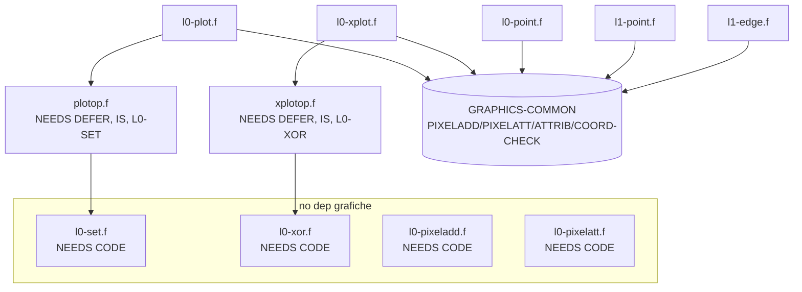

# Plan: estrarre le parole condivise dei moduli LAYERxx-GRAPHICS in `inc/`

## Context
I sei moduli `tools/vForth/lib/LAYERxx-GRAPHICS.f` (LAYER0/10/11/12/13/2) ridefiniscono
le stesse parole ad ogni caricamento. Caricando piu' modalita' con `NEEDS`
(es. `NEEDS LAYER12-GRAPHICS` + `NEEDS LAYER13-GRAPHICS`) parole come `L0-SET`,
`L0-PLOT`, `PLOTOP` vengono ricreate identiche -> spreco di dizionario e ridefinizioni
rumorose. Verifica byte-esatta eseguita: i **corpi** (CODE e colon) delle parole
condivise sono identici tra i file; differiscono solo le righe di commento descrittivo.

Soluzione (scelta dell'autore del progetto): estrarre ogni parola condivisa in un file
`inc/` (uno per parola) e sostituire i blocchi inline con righe `NEEDS`. La semantica di
`NEEDS` (salta il load se la parola e' gia' definita) deduplica automaticamente al
secondo modulo. Coerente con la "Refactoring guideline" di `lib/CLAUDE.md` (estrarre in
`inc/` cio' che e' riusabile). Il monolite legacy `lib/GRAPHICS.f` resta **intatto**.

## Parole condivise (verificate byte-identiche nei corpi)
| Parola | Tipo | Condivisa da |
|---|---|---|
| `L0-SET`, `L0-XOR` | CODE | L0, L11, L12, L13 |
| `PLOTOP`, `XPLOTOP` | DEFER + `IS` bind | L0, L11, L12, L13 |
| `L0-POINT`, `L0-PLOT`, `L0-XPLOT` | colon | L0, L11, L12, L13 |
| `L0-PIXELADD` | CODE | L0, L11, L13 |
| `L0-PIXELATT` | CODE | L0, L11 |
| `L1-POINT`, `L1-EDGE` | colon | L10, L2 |

Restano **inline** (uniche): `L12-PIXELADD` (L12), `L13-PIXELATT` (L13),
`L10-PIXELADD`/`L1-PLOT`/`L1-XPLOT` (L10), `L2-RAM-PAGE`/`L2-PIXELADD`/`L2-PLOT`/`L2-XPLOT` (L2).

## Catena di dipendenze (decide gli `inc/` e l'ordine di NEEDS)

`PIXELADD`/`PIXELATT`/`ATTRIB`/`COORD-CHECK` sono i DEFER/VALUE di `GRAPHICS-COMMON.f`;
`LAYER:` li ri-vettorizza all'attivazione, quindi `L0-POINT/PLOT/XPLOT` sono indipendenti
dalla modalita' e condivisibili.

## 11 nuovi file `inc/` (uno per parola)
Nomi file (FAT: i trattini sono legali, nessuna mappatura speciale necessaria; nessuna
collisione con `inc/` esistenti -- verificato):
`l0-set.f`, `l0-xor.f`, `l0-pixeladd.f`, `l0-pixelatt.f`, `plotop.f`, `xplotop.f`,
`l0-point.f`, `l0-plot.f`, `l0-xplot.f`, `l1-point.f`, `l1-edge.f`.

Regole comuni: banner `.( NOME )`; `NEEDS` delle dipendenze; corpo copiato **verbatim**
dai byte esistenti (commento descrittivo neutro); 7-bit ASCII, no BOM, no TAB; **riga
finale vuota obbligatoria** (bug newline di `INCLUDE`/`NEEDS`).

### Template CODE word (pattern `inc/Lshift.f`) -- es. `inc/l0-set.f`
```forth
\
\ l0-set.f
\
.( L0-SET )

NEEDS CODE      \ CODE = RENAME MCOD CODE

BASE @
HEX
CODE L0-SET   ( b1 b2 -- b3 )
    E1 C,               \ pop   hl    ; b2 byte
    7D C,               \ ld   a'| l|
    E1 C,               \ pop   hl    ; b1 pattern
    B5 C,               \ ora  l'|
    6F C,               \ ld   l'| a|
    E5 C,               \ push  hl
    DD C, E9 C,         \ jp   (ix)
    SMUDGE
BASE !

```
- Usare `SMUDGE` (come nei file LAYER), **non** `FORTH SMUDGE`.
- `l0-xor.f`, `l0-pixeladd.f`, `l0-pixelatt.f`: stessa forma, copiando i rispettivi `C,`
  dai blocchi originali (vedi tabella sotto per i sorgenti esatti).

### Template DEFER word -- `inc/plotop.f` (e analogo `inc/xplotop.f`)
```forth
\
\ plotop.f
\
.( PLOTOP )

NEEDS DEFER
NEEDS IS
NEEDS L0-SET

DEFER PLOTOP
' L0-SET IS PLOTOP       \ usually OR to "set" the pixel

```
`xplotop.f`: `NEEDS L0-XOR`, `DEFER XPLOTOP`, `' L0-XOR IS XPLOTOP`.

### Template colon word -- es. `inc/l0-plot.f`
```forth
\
\ l0-plot.f
\
.( L0-PLOT )

NEEDS GRAPHICS-COMMON    \ PIXELADD/PIXELATT/ATTRIB/COORD-CHECK
NEEDS PLOTOP

BASE @
HEX
: L0-PLOT       ( x y -- )
    COORD-CHECK
    IF
        TUCK
        PIXELADD >R
        7 AND
        80 SWAP RSHIFT
        R@ C@
        PLOTOP
        R@ C!
        ATTRIB R>
        PIXELATT
    ELSE
        2DROP
    THEN
;
BASE !

```
Le colon words usano letterali hex (`80`, `7`), quindi vanno avvolte in
`BASE @ HEX ... BASE !` (copia verbatim del corpo). Dipendenze per file:
- `l0-point.f`: `NEEDS GRAPHICS-COMMON` (usa `PIXELADD`).
- `l0-plot.f`: `NEEDS GRAPHICS-COMMON` + `NEEDS PLOTOP`.
- `l0-xplot.f`: `NEEDS GRAPHICS-COMMON` + `NEEDS XPLOTOP`.
- `l1-point.f`: `NEEDS GRAPHICS-COMMON` (corpo `: L1-POINT  ( x y -- c ) PIXELADD C@ ;`, niente hex -> no BASE wrap).
- `l1-edge.f`: `NEEDS GRAPHICS-COMMON` (corpo `: L1-EDGE  ( b -- f ) ATTRIB = ;`, no BASE wrap).

(`NEEDS GRAPHICS-COMMON` e' no-op a runtime quando il modulo LAYER lo ha gia' caricato;
rende il file `inc/` autoconsistente.)

### Sorgenti esatti da cui copiare i corpi
| inc file | Sorgente verbatim |
|---|---|
| l0-set.f / l0-xor.f | `LAYER0-GRAPHICS.f` righe 47-56 / 58-67 |
| l0-pixeladd.f | `LAYER0-GRAPHICS.f` righe 30-39 |
| l0-pixelatt.f | `LAYER0-GRAPHICS.f` righe 130-144 |
| l0-point.f / l0-plot.f / l0-xplot.f | `LAYER0-GRAPHICS.f` righe 76-81 / 88-103 / 109-122 |
| l1-point.f / l1-edge.f | `LAYER10-GRAPHICS.f` righe 53-55 / 60-62 |

## Modifiche ai 6 `LAYERxx-GRAPHICS.f` (pattern unico)
Struttura attuale: `.(banner)` -> `NEEDS GRAPHICS-COMMON` -> `MARKER NO-LAYERxx-GRAPHICS`
-> `: LAYERxx-GRAPHICS NOOP ;` -> `BASE @` ... defs ... build block ... `LAYER: LAYERxx`
-> attivazione -> `BASE !`.

Per ogni file:
1. **Inserire** le righe `NEEDS <parola>` **dopo** `: LAYERxx-GRAPHICS NOOP ;` e **prima**
   di `BASE @` (scelta dell'utente: i NEEDS vanno DOPO il `MARKER`).
2. **Rimuovere** i blocchi inline delle parole estratte (header-comment + corpo) dalla
   regione `BASE @ ... BASE !`, lasciando solo le parole ancora inline + il build block.

| File | Righe `NEEDS` da aggiungere | Blocchi inline da rimuovere | Resta inline |
|---|---|---|---|
| LAYER0 | L0-PIXELADD, L0-PIXELATT, L0-POINT, L0-PLOT, L0-XPLOT | tutti (PIXELADD, SET/XOR+DEFER/IS, POINT, PLOT, XPLOT, PIXELATT) | (solo build block) |
| LAYER11 | L0-PIXELADD, L0-PIXELATT, L0-POINT, L0-PLOT, L0-XPLOT | come LAYER0 | (solo build block) |
| LAYER12 | L0-POINT, L0-PLOT, L0-XPLOT | SET/XOR+DEFER/IS, POINT, PLOT, XPLOT | `L12-PIXELADD` |
| LAYER13 | L0-PIXELADD, L0-POINT, L0-PLOT, L0-XPLOT | PIXELADD, SET/XOR+DEFER/IS, POINT, PLOT, XPLOT | `L13-PIXELATT` |
| LAYER10 | L1-POINT, L1-EDGE | L1-POINT, L1-EDGE | L10-PIXELADD, L1-PLOT, L1-XPLOT |
| LAYER2 | L1-POINT, L1-EDGE | L1-POINT, L1-EDGE | L2-RAM-PAGE, L2-PIXELADD, L2-PLOT, L2-XPLOT |

I NEEDS minimi bastano per la catena (es. `NEEDS L0-PLOT` tira `PLOTOP`->`L0-SET`); restano
elencati esplicitamente per leggibilita'. Il build block in fondo (`' L0-PIXELADD ...
LAYER: LAYERxx`) e' invariato: le sue `'` risolvono perche' le parole sono ora definite
via i `NEEDS` posti prima di `BASE @`. Per LAYER0/LAYER11 la regione `BASE @ ... BASE !`
conterra' solo il build block.

### Conseguenza nota sull'unload (accettata dall'utente)
Poiche' i `NEEDS` stanno DOPO il `MARKER`, le parole condivise cadono nella regione
rimossa da `NO-LAYERxx-GRAPHICS` (FORGET fino al marker). Coerente con lo scopo del marker
e con il flusso "una modalita' alla volta". Caso limite accettato: con due modalita'
caricate insieme, unloadare la prima rimuove (per semantica FORGET) anche la seconda.

## File NON toccati
- `lib/GRAPHICS.f` (monolite legacy) -- per scelta.
- `lib/GRAPHICS-COMMON.f` -- invariato (gia' fornisce i DEFER PIXELADD/PIXELATT/...).
- `version/**`, `tutorial/038-...` (solo commento), `dot/` -- nessuna dipendenza reale.
- Nessun bump-build: nessuna modifica a core/binari.

## Verifica
1. **Statico (automatico)**: per ciascuna parola estratta, `diff` tra il corpo nel nuovo
   `inc/` e il blocco originale nel rispettivo `LAYERxx-GRAPHICS.f` -> devono coincidere
   sui byte di codice (`C,` / corpo colon). Controllare anche: ogni file termina con
   `0x0A` e penultimo byte != `0x20`; nessun TAB; solo ASCII 7-bit.
2. **CSpect (manuale, l'utente avvia l'emulatore)**:
   - `NEEDS LAYER12-GRAPHICS` poi `NEEDS LAYER13-GRAPHICS`: la seconda load NON deve
     ristampare i banner `.( L0-SET )` `.( L0-PLOT )` ecc. e non deve dare ridefinizioni
     (dedup via NEEDS).
   - Per ogni modalita': attivazione + qualche `PLOT`/`XPLOT`/`POINT`/`DRAW-LINE`/`CIRCLE`
     per confermare comportamento identico a prima.
   - `NO-LAYER12-GRAPHICS` dopo aver caricato solo LAYER12: verifica unload pulito; con
     LAYER12+LAYER13 insieme, verificare il comportamento FORGET atteso (caso limite).
   - Opzionale: caricare ciascun `LAYERxx` da sessione pulita e controllare banner/`WORDS`.

## Operativo
- Sviluppo sul branch `claude/refine-local-plan-wk9s7c`; commit descrittivo; push
  `git push -u origin claude/refine-local-plan-wk9s7c`. PR solo se richiesto.
- Eventuale `/sync-sd` per portare i nuovi `inc/` + i LAYERxx aggiornati sull'immagine SD
  dopo le verifiche.

